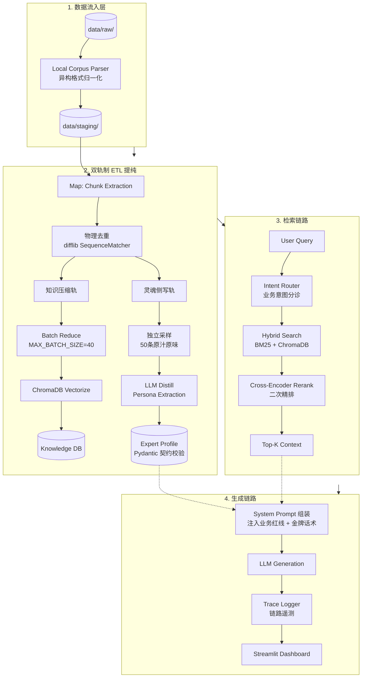

# Enterprise-Expert-Digital-Twin

<p align="center">
  <strong>企业级数字专家孪生中台</strong><br>
  <em>从肮脏非结构化数据到精准专家知识推理的工业级解决方案</em>
</p>

<p align="center">
  
  
  
  
</p>

---

## Overview

Enterprise-Expert-Digital-Twin 是一个面向企业级场景的**专家知识推理中台**。它能够将企业内部非结构化的知识资产（SOP手册、客服对话记录、技术文档）转化为具备精准知识召回、业务意图分诊、专家语气克隆能力的数字专家。

### 核心痛点解决

| 痛点 | 传统方案缺陷 | 本系统解法 |
|------|-------------|-----------|
| **数据又脏又长** | 一次性喂入导致 Token 爆炸 | 双轨制 ETL：分批压缩 + 物理去重 |
| **检索幻觉严重** | 纯向量检索语义漂移 | Hybrid Search：BM25 + ChromaDB + Reranker |
| **输出格式失控** | 正则解析脆弱易崩溃 | 大模型自纠错：Agentic JSON 修复 |
| **回答机器味重** | 单纯 Prompt 语气指令无效 | 金牌话术注入：原话原句 Few-Shot 硬编码 |
| **多租户安全** | 逻辑隔离易被穿透 | 物理隔离：目录 + 向量命名空间双重隔离 |

---

## System Architecture

### Data Pipeline



---

## Key Design Nodes | 关键设计节点

### 1. Universal Ingestion Probe | 万能数据嗅探探针

**文件**: `tools/universal_ingestor.py`, `tools/local_corpus_parser.py`

**功能**:
- 自动识别多种数据格式（CSV/JSONL/Excel）
- 智能推断 speaker 角色映射（买家→客服、患者→医生）
- 归一化为标准 JSONL 格式，输出到 `data/staging/`

**关键代码**:
```python
def _infer_role_mapping(df: pd.DataFrame) -> Dict[str, str]:
    # 自动推断第一说话人为客户，第二为专家
    # 返回 {"客户/患者": "user", "金牌客服/医生": "expert"}
```

---

### 2. Dual-Track ETL Pipeline | 双轨制提纯流水线

**文件**: `services/etl_pipeline.py`

#### 2.1 知识压缩轨 (Knowledge Track)

**核心机制**:
- **物理去重**: `difflib.SequenceMatcher` 模糊匹配，相似度 >0.85 即剔除
- **分批打包**: `MAX_BATCH_SIZE = 40`，无视数据类型强制切分
- **批次容错**: 单批次失败只丢弃该批次，不中断整体流程
- **0 数据熔断**: Map 阶段后空数据直接拦截返回

**运转流程**:
```
Raw Chunks → Deduplicate → Batch(40) → LLM Judge → KnowledgeChunk[Pydantic]
```

#### 2.2 灵魂侧写轨 (Persona Track)

**核心机制**:
- **独立采样**: 直接采样 Map 阶段原汁原味切片（50条），不经过 Reduce 压缩
- **斩断复读幻觉**: 严格的 golden_few_shots 提取红线
- **金牌话术注入**: `standard_scripts` 原话原句硬编码

**运转流程**:
```
Raw Slices(50) → LLM Distill → DigitalTwinProfile[Pydantic]
```

---

### 3. Business Intent Probe | 业务意图探针

**文件**: `services/state_tracker.py`

**核心机制**:
- 注入专家专属 `supported_intents` 列表，非简单兜底
- 输出结构化 `ProbeState`: `business_intent` + `urgency_level` + `emotional_state`
- 非业务意图直接物理阻断，避免无效向量检索

**关键代码**:
```python
class BusinessIntentProbe:
    def classify(self, user_input: str, expert_id: str) -> ProbeState:
        # 构造专家专属意图列表的 Prompt
        # LLM 输出 JSON 格式意图分类结果
```

---

### 4. Hybrid Retrieval + Rerank | 混合召回与重排

**文件**: `services/chroma_service.py` (或 `vector_db_service.py`)

**运转流程**:
```
User Query ─┬─→ BM25 Sparse Retrieval ─┐
            │                           ├──→ Merge → Deduplicate ──→ Cross-Encoder Rerank ──→ Top-5
            └──→ ChromaDB Dense Retrieval ┘
```

**核心机制**:
- **双路召回**: 关键词稀疏检索 (BM25) + 语义稠密检索 (ChromaDB)
- **去重合**: 基于内容哈希的去重
- **精排序**: Cross-Encoder (BGE-Reranker) 交叉打分，相关性重校准

---

### 5. Agent Engine | 专家推理引擎

**文件**: `services/agent_engine.py`

**核心机制**:
- **动态 Prompt 组装**: 注入 `expert_profile` + `rag_context` + `business_redlines`
- **金牌话术护栏**: 语境契合锁 + 概率锁 (80%不使用) + 频次锁 (每次最多1句)
- **RAG 降噪护栏**: 无关知识切片绝对无视，宁可承认不知道也不编造

**System Prompt 结构**:
```
专家角色 + 专业领域
├── 沟通风格 (tone, response_pattern, standard_scripts)
├── 业务红线 (绝不可违反)
├── 路由意图 + 紧急程度
├── 企业知识切片参考
├── RAG 降噪护栏
└── 金牌示例对话 (Few-Shot 语气校准)
```

---

### 6. API Gateway + Trace Logger | 网关与遥测

**文件**: `api_gateway.py`

**核心机制**:
- **Pydantic 请求/响应契约**: `ChatRequest`, `ChatResponse`, `TitleRequest`
- **链路追踪**: 全链路 RAG 遥测数据捕获（召回内容、分数、引用来源）
- **多租户路由**: `expert_id` 级别的请求路由与数据隔离

**遥测数据模型**:
```python
class ChatResponse(BaseModel):
    reply: str
    intent: str
    retrieved_memories: List[Dict]  # 包含 text, score, citation_source, chunk_type
```

---

### 7. Streamlit Dashboard | 监控面板

**文件**: `web_ui.py`

**核心功能**:
- **专家档案室**: 多租户切换，物理隔离保障
- **会话历史管理**: UUID 会话 ID，实时持久化
- **RAG 遥测可视化**: 召回知识、相似度分数、引用来源展示
- **CTO 级全息监控**: Token 消耗、响应延迟、意图分布

---

## Quick Start

### 一键启动（推荐）

```bash
# 1. 将企业数据放入 raw 目录
mv your_data.csv data/raw/source_data.csv

# 2. 执行一键启动
python start_system.py
```

系统将自动完成：数据探针 → ETL 提纯 → 向量入库 → 网关启动 → 监控启动

访问：
- API 网关: http://localhost:8088
- 监控面板: http://localhost:8501

### 手动分步测试

```bash
# Step 1: 数据探针（低成本验证）
python -c "from tools.universal_ingestor import main; main()"

# Step 2: ETL 提纯（高成本，可控执行）
python services/etl_pipeline.py

# Step 3: 启动服务（分窗口执行）
python api_gateway.py    # Terminal 1
python web_ui.py         # Terminal 2
```

---

## Project Structure

```
project/
├── services/
│   ├── agent_engine.py         # 专家推理引擎 (RAG + 意图路由 + Prompt 组装)
│   ├── etl_pipeline.py         # 双轨制 ETL (Dual-Track: Knowledge + Persona)
│   ├── state_tracker.py        # 业务意图探针 (Intent Router)
│   └── chroma_service.py       # 向量存储与混合检索服务
├── api_gateway.py              # FastAPI 网关 + 链路遥测
├── web_ui.py                   # Streamlit 监控面板
├── domain/
│   └── models.py               # Pydantic 数据防腐层契约
├── tools/
│   ├── local_corpus_parser.py  # 异构数据归一化
│   └── universal_ingestor.py   # 万能数据嗅探探针
├── start_system.py             # 全自动一键启动中枢
└── data/
    ├── raw/                    # 原始脏数据（生肉区）
    ├── staging/                # 归一化暂存区
    ├── experts/                # 专家熟肉区（画像+知识，物理隔离）
    └── chroma_db/              # 向量缓存
```

---

## Tech Stack

- **Python**: 3.8+
- **Web Framework**: FastAPI
- **Vector Store**: ChromaDB
- **Data Validation**: Pydantic
- **Monitoring**: Streamlit
- **Embeddings**: Sentence-Transformers
- **Reranker**: Cross-Encoder (BGE)

---

## Architecture Paradigm

- **Contract-First Design**: Pydantic 强类型契约驱动
- **Dual-Track Data Pipeline**: 知识压缩与灵魂侧写独立运行
- **Physical Multi-Tenancy**: expert_id 级别物理隔离
- **Agentic Self-Correction**: 大模型 JSON 格式自修复
- **Defensive Engineering**: Token 熔断 + 0 数据拦截 + 批次容错

---

## Interview Guide | 面试/展示避坑指南（可删除）

### 引导面试官提问的核心架构设计

| 暗示方向 | 可能的问题 | 核心回答 |
|---------|----------|---------|
| "双轨制 ETL 很特殊" | "为什么要分两条轨道？" | 知识压缩轨解决 Token 爆炸，灵魂侧写轨解决语气保真。两者数据流独立，避免 Reduce 后的干瘪数据污染专家画像 |
| "Pydantic 契约" | "如何防止大模型幻觉字段？" | 强类型防腐层，在数据入口处拦截非法字段，而非在下游发现错误 |
| "物理隔离" | "多租户安全怎么保证？" | 不仅是逻辑隔离，而是 `expert_id` 级别的目录 + 向量命名空间双重物理隔离 |
| "混合召回" | "为什么不用纯向量检索？" | 企业场景下 BM25 对专业术语精确匹配 + 向量检索语义泛化能力互补 |
| "Reranker" | "召回后为什么还要重排？" | 粗排保召回率，精排用 Cross-Encoder 做相关性重校准，成本与效果的平衡点 |
| "JSON 自纠错" | "LLM 输出格式乱了怎么办？" | Agentic 模式：捕获错误后把 Error Log 和坏 JSON 重新发给 LLM，强制其自己修复 |

### 避免被问死的陷阱

- ❌ "这是一个聊天机器人"
- ✅ "这是企业级专家知识推理中台，RAG 只是其中一层"

- ❌ "我们用了 GPT-4"
- ✅ "设计了模型无关抽象层，LLM 只是推理引擎，核心在于知识锚定机制"

- ❌ "数据存在 ChromaDB"
- ✅ "ChromaDB 是向量缓存层，权威数据以 JSONL 形态持久化在物理目录"