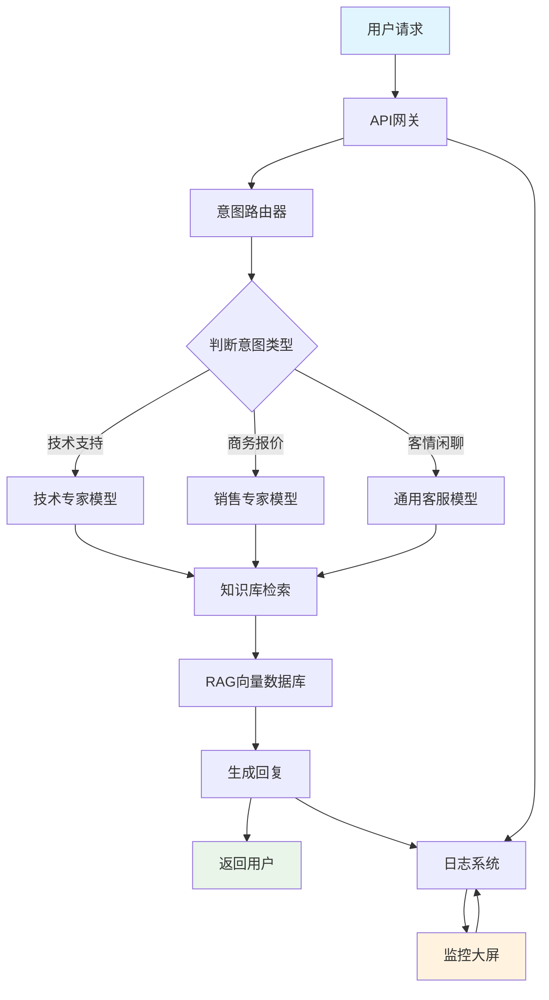

# 企业级专家数字孪生中台

## 项目简介

这是一个**企业级专家数字孪生中台**，简单来说就是：

> 把企业内部的专业知识（比如技术文档、客服问答、产品白皮书）喂给AI，让它变成一个"数字专家"，能够7x24小时回答员工或客户的业务问题。

**核心功能：**
- 🤖 **智能问答**：像跟真专家聊天一样咨询技术问题
- 🎯 **意图识别**：自动判断你是要技术支持、商务报价还是随便聊聊
- 📊 **实时监控**：CTO可以随时查看系统运行状态和问答质量
- 🔧 **企业级部署**：支持多客户并发，数据安全隔离

## 🚀 一键部署专家系统（全自动炼丹）

> **⚡ 极简启动（推荐）**：只需执行 **一条命令**，系统自动完成从原始数据到可用专家的全流程！

```bash
python start_system.py
```

### 📦 方式一：全自动一键启动（推荐）

这是最简单的方式，也是**项目唯一的总启动入口**：

```bash
# 1. 将你的企业数据放入 data/raw/ 目录，命名为 source_data.csv
# 2. 执行唯一启动命令
python start_system.py
```

系统将全自动完成：

| 阶段 | 操作 | 输出 |
|------|------|------|
| � **数据探针** | 嗅探数据结构 → 清洗归一化 | `data/staging/staging_{expert}_{timestamp}.jsonl` |
| 🧠 **专家克隆** | 大模型侧写画像 → 生成专家ID | `data/experts/{expert_id}/` |
| 🔍 **向量入库** | 知识切片向量化 → ChromaDB | 物理隔离的向量记忆 |
| 🚀 **启动网关** | FastAPI 后端就绪 | `http://localhost:8088` |
| 🌐 **启动前端** | Streamlit 界面就绪 | `http://localhost:8501` |
| 🌍 **打开浏览器** | 自动跳转到对话界面 | 浏览器新标签页 |

启动完成后，浏览器会自动打开 `http://localhost:8501`，在侧边栏"专家档案室"选择专家即可开始对话。

**停止服务**：在终端按 `Ctrl+C`，系统将优雅关闭所有服务。

### 🔄 方式二：手动分步接入（高级用户）

如果需要更精细控制，可以分步执行：

```bash
# 步骤 1：数据探针清洗（低成本）
python -c "from tools.universal_ingestor import main; main()"

# 步骤 2：ETL 知识提取与画像侧写（高成本，需手动确认）
python services/etl_pipeline.py
```

### 📁 数据导入说明

#### 支持的数据格式

系统通过大模型自动识别以下任意格式：

| 格式 | 示例 | 自动推断 |
|------|------|----------|
| 医疗问答 | `instruction` + `output` | 患者 → 主治医师 |
| 客服对话 | `speaker` + `content` | 买家 → 金牌客服 |
| 通用问答 | `question` + `answer` | 用户 → 专家 |

#### 📁 目录结构说明

```
project/
├── data/
│   ├── raw/                    # 原始脏数据目录
│   │   └── source_data.csv     # 您的企业数据文件
│   ├── staging/                # 暂存区（带时间戳）
│   │   └── staging_{expert}_{YYYYMMDD_HHMMSS}.jsonl
│   ├── experts/                # 专家数据（物理隔离）
│   │   └── {expert_id}/
│   │       ├── profile.json     # 专家数字孪生画像
│   │       └── knowledge.json   # 结构化知识库
│   └── chroma_db/             # 向量数据库
├── .env                       # 环境变量（含 LATEST_STAGING_FILE）
└── start_system.py            # 一键启动脚本
```

**重要说明：**
- `data/raw/`：放置原始脏数据，支持 `.csv`、`.jsonl`、`.xlsx`
- `data/staging/`：自动生成带时间戳的暂存文件，格式为 `staging_{expert}_{YYYYMMDD_HHMMSS}.jsonl`
- `LATEST_STAGING_FILE`：.env 文件中自动更新最新的暂存文件路径
- `data/experts/{expert_id}/`：按专家ID物理隔离，格式为 `{pinyin}_{YYYYMMDD_HHMMSS}`

### 示例数据结构

```json
// expert_profile.json 示例
{
  "expert_role": "金牌架构师",
  "specialized_terms": ["微服务", "容器化", "DevOps"],
  "compliance_boundaries": ["不得泄露源码", "遵守保密协议"]
}
```

## 🏗️ 系统架构图



## 🔧 常见问题

**Q: 系统启动失败怎么办？**
A: 检查Python版本（建议3.8+），确保安装了requirements.txt中的依赖包。

**Q: 如何更换专家角色？**
A: 系统支持**多租户专家池**架构：
1. 运行 ETL 流程会自动创建新的专家（每个数据源生成一个专家ID）
2. 启动 `web_ui.py` 后，在侧边栏"🏢 专家档案室"下拉框中选择不同专家ID
3. 切换专家时会自动清空对话历史，保持上下文隔离

**专家数据位置**：`data/experts/{expert_id}/`
- `profile.json`：专家画像（名称、领域、沟通风格、业务红线）
- `knowledge.json`：知识切片库

**Q: 数据安全吗？**
A: 系统具备企业级安全设计：
- ✅ **物理隔离**：每个专家拥有独立的数据目录和向量命名空间
- ✅ **本地存储**：所有数据（包括向量库）存储在本地 `data/` 目录
- ✅ **租户隔离**：通过 `expert_id` 实现查询级别的物理过滤
- ✅ **零上传**：原始数据不会上传到任何第三方服务（仅调用LLM API进行推理）

**Q: 如何查看系统性能？**
A: 访问监控大屏 `http://localhost:8000/monitor`，可以看到详细的性能指标。

---

> 💡 **提示**：这个系统专为不懂代码的业务人员设计，如果你遇到任何问题，直接查看监控大屏的错误信息，或者联系技术团队。
