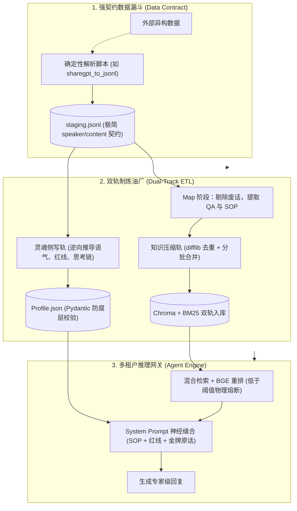

# Enterprise-Expert-Digital-Twin

<p align="center">
  <strong>业界首个主打【专家灵魂克隆】的 B 端 RAG 中台</strong><br>
  <em>拒绝冷冰冰的问答机，从双轨制 ETL 到金牌话术的神经缝合</em>
</p>

<p align="center">
  
  
  
  
</p>

---

## 🎯 Overview | 为什么我们需要它？

当前开源界的 RAG 系统（如 FastGPT、Dify）都在卷解析速度、卷检索算法，但它们克隆出来的数字人，永远是一副**"作为一名AI，综上所述"**的官腔机器味。这在 B 端商业场景（销售逼单、售后安抚、技术排障）中是致命的。

Enterprise-Expert-Digital-Twin 旨在解决这一痛点。我们不只是检索知识，我们**提取并克隆专家的业务灵魂**。

### 核心护城河 (Core Competence)

| 致命痛点 | 传统 RAG 的做法 | 我们的工业级解法 (SOTA) |
|---------|---------------|----------------------|
| **机器味极重** | 仅靠 Prompt 要求"你是一个客服" | **金牌话术神经缝合**：硬编码专家原话，设置 80% 概率锁防坍塌 |
| **缺乏业务深度** | 从知识库生硬复制粘贴 | **CoT 思考链注入**：让大模型按专家的 `reasoning_logic` 分步推演 |
| **算力与 Token 爆炸** | 把万字文档一口气喂给 LLM | **双轨制 ETL**：客观知识走去重压缩轨，灵魂侧写走原汁原味采样轨 |
| **检索召回幻觉** | 纯向量检索导致专业术语漂移 | **三路混合检索**：Dense(Chroma) + Sparse(BM25) + Cross-Encoder 重排 |

---

## 🏗️ Architecture | 系统心智图



## ⚡ Quick Start | 3分钟一键唤醒

我们拒绝复杂的环境配置。你只需要一份真实的聊天记录，系统会自动为你克隆出一个有血有肉的数字专家。

### 1. 安装依赖
```bash
pip install -r requirements.txt
```

### 2. 配置引擎

复制 `.env.example` 为 `.env`，填入你的 SiliconFlow API Key（本项目默认使用 Qwen-72B 进行 ETL，DeepSeek-V3 进行推理，你可自由替换）。

### 3. 一键点火与算力风控

我们内置了一份 400 行的高质量真实语料在 `data/staging/demo_staging.jsonl` 中。

#### 第一步：启动基础服务

```bash
python start_system.py
```

> **注：** 系统秉持 ROI 最大化原则，为防止大模型 API Token 意外消耗破产，`start_system.py` 默认物理拦截了高成本的 ETL 灵魂蒸馏流程。服务启动后，你需要手动打通第二步。

#### 第二步：手动触发灵魂蒸馏 (ETL) 炼丹

另开一个终端窗口，强制执行知识提取与画像侧写：

```bash
python services/etl_pipeline.py
```


等待进度条走完（约需 2-5 分钟），刷新你的 Streamlit 浏览器页面。在左侧"专家档案室"中，你将看到一个拥有完整思维链 (CoT) 与金牌话术的数字专家正式苏醒。


---

## 🔬 Core Designs | 必须阅读的架构信仰

### 1. 物理隔离的多租户系统 (Multi-Tenancy)

我们不相信逻辑隔离。在本系统中，不同的专家（如"儿科医生"、"金牌销售"）拥有绝对物理隔离的数据目录（`data/experts/{expert_id}/`）。向量检索时，强制注入 `expert_id` 标签，杜绝串脑幻觉。

### 2. Pydantic 防腐层与物理剥壳机 (Anti-Corruption)

LLM 极度容易在 JSON 外面包裹 ````json` 和解释性废话。本系统在所有大模型解析层都实装了 **Markdown Stripper（物理剥壳正则）** 与 **Agentic Self-Correction（自纠错循环）**，确保流入系统的每一滴数据都符合强类型契约。

### 3. RAG 算力风控 (Intent Routing)

如果用户只说了一句"你好"，系统去搜遍向量库就是极大的算力浪费。我们在入口处配置了 **动态意图探针**。当识别为"闲聊兜底"意图时，物理阻断 ChromaDB 调用，直接让大模型以专家语气回复。

---

## 🗺️ Roadmap | 降维演进路线图

```
V1.0 (已完成) ──────────────────────────────────────────────────────────────
  ✅ 专家灵魂克隆 (双轨制 ETL)
  ✅ 混合检索引擎 (Dense + Sparse + Reranking)
  ✅ 多租户物理隔离 (ChromaDB 集合级)
  ✅ 业务意图路由 + 算力风控
  ✅ 神经缝合 Prompt (金牌话术 + CoT + 反机器味)

V2.0 (当前版本) ────────────────────────────────────────────────────────────
  ✅ Ingest Hub 2.0 Docling AST (Parser Registry + A/B 双轨分发)
  ✅ AsyncAgentPool 异步无状态池 (双重检查锁 + asyncio.to_thread)
  ✅ BM25 内存常驻缓存 (HybridSearchEngine 内部自动降级)
  ✅ 契约 ACL 闭环 (ChatRequest expert_id 选参 + 100% 向下兼容)
  ✅ CTO 遥测完全体 (富文本 retrieved_memories + 推理耗时监控)

V3.0 (进行中) ────────────────────────────────────────────────────────────
  🔲 MCP 多租户文档解析网关 (MCP 客户端管理器 + 双轨混合推理)
  🔲 专家即标准 Skill 导出 (profile.json MCP 路由配置)
  🔲 SQL 会话存储 (PostgreSQL/Redis)
  🔲 自适应缝合 (ToneCalibrationMatrix 动态语气校准)

V4.0 (远期规划) ──────────────────────────────────────────────────────────
  🔲 MCP 动态 ERP API 挂载 (实时数据查询)
  🔲 Orchestrator 编排网关 (多 Agent 协作)
  🔲 生产级监控告警体系 (Grafana/Prometheus)
  🔲 A/B 测试框架 (Prompt 效果对比)
```


---

> "在算力溢出的时代，我们不缺参数，缺的是业务逻辑的确定性。" —— 首席 AI 系统架构师
