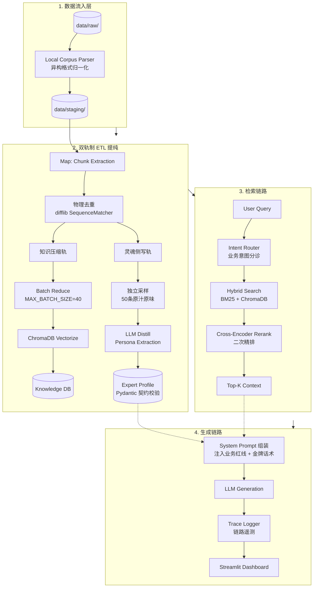

# 📋 企业级专家数字孪生中台 - 全息物理快照
**生成时间**: 2026-05-13 17:24:34
**项目路径**: A:\Windsurf_project\AI identify2.0企业版

## 📂 项目目录结构
```text
📁 项目目录树结构:
├── api_gateway.py
├── domain
│   └── models.py
├── engineering_norms.md
├── generate_snapshot.py
├── main_router_test.py
├── README.md
├── services
│   ├── agent_engine.py
│   ├── etl_pipeline.py
│   ├── expert_manager.py
│   ├── memory_manager.py
│   ├── state_tracker.py
│   └── vector_db_service.py
├── start_system.py
├── tools
│   ├── local_corpus_parser.py
│   └── universal_ingestor.py
└── web_ui.py
```

## 🔧 全量核心文件源代码
### 📄 api_gateway.py
```python
"""
FastAPI 统一网关 - Project 6.0 Persona Engine
对外提供 RESTful API 接口，内部调用 PersonaAgent 生成回复
"""

from fastapi import FastAPI, HTTPException
from pydantic import BaseModel, Field
from typing import Optional, List
import uvicorn
import os
import sys
import json
import traceback
from datetime import datetime
import openai

from services.agent_engine import ExpertDigitalTwinAgent
import glob

# [核心节点]：动态加载默认专家ID（多租户架构）
def get_default_expert_id() -> str:
    """
    从 data/experts/ 目录读取第一个专家ID作为默认启动专家
    
    输出：专家ID字符串
    异常：如果目录为空，返回None
    """
    experts_dir = os.path.join(os.path.dirname(__file__), "data", "experts")
    
    if not os.path.exists(experts_dir):
        return None
    
    # 获取所有子目录（专家目录）
    expert_dirs = [d for d in os.listdir(experts_dir) 
                   if os.path.isdir(os.path.join(experts_dir, d))]
    
    # 过滤掉空目录，优先选择非空目录
    valid_experts = []
    for expert_id in expert_dirs:
        expert_path = os.path.join(experts_dir, expert_id)
        if os.listdir(expert_path):  # 目录非空
            valid_experts.append(expert_id)
    
    if not valid_experts:
        return None
    
    # 返回第一个有效的专家ID
    return valid_experts[0]

# 确保日志目录存在
LOGS_DIR = os.path.join(os.path.dirname(__file__), "logs")
os.makedirs(LOGS_DIR, exist_ok=True)
LOG_FILE = os.path.join(LOGS_DIR, "system_trace.log")

def write_system_trace(user_input: str, business_intent: str, urgency_level: str, retrieved_memories: List, reply: str, generation_time: float, prompt_length: int, temperature: float):
    """
    写入系统追踪日志
    
    输入：用户输入、业务意图、紧急程度、RAG记忆、回复、耗时、Prompt长度、温度
    输出：无
    副作用：追加写入日志文件
    
    原理：将本次对话的关键信息以 JSONL 格式写入日志文件，用于业务意图追踪和紧急事件审计
    """
    log_entry = {
        "timestamp": datetime.now().isoformat(),
        "user_input": user_input,
        "business_intent": business_intent,
        "urgency_level": urgency_level,
        "retrieved_memories": retrieved_memories,
        "reply": reply,
        "generation_time": generation_time,
        "prompt_length": prompt_length,
        "temperature": temperature
    }
    with open(LOG_FILE, "a", encoding="utf-8") as f:
        f.write(json.dumps(log_entry, ensure_ascii=False) + "\n")


# Pydantic 契约定义
class ChatRequest(BaseModel):
    """企业级对话请求契约"""
    user_query: str = Field(
        ...,
        description="企业客户的业务咨询或技术报障，将经过业务意图探针分析后路由至对应专家生成回复",
        examples=["服务器一直报 502 错误怎么排查？", "请问企业版 API 额度如何计费？", "你好，我想咨询一下产品功能"]
    )
    session_history: List[dict] = Field(
        default_factory=list,
        description="当前会话的短期上下文历史，格式为 [{'role': 'user/assistant', 'content': '...'}]",
        examples=[[{"role": "user", "content": "你好"}, {"role": "assistant", "content": "您好，有什么可以帮助您？"}]]
    )
    temperature: float = Field(
        default=0.7,
        description="大模型发散温度，控制回复的确定性。B 端场景建议低温度以确保准确性",
        examples=[0.7]
    )
    frequency_penalty: float = Field(
        default=0.2,
        description="防复读惩罚，降低重复内容的概率",
        examples=[0.2]
    )
    presence_penalty: float = Field(
        default=0.2,
        description="新话题激励，鼓励模型讨论新话题",
        examples=[0.2]
    )
    max_tokens: int = Field(
        default=500,
        description="最大生成 Token 数，企业级回复可能需要更详细的解释",
        examples=[500]
    )
    stop_sequences: List[str] = Field(
        default_factory=lambda: ["\nCustomer:", "\nExpert:"],
        description="停止序列，防止模型生成对话双方内容",
        examples=[["\nCustomer:", "\nExpert:"]]
    )


class ChatResponse(BaseModel):
    """企业级对话响应契约"""
    reply: str = Field(
        ...,
        description="专家生成的专业回复文本，基于业务意图探针和知识切片动态生成",
        examples=["请检查 Nginx 错误日志，502 错误通常表示后端服务不可用", "企业版 API 按调用次数计费，详情如下...", "您好，请问有什么可以帮助您？"]
    )
    business_intent: str = Field(
        ...,
        description="业务意图探针识别结果：TECHNICAL_SUPPORT(技术支持)、SALES_PITCH(销售咨询)、CHIT_CHAT(闲聊兜底)",
        examples=["TECHNICAL_SUPPORT", "SALES_PITCH", "CHIT_CHAT"]
    )
    urgency_level: str = Field(
        ...,
        description="紧急程度判定结果：高(系统故障/业务中断)、中(功能异常)、低(一般咨询)",
        examples=["高", "中", "低"]
    )
    retrieved_memories: List = Field(
        default_factory=list,
        description="RAG 召回的企业级知识切片（富文本遥测数据），包含重排得分、知识溯源、切片类型等硬核指标，用于 CTO 全息监控",
        examples=[
            [{"text": "502 错误如何排查？", "score": 0.85, "citation_source": "运维手册", "chunk_type": "QA_PAIR"}],
            ["Q: 502 错误如何排查？A: 检查后端服务状态..."]  # 向后兼容
        ]
    )
    prompt_length: int = Field(
        default=0,
        description="最终组装发给大模型的 Token/字符长度，用于算力消耗监控",
        examples=[2000]
    )
    generation_time: float = Field(
        default=0.0,
        description="大模型推理耗时（秒），用于性能监控",
        examples=[1.5]
    )


class SwitchExpertRequest(BaseModel):
    """切换专家请求契约"""
    expert_id: str = Field(
        ...,
        description="目标专家的唯一标识符",
        examples=["expert_20260508_183912", "zhuanjia_20260507_165342"]
    )


class SwitchExpertResponse(BaseModel):
    """切换专家响应契约"""
    success: bool = Field(
        ...,
        description="切换是否成功",
        examples=[True, False]
    )
    message: str = Field(
        ...,
        description="切换结果消息",
        examples=["专家切换成功", "专家不存在"]
    )
    expert_name: str = Field(
        default="",
        description="切换后的专家名称",
        examples=["金牌架构师", "资深法务顾问"]
    )


class TitleRequest(BaseModel):
    """标题生成请求契约"""
    user_query: str = Field(
        ...,
        description="用户输入的查询内容，用于生成会话标题",
        examples=["服务器一直报 502 错误怎么排查？", "请问企业版 API 额度如何计费？"]
    )


class TitleResponse(BaseModel):
    """标题生成响应契约"""
    title: str = Field(
        ...,
        description="生成的会话标题，极简不超过6个字",
        examples=["服务器502报错", "API额度计费", "产品功能咨询"]
    )


# [核心节点]：初始化 FastAPI 企业级网关
app = FastAPI(
    title="企业级专家数字孪生系统网关",
    description="B 端企业级专家数字孪生对话系统 - 基于业务意图探针与企业知识切片",
    version="1.0.0"
)

# [核心节点]：初始化全局 ExpertDigitalTwinAgent 实例（多租户架构）
print("[系统点火] 正在探测已炼丹的专家数据...")
default_expert_id = get_default_expert_id()

if not default_expert_id:
    print("[错误] 未找到任何已炼丹的专家数据，请先运行 etl_pipeline.py")
    print("[提示] 运行命令: python services/etl_pipeline.py")
    sys.exit(1)

print(f"[系统点火] 正在加载默认专家: {default_expert_id}")
try:
    agent = ExpertDigitalTwinAgent(expert_id=default_expert_id)
    print(f"[系统点火] 专家 [{agent.expert_profile.expert_name}] 加载完成，系统准备就绪\n")
except Exception as e:
    print(f"[致命错误] 专家加载失败: {e}")
    sys.exit(1)

# [物理切除]：SillyTavern 适配器已物理删除
# B 端企业系统不需要酒馆角色卡导出功能


@app.get(
    "/",
    summary="服务根路径",
    description="返回服务基本信息，用于快速确认服务是否正常运行",
    tags=["系统状态接口"]
)
async def root():
    """根路径 - 健康检查"""
    return {
        "service": "企业级专家数字孪生系统网关",
        "status": "running",
        "version": "1.0.0"
    }


@app.get(
    "/health",
    summary="健康检查",
    description="检查服务健康状态，返回专家名称和知识库大小等关键指标",
    tags=["系统状态接口"]
)
async def health_check():
    """健康检查接口"""
    return {
        "status": "healthy",
        "expert_name": agent.expert_profile.expert_name,
        "knowledge_base_size": len(agent.knowledge_base)
    }


@app.post(
    "/api/v1/chat",
    response_model=ChatResponse,
    summary="发送聊天请求",
    description="接收用户输入，经过业务意图探针分析与知识切片召回，返回企业级专家回复。系统会自动识别用户业务意图和紧急程度，从企业知识库中检索最相关的知识切片，并基于专家画像规则生成专业回复。",
    tags=["核心对话接口"]
)
async def chat(request: ChatRequest):
    """
    聊天接口 - 接收用户输入，生成企业级专家回复
    
    Args:
        request: 包含 user_query 的请求体
        
    Returns:
        ChatResponse: 包含回复、业务意图和紧急程度的响应
    """
    try:
        print(f"\n[API] 收到聊天请求: \"{request.user_query}\"")
        
        # [核心节点]：调用企业级专家数字孪生引擎生成回复
        result = agent.generate_reply(
            request.user_query,
            request.session_history,
            request.temperature,
            request.frequency_penalty,
            request.presence_penalty,
            request.max_tokens,
            request.stop_sequences
        )
        
        print(f"[API] 聊天请求处理完成")
        
        # [核心节点]：写入系统追踪日志
        write_system_trace(
            user_input=request.user_query,
            business_intent=result.get("business_intent", "CHIT_CHAT"),
            urgency_level=result.get("urgency_level", "低"),
            retrieved_memories=result.get("retrieved_memories", []),
            reply=result["reply"],
            generation_time=result.get("generation_time", 0.0),
            prompt_length=result.get("prompt_length", 0),
            temperature=request.temperature
        )
        
        return ChatResponse(
            reply=result["reply"],
            business_intent=result.get("business_intent", "CHIT_CHAT"),
            urgency_level=result.get("urgency_level", "低"),
            retrieved_memories=result.get("retrieved_memories", []),
            prompt_length=result.get("prompt_length", 0),
            generation_time=result.get("generation_time", 0.0)
        )
        
    except Exception as e:
        # [核心节点]：异常透传与 traceback 打印
        error_traceback = traceback.format_exc()
        print(f"[API] 处理请求时发生错误:")
        print(error_traceback)
        raise HTTPException(status_code=500, detail=f"内部服务器错误: {str(e)}")


@app.post(
    "/api/v1/switch_expert",
    response_model=SwitchExpertResponse,
    summary="切换专家",
    description="动态切换当前激活的专家，无需重启服务。接收 expert_id 参数，重新初始化 ExpertDigitalTwinAgent。",
    tags=["多租户专家管理"]
)
async def switch_expert(request: SwitchExpertRequest):
    """
    切换专家接口 - 多租户架构核心功能
    
    允许指挥官在运行时切换不同专家（如从儿科切换到法律），无需重启服务。
    全局变量 agent 被重新赋值为新的 ExpertDigitalTwinAgent 实例。
    
    Args:
        request: 包含目标 expert_id 的请求体
        
    Returns:
        SwitchExpertResponse: 切换结果，包含成功状态和当前专家名称
    """
    global agent
    
    try:
        print(f"\n[多租户切换] 收到专家切换请求: {request.expert_id}")
        
        # 验证专家是否存在
        experts_dir = os.path.join(os.path.dirname(__file__), "data", "experts")
        target_expert_path = os.path.join(experts_dir, request.expert_id)
        
        if not os.path.exists(target_expert_path) or not os.listdir(target_expert_path):
            print(f"[多租户切换] 专家不存在或目录为空: {request.expert_id}")
            return SwitchExpertResponse(
                success=False,
                message=f"专家 '{request.expert_id}' 不存在或未完成炼丹，请检查 expert_id",
                expert_name=agent.expert_profile.expert_name if agent else ""
            )
        
        # [核心节点]：重新初始化全局 agent 实例
        print(f"[多租户切换] 正在加载新专家: {request.expert_id}")
        new_agent = ExpertDigitalTwinAgent(expert_id=request.expert_id)
        
        # 切换成功后才赋值给全局变量
        agent = new_agent
        
        print(f"[多租户切换] 专家切换成功！当前专家: [{agent.expert_profile.expert_name}]")
        
        return SwitchExpertResponse(
            success=True,
            message=f"专家切换成功，当前以【{agent.expert_profile.expert_name}】身份应答",
            expert_name=agent.expert_profile.expert_name
        )
        
    except Exception as e:
        error_traceback = traceback.format_exc()
        print(f"[多租户切换] 切换失败:")
        print(error_traceback)
        return SwitchExpertResponse(
            success=False,
            message=f"专家切换失败: {str(e)}",
            expert_name=agent.expert_profile.expert_name if agent else ""
        )


@app.post("/api/v1/generate_title", response_model=TitleResponse)
async def generate_title(request: TitleRequest):
    """
    生成会话标题 API
    
    输入：用户查询内容
    输出：简洁的会话标题（不超过6个字）
    
    原理：调用大模型生成概括性标题，用于会话管理
    """
    try:
        # 初始化 OpenAI 客户端
        client = openai.OpenAI(
            api_key=os.getenv("SILICONFLOW_API_KEY"),
            base_url=os.getenv("BASE_URL")
        )
        
        # 构建标题生成 Prompt
        prompt = f"你是一个标题生成器。请根据用户的这句话，生成一个简洁的概括性标题（要求：极简，绝对不要超过 6 个字，不要标点符号）。用户原话：{request.user_query}"
        
        # 调用大模型生成标题
        response = client.chat.completions.create(
            model="Qwen/Qwen2.5-7B-Instruct",
            messages=[
                {"role": "user", "content": prompt}
            ],
            temperature=0.7,
            max_tokens=20
        )
        
        # 提取生成的标题
        title = response.choices[0].message.content.strip()
        
        # 清理标题：移除多余空格和标点
        title = title.replace(" ", "").replace("。", "").replace("？", "").replace("！", "").replace("、", "")
        
        # 确保标题不超过6个字
        if len(title) > 6:
            title = title[:6]
        
        print(f"[标题生成] 用户原话: {request.user_query}")
        print(f"[标题生成] 生成标题: {title}")
        
        return TitleResponse(title=title)
        
    except Exception as e:
        error_traceback = traceback.format_exc()
        print(f"[标题生成] 生成失败:")
        print(error_traceback)
        
        # 降级返回默认标题
        default_title = "新对话"
        return TitleResponse(title=default_title)


if __name__ == "__main__":
    print("=" * 80)
    print("启动 FastAPI 企业级专家数字孪生网关")
    print("=" * 80)
    print(f"服务地址: http://0.0.0.0:8088")
    print(f"API 文档: http://0.0.0.0:8088/docs")
    print("=" * 80)
    
    uvicorn.run(
        app,
        host="0.0.0.0",
        port=8088,
        log_level="info"
    )

```

### 📄 domain\models.py
```python
"""
领域模型 - Domain Models
企业级专家数字孪生系统核心数据契约
使用 Pydantic V2 构建防腐层，所有模型都经过严格校验，防止大模型幻觉污染
"""

from pydantic import BaseModel, Field, field_validator
from typing import List, Optional, Dict, Any, Literal
from enum import Enum
import re


class ChunkType(str, Enum):
    """
    知识切片类型枚举
    
    用途：标识企业知识切片的类型
    """
    QA_PAIR = "QA_PAIR"
    SOP_STEP = "SOP_STEP"
    BUSINESS_RULE = "BUSINESS_RULE"


class UrgencyLevel(str, Enum):
    """
    紧急程度枚举
    
    用途：标识用户请求的紧急程度，用于优先级路由
    """
    HIGH = "高"
    MEDIUM = "中"
    LOW = "低"


class DigitalTwinProfile(BaseModel):
    """
    数字孪生专家画像模型
    
    输入：从配置文件或大模型侧写输出的原始 JSON 数据
    输出：经过 Pydantic 校验和清洗后的结构化专家画像对象
    副作用：自动清洗大模型生成的解释性废话，确保数据纯净
    
    用途：存储企业数字孪生专家的完整画像，包括专业领域、沟通风格、业务红线等
    
    [核心节点]：多租户专家池架构 - 每个专家拥有全局唯一的 expert_id
    """
    expert_id: str = Field(..., description="专家全局唯一标识（拼音或UUID）", examples=["jinpaifuwu_001", "zhuanjia_abc123"])
    expert_name: str = Field(..., description="专家姓名/代号", examples=["金牌架构师", "资深法务", "售前金牌销售"])
    domain_expertise: str = Field(..., description="专业领域", examples=["云计算架构", "企业法律合规", "售前咨询"])
    communication_style: Dict[str, Any] = Field(
        default_factory=dict,
        description="沟通风格描述（从原有的 language_features 演变而来），包含专家在业务中高频使用的金牌话术模板/口头禅",
        examples=[
            {
                "tone": "专业严谨", 
                "avg_response_length": 50, 
                "preferred_greeting": "您好",
                "standard_scripts": ["建议您尽快带孩子去医院做进一步检查", "这款目前库存紧张，建议先拍下锁单"]
            }
        ]
    )
    business_redlines: List[str] = Field(
        default_factory=list,
        description="业务红线（禁止触碰的边界）",
        examples=["绝不承诺未发布的特性", "不得泄露客户敏感数据", "禁止提供未经授权的技术访问"]
    )
    reasoning_logic: List[str] = Field(
        default_factory=list,
        description="专家专属的业务推理框架/SOP思考步骤，用于大模型 CoT 思维链注入，杜绝回复逻辑断层",
        examples=[["第一步：确认客户痛点与情绪共情", "第二步：排查是否存在合规风险或业务红线", "第三步：给出带有明确行动点的解决方案"]]
    )
    golden_few_shots: List[Dict[str, str]] = Field(
        default_factory=list,
        description="金牌示例对话，用于大模型 Few-Shot 模仿",
        examples=[[{"user_input": "...", "expert_reply": "..."}]]
    )
    supported_intents: List[str] = Field(
        default_factory=list,
        description="专家支持的专属业务意图列表（如：病理问诊、用药指导、闲聊兜底）",
        examples=[["病理问诊", "用药指导", "闲聊兜底"]]
    )
    
    @field_validator('supported_intents')
    @classmethod
    def validate_supported_intents(cls, v: List[str]) -> List[str]:
        """
        租户专属意图列表验证
        
        输入：原始意图列表
        输出：验证后的意图列表
        副作用：无
        
        原理：确保意图列表至少包含3个意图，且必须包含兜底意图
        """
        if len(v) < 3:
            raise ValueError(f"专家必须支持至少3个业务意图，当前仅有 {len(v)} 个: {v}")
        
        # 检查是否包含兜底意图
        fallback_keywords = ['兜底', '其他', '闲聊', '杂项', '通用', '默认', 'misc', 'other', 'general']
        has_fallback = any(
            any(keyword in intent.lower() for keyword in fallback_keywords)
            for intent in v
        )
        
        if not has_fallback:
            raise ValueError(f"专家意图列表必须包含兜底意图（如：闲聊兜底、其他咨询等），当前列表: {v}")
        
        return [intent.strip() for intent in v if intent.strip()]
    
    @field_validator('expert_name', 'domain_expertise')
    @classmethod
    def clean_llm_fluff(cls, v: str) -> str:
        """
        反 LLM 谄媚机制：清洗大模型输出的解释性废话
        
        输入：可能包含废话前缀的原始文本（如"从对话中可以看出..."）
        输出：去除废话后的纯设定文本
        副作用：无
        
        原理：使用正则表达式匹配并删除常见的 LLM 废话模式
        """
        # [核心节点]：此处利用正则表达式物理斩断大模型生成的废话前缀
        fluff_patterns = [
            r'从对话中可以看出[，,]?\s*',
            r'根据语料分析[，,]?\s*',
            r'该专家表现出[，,]?\s*',
            r'从上述对话可以得出[，,]?\s*',
            r'基于对话内容[，,]?\s*',
            r'作为一个AI[，,]?\s*',
            r'经过分析[，,]?\s*',
            r'可以看出[，,]?\s*',
            r'显示出[，,]?\s*',
            r'表现出[，,]?\s*',
        ]
        
        cleaned = v
        for pattern in fluff_patterns:
            cleaned = re.sub(pattern, '', cleaned, flags=re.IGNORECASE)
        
        # 去除首尾空白
        cleaned = cleaned.strip()
        
        return cleaned
    
    @field_validator('business_redlines', 'reasoning_logic')
    @classmethod
    def clean_list_items(cls, v: List[str]) -> List[str]:
        """
        列表字段验证和清洗
        
        输入：原始的列表数据
        输出：去除空白和空字符串后的列表
        副作用：无
        
        原理：防止大模型输出格式错误导致后续处理崩溃
        """
        # [核心节点]：此处确保列表项都是非空字符串
        return [item.strip() for item in v if item.strip()]


class KnowledgeChunk(BaseModel):
    """
    企业知识切片模型
    
    输入：从企业知识库中提取的单条知识数据
    输出：标准化的知识切片对象
    副作用：无
    
    用途：存储企业知识库的单条记录，包括内容、类型和来源出处
    
    [核心节点]：多租户专家池架构 - 每个知识切片关联到特定专家
    """
    content: str = Field(..., description="切片内容", examples=["API接口调用失败时，请检查认证token是否过期"])
    expert_id: str = Field(..., description="所属专家的全局唯一标识", examples=["jinpaifuwu_001"])
    chunk_type: Literal["QA_PAIR", "SOP_STEP", "BUSINESS_RULE"] = Field(
        ...,
        description="切片类型（必须是枚举值之一）",
        examples=["QA_PAIR", "SOP_STEP", "BUSINESS_RULE"]
    )
    citation_source: str = Field(..., description="必须包含来源出处，防幻觉", examples=["技术文档v2.3", "销售话术手册", "产品规格表"])
    
    @field_validator('content', 'citation_source')
    @classmethod
    def clean_text_fields(cls, v: str) -> str:
        """
        文本字段验证和清洗
        
        输入：原始的文本数据
        输出：去除首尾空白后的文本
        副作用：无
        
        原理：防止大模型输出格式错误导致后续处理崩溃
        """
        # [核心节点]：此处确保文本字段去除首尾空白
        return v.strip()


class ProbeState(BaseModel):
    """
    探针状态模型
    
    输入：意图识别探针输出的业务意图和紧急程度数据
    输出：经过 Pydantic 强校验后的探针状态对象
    副作用：无
    
    用途：捕获当前用户的业务意图和紧急程度，用于专家模型路由决策
    """
    business_intent: str = Field(
        ...,
        description="业务意图类型（租户专属动态意图，由专家画像定义）",
        examples=["病理问诊", "用药指导", "技术排障", "闲聊兜底"]
    )
    urgency_level: Literal["高", "中", "低"] = Field(
        ...,
        description="紧急程度（必须是枚举值之一）",
        examples=["高", "中", "低"]
    )
    confidence: float = Field(
        default=1.0,
        ge=0.0,
        le=1.0,
        description="分类置信度（0-1之间）",
        examples=[0.95, 0.87, 0.72]
    )

```

### 📄 engineering_norms.md
```markdown
# 《AI 架构工程宪法 V2.0》

## 1. 零回归与防腐层原则 (Zero-Regression & ACL)
- 修复 Bug 或新增特性时，必须进行最小化修改，严禁重写稳定逻辑。
- 外部开源工具（如 SillyTavern）仅视为下游消费者。系统内部必须建立 `UnifiedAdapter`（统一适配器）作为防腐层，隔离外部格式变化对内部数据契约的污染。

## 2. 数据契约与 Pydantic 护城河
- 模块间传递必须使用 `domain/models.py` 中定义的类。
- **反 LLM 谄媚机制 (Anti-Sycophancy)：** 所有接收大模型输出的文本字段，必须使用 Pydantic 的 `@field_validator` 进行正则清洗，物理斩断"从对话中可以看出"、"作为一个AI"等废话前缀。

## 3. 数学+AI 双重过滤原则 (Math-LLM Hybrid Pipeline)
- 严禁让大模型"一口吞下"海量数据进行盲目统计。
- 提取【行业黑话/专业术语/SOP 流程节点】等客观特征时，必须先用 Python 原生库（如 `collections.Counter` / N-gram 分词）进行物理词频统计，然后将【Top N 真实高频专业词汇】送给大模型进行业务价值筛选。用统计学锁死大模型的业务幻觉。

## 4. 彻底的泛化解耦 (Generalization)
- 业务代码中（如 `state_tracker.py`）绝对禁止出现特定企业名称或特定客户名的硬编码。
- 必须构建 Zero-Shot 动态分类器，基于配置驱动，而非代码驱动。
- **业务意图路由 (Intent Router)**：判断请求是技术支持、商务报价、还是客情闲聊。

## 5. 面向 AI 与架构师的极致注释协议 (AI-Oriented Commenting)

### 铁律 1：业务界碑
- 所有 `class` 和 `def` 必须配有大白话的中文 Docstring
- Docstring 必须明确说明：输入什么、输出什么、副作用是什么
- 示例格式：
  ```python
  def process_data(raw_input: str) -> dict:
      """
      处理原始数据，提取关键信息
      
      Args:
          raw_input: 原始文本输入
          
      Returns:
          包含提取信息的字典
          
      Side Effects:
          会打印处理进度日志
      """
  ```

### 铁律 2：逻辑节点透视
- 在代码的每一个关键核心流转处，必须上方空一行，写入双斜杠中文注释
- 注释格式：`# [核心节点]：此处利用 Pydantic 过滤掉大模型生成的废话前缀`
- 核心流转包括：开始调用大模型、开始清洗数据、正则拦截处、数据转换处

### 铁律 3：零术语壁垒
- 注释必须做到让只懂基础语法的架构师能够完全看懂业务走向
- 禁止使用晦涩的技术术语，必须用大白话解释业务逻辑
- 这是未来所有代码生成的强制标准

## 数据契约 (Data Contract)

### 身份映射
- **Client (客户)**: 从 `.env` 或接口动态读取
- **Expert (专家)**: {{EXPERT_ROLE}}（如：金牌架构师、资深法务，从 `.env` 读取）

### 核心数据文件（全新定义）
- `data/expert_profile.json`: 专家知识基座（SOP 规范、专业术语边界、合规红线）
- `data/enterprise_knowledge_base.json`: 结构化企业语料库（如 QA 对、历史工单、产品白皮书切片）
- `raw_enterprise_corpus.txt/csv`: 原始企业脏数据源

## 接口说明

### 企业级 API 网关契约 (api_gateway.py)

#### 核心接口
- **唯一对外暴露接口**: `POST /api/v1/expert/chat`
- **并发支持**: 必须支持并发处理，严禁在全局变量中存储单一用户状态
- **请求格式**: JSON 格式，包含 client_id、expert_role、query 等字段
- **响应格式**: JSON 格式，包含 reply、intent_routed、generation_time 等字段

#### 业务意图路由
- 自动识别请求类型：技术支持、商务报价、客情闲聊
- 根据意图路由到不同的专家模型或处理逻辑
- 支持动态专家角色切换

## 部署禁令

### 严禁操作
- **严禁重写**: 所有文件操作仅允许修改，禁止完全重写文件
- **严禁硬编码路径**: 必须使用 `os.path.abspath(os.path.dirname(__file__))` 动态获取路径
- **严禁零散脚本**: 禁止创建孤立的一次性转换脚本

### 强制规范
- 所有文件读写必须使用动态路径
- 每个方法必须包裹在 `try-except` 中
- 异常日志格式: `❌ [适配器异常] {e}`
- 成功日志格式: `[+] 成功清除语料库中 {n} 条重复项`、`[+] 酒馆全套数据包 (Card/Book/RAG) 已全自动产出至 data/ 目录`

## 流水线集成

### 自动触发机制
- 在 `api_gateway.py` 或 `main.py` 的初始化阶段自动触发适配器运行
- 确保 SillyTavern 拿到的永远是最新且清洗过的干净数据
- 单一事实来源 (Single Source of Truth): 所有导出基于核心 JSON 文件

## 6. LLMOps 可观测性铁律 (Observability)

### 核心要求
- 所有微服务项目必须具备独立的 LLMOps 监控面板。
- 记录规范：每一次大模型调用的 Request、Response、耗时、Tokens、RAG 命中切片，必须以 JSONL 格式异步写入 `logs/system_trace.log`，以便监控大盘读取分析。

### 日志格式规范
每行日志必须包含以下字段：
```json
{
  "timestamp": "ISO8601格式时间戳",
  "user_input": "用户输入文本",
  "detected_intent": "检测到的业务意图",
  "retrieved_memories": ["RAG召回的记忆切片"],
  "reply": "AI回复",
  "generation_time": "推理耗时(秒)",
  "prompt_length": "Prompt长度(字符)",
  "temperature": "企业级默认保持低温度 (0.1 - 0.3) 以保证确定性，仅在客情闲聊意图下动态调高"
}
```

### 监控大盘要求
- 必须提供实时数据表格展示
- 必须提供推理耗时监控图表
- 必须支持日志清空功能

## 7. 活文档与小白级说明书同步铁律 (Living Documentation)
- **唯一入口：** 项目根目录下的 `README.md` 是本系统唯一的"小白级操作指南"。
- **动态更新：** 任何涉及系统架构升级、端口变更、启动命令修改的操作，执行层 AI 必须**同步修改** `README.md`。
- **零门槛原则：** `README.md` 必须拒绝堆砌晦涩术语。必须包含"如何一键启动"、"去哪里看监控大屏"、"如何导入数据"的傻瓜式（Step-by-Step）操作步骤，确保不懂代码的业务人员能从零上手。

## 8. 面向指挥官的汉化交互原则 (Commander-Facing Localization)
- 所有终端打印的日志、系统的报错提示、Web UI 的展现文案，必须 100% 使用专业、易懂的中文大白话。
- 你在执行或者思考代码编写，架构升级过程中的流程语言也要使用中文确保指挥官读取。
- 严禁在终端抛出未经捕获包装的纯英文 traceback 吓唬指挥官。异常必须被 try-except 捕获，并转化为如"[致命拦截] JSON 解析失败，已触发大模型自纠错..."等中文提示。

## 版本历史
- v1.0 (2026-04-27): 初始版本，确立数据契约和工程规范
- v2.0 (2026-04-28): 工业级重构，颁布零回归、Pydantic 护城河、数学+AI 双重过滤、彻底泛化解耦四大原则
- v3.0 (2026-04-29): 新增 LLMOps 可观测性铁律，强制要求日志记录与监控大盘
- v4.0 (2026-05-05): 剥离 C 端情感模块，全面转型 B 端企业专家数字孪生系统，升级意图路由与专业术语过滤机制

```

### 📄 generate_snapshot.py
```python
#!/usr/bin/env python3
"""
企业级项目快照生成器 V2.0 - 动态泛化嗅探版
"""

import os
from pathlib import Path
from datetime import datetime


def should_ignore(path: Path) -> bool:
    """物理级屏蔽词：防止把虚拟环境、缓存和快照文件本身扫进去（防止无限套娃）"""
    ignore_patterns = ['__pycache__', '.venv', 'venv', 'node_modules', '.git', '.idea', 'logs']
    
    # 检查路径的任何一部分是否在黑名单中
    if any(pattern in path.parts for pattern in ignore_patterns):
        return True
    # 绝对禁止读取生成的快照本身
    if path.name == 'project_snapshot.md':
        return True
    return False


def scan_directory_tree(root_path: Path) -> str:
    """生成漂亮的目录树"""
    tree_lines = []
    
    def build_tree(path: Path, prefix: str = "", is_last: bool = True):
        if should_ignore(path):
            return
            
        items = sorted([item for item in path.iterdir() if not should_ignore(item)])
        
        filtered_items = []
        for item in items:
            if item.is_file() and item.suffix in ['.py', '.md', '.jsonl']:  # 支持未来探查jsonl数据源
                filtered_items.append(item)
            elif item.is_dir():
                has_relevant = any(
                    sub.suffix in ['.py', '.md'] 
                    for sub in item.rglob('*') 
                    if sub.is_file() and not should_ignore(sub)
                )
                if has_relevant:
                    filtered_items.append(item)
                    
        for i, item in enumerate(filtered_items):
            is_last_item = i == len(filtered_items) - 1
            current_prefix = "└── " if is_last_item else "├── "
            tree_lines.append(f"{prefix}{current_prefix}{item.name}")
            
            if item.is_dir():
                extension = "    " if is_last_item else "│   "
                build_tree(item, prefix + extension, is_last_item)
                
    tree_lines.append("📁 项目目录树结构:")
    build_tree(root_path)
    return "\n".join(tree_lines)


def generate_snapshot():
    print("🚀 [系统点火] 开始动态生成全局项目快照...")
    project_root = Path(os.path.abspath(os.path.dirname(__file__)))
    
    snapshot_content = [
        "# 📋 企业级专家数字孪生中台 - 全息物理快照",
        f"**生成时间**: {datetime.now().strftime('%Y-%m-%d %H:%M:%S')}",
        f"**项目路径**: {project_root}\n",
        "## 📂 项目目录结构",
        "```text",
        scan_directory_tree(project_root),
        "```\n",
        "## 🔧 全量核心文件源代码"
    ]
    
    # 动态抓取所有核心代码
    print("📄 正在进行动态文件探针扫描...")
    source_files = []
    for file_path in project_root.rglob('*'):
        if file_path.is_file() and file_path.suffix in ['.py', '.md']:
            if not should_ignore(file_path):
                source_files.append(file_path)
                
    source_files = sorted(source_files)
    
    for file_path in source_files:
        rel_path = file_path.relative_to(project_root)
        print(f"  📖 抓取透传: {rel_path}")
        try:
            with open(file_path, 'r', encoding='utf-8') as f:
                content = f.read()
            ext = "python" if file_path.suffix == '.py' else "markdown"
            snapshot_content.extend([
                f"### 📄 {rel_path}",
                f"```{ext}",
                content,
                "```\n"
            ])
        except Exception as e:
            print(f"  ❌ 抓取失败: {rel_path} - {e}")
            
    output_path = project_root / "project_snapshot.md"
    with open(output_path, 'w', encoding='utf-8') as f:
        f.write("\n".join(snapshot_content))
        
    print(f"✅ [大盘透传成功] 动态快照已生成! 共抓取 {len(source_files)} 个文件。")


if __name__ == "__main__":
    generate_snapshot()

```

### 📄 main_router_test.py
```python
"""
Dynamic Persona Router - Sandbox Test Flow
Demonstrates the complete routing pipeline with mock data.
"""

import sys
from typing import List
from domain.models import CoreIdentity, DialogueSnippet, CurrentState
from services.state_tracker import StateAnalyzer
from services.behavioral_rag import DynamicRetriever


def create_mock_corpus() -> List[DialogueSnippet]:
    """
    Create a mock corpus with 10 dialogue snippets across different business intents.
    Simulates cleaned enterprise dialogue data.
    """
    return [
        # Tech Support snippets
        DialogueSnippet(
            user_input="你们的 API 接口突然报 500 错误了！",
            char_reply="收到，请提供您的 tenant_id，我立刻查看网关日志。",
            intent_tag="tech_support",
            scene_meta={"context": "system_failure"}
        ),
        DialogueSnippet(
            user_input="系统连不上数据库，怎么办？",
            char_reply="请检查数据库连接字符串，我来帮您诊断网络连通性。",
            intent_tag="tech_support",
            scene_meta={"context": "database_issue"}
        ),
        DialogueSnippet(
            user_input="代码部署后出现异常，需要回滚吗？",
            char_reply="先查看错误日志，如果是配置问题可以在线修复，否则建议回滚。",
            intent_tag="tech_support",
            scene_meta={"context": "deployment_issue"}
        ),
        DialogueSnippet(
            user_input="服务器宕机了，紧急情况！",
            char_reply="我已收到告警，正在启动备用服务器，预计2分钟内恢复。",
            intent_tag="tech_support",
            scene_meta={"context": "server_downtime"}
        ),
        
        # Sales Inquiry snippets
        DialogueSnippet(
            user_input="企业版的价格是多少？",
            char_reply="企业版根据用户规模定价，标准版5万/年，旗舰版20万/年。",
            intent_tag="sales_inquiry",
            scene_meta={"context": "pricing_inquiry"}
        ),
        DialogueSnippet(
            user_input="可以申请试用吗？",
            char_reply="当然可以，我们提供30天免费试用，需要您提供企业邮箱。",
            intent_tag="sales_inquiry",
            scene_meta={"context": "trial_request"}
        ),
        DialogueSnippet(
            user_input="有折扣吗？长期合作",
            char_reply="年付可享9折，3年付8折，另外还有定制化服务方案。",
            intent_tag="sales_inquiry",
            scene_meta={"context": "discount_negotiation"}
        ),
        
        # Casual/General snippets
        DialogueSnippet(
            user_input="你好，在吗？",
            char_reply="在的，我是企业助手，有什么可以帮您？",
            intent_tag="casual",
            scene_meta={"context": "greeting"}
        ),
        DialogueSnippet(
            user_input="谢谢你的帮助",
            char_reply="不客气，很高兴能帮到您，还有其他问题吗？",
            intent_tag="casual",
            scene_meta={"context": "acknowledgment"}
        ),
        DialogueSnippet(
            user_input="再见",
            char_reply="再见，祝您工作顺利！",
            intent_tag="casual",
            scene_meta={"context": "farewell"}
        ),
    ]


def assemble_dynamic_prompt(
    identity: CoreIdentity,
    state: CurrentState,
    few_shots: List[DialogueSnippet]
) -> str:
    """
    Assemble the final dynamic system prompt for LLM.
    Combines static identity rules with dynamic few-shot examples.
    """
    prompt_parts = [
        f"# Character Identity: {identity.name}",
        "\n## Static Rules (Immutable):",
    ]
    
    for rule in identity.static_rules:
        prompt_parts.append(f"- {rule}")
    
    prompt_parts.append("\n## Current Context:")
    prompt_parts.append(f"- User Intent: {state.user_intent}")
    prompt_parts.append(f"- Detected Intent: {state.detected_intent}")
    
    prompt_parts.append("\n## Few-Shot Examples (Dynamic):")
    for i, shot in enumerate(few_shots, 1):
        prompt_parts.append(f"\n### Example {i} [{shot.intent_tag}]:")
        prompt_parts.append(f"Client: {shot.user_input}")
        prompt_parts.append(f"Expert: {shot.char_reply}")
    
    prompt_parts.append("\n## Task:")
    prompt_parts.append("Based on the above examples and current context, respond to the user naturally while maintaining character consistency.")
    
    return "\n".join(prompt_parts)


def main():
    """
    Main test flow demonstrating the Dynamic Persona Router.
    """
    print("=" * 80)
    print("DYNAMIC PERSONA ROUTER - SANDBOX TEST")
    print("=" * 80)
    
    # Step 1: Initialize core identity
    print("\n[STEP 1] Initializing Core Identity...")
    identity = CoreIdentity(
        name="企业专家助手",
        static_rules=[
            "Always provide professional and accurate technical information",
            "Maintain enterprise-level communication standards",
            "Prioritize problem-solving and efficiency",
            "Never disclose sensitive company information"
        ]
    )
    print(f"  ✓ Identity: {identity.name}")
    print(f"  ✓ Static Rules: {len(identity.static_rules)} rules defined")
    
    # Step 2: Load mock corpus
    print("\n[STEP 2] Loading Mock Enterprise Corpus...")
    corpus = create_mock_corpus()
    print(f"  ✓ Loaded {len(corpus)} dialogue snippets")
    intent_distribution = {}
    for snippet in corpus:
        intent_distribution[snippet.intent_tag] = intent_distribution.get(snippet.intent_tag, 0) + 1
    print(f"  ✓ Intent Distribution: {intent_distribution}")
    
    # Step 3: Initialize services
    print("\n[STEP 3] Initializing Router Services...")
    state_analyzer = StateAnalyzer()
    retriever = DynamicRetriever()
    print("  ✓ State Analyzer initialized")
    print("  ✓ Dynamic Retriever initialized")
    
    # Step 4: Simulate user input
    test_input = "系统出现异常，需要技术支持"
    print(f"\n[STEP 4] Simulating User Input...")
    print(f"  User Input: \"{test_input}\"")
    
    # Step 5: Analyze state
    print(f"\n[STEP 5] State Analysis (Intent Probe)...")
    current_state = state_analyzer.analyze_input(test_input)
    print(f"  ✓ Detected Intent: {current_state.user_intent}")
    print(f"  ✓ Detected Business Intent: {current_state.detected_intent}")
    
    # Step 6: Retrieve few-shots
    print(f"\n[STEP 6] Dynamic Few-Shot Retrieval...")
    few_shots = retriever.retrieve_few_shots(current_state, corpus, top_k=3)
    print(f"  ✓ Retrieved {len(few_shots)} relevant snippets")
    for i, shot in enumerate(few_shots, 1):
        print(f"    [{i}] Intent: {shot.intent_tag} | Client: \"{shot.user_input[:20]}...\"")
    
    # Step 7: Assemble dynamic prompt
    print(f"\n[STEP 7] Assembling Dynamic System Prompt...")
    dynamic_prompt = assemble_dynamic_prompt(identity, current_state, few_shots)
    print(f"  ✓ Prompt assembled ({len(dynamic_prompt)} characters)")
    
    # Step 8: Display final prompt
    print("\n" + "=" * 80)
    print("FINAL DYNAMIC SYSTEM PROMPT FOR LLM:")
    print("=" * 80)
    print(dynamic_prompt)
    print("=" * 80)
    
    print("\n[✓] Test completed successfully!")
    print("\nSummary:")
    print(f"  - Input intent detected: {current_state.detected_intent}")
    print(f"  - Retrieved {len(few_shots)} {current_state.detected_intent}-themed examples")
    print(f"  - Dynamic prompt ready for LLM inference")


if __name__ == "__main__":
    main()

```

### 📄 README.md
```markdown
# Enterprise-Expert-Digital-Twin

<p align="center">
  <strong>企业级数字专家孪生中台</strong><br>
  <em>从肮脏非结构化数据到精准专家知识推理的工业级解决方案</em>
</p>

<p align="center">
  
  
  
  
</p>

---

## Overview

Enterprise-Expert-Digital-Twin 是一个面向企业级场景的**专家知识推理中台**。它能够将企业内部非结构化的知识资产（SOP手册、客服对话记录、技术文档）转化为具备精准知识召回、业务意图分诊、专家语气克隆能力的数字专家。

### 核心痛点解决

| 痛点 | 传统方案缺陷 | 本系统解法 |
|------|-------------|-----------|
| **数据又脏又长** | 一次性喂入导致 Token 爆炸 | 双轨制 ETL：分批压缩 + 物理去重 |
| **检索幻觉严重** | 纯向量检索语义漂移 | Hybrid Search：BM25 + ChromaDB + Reranker |
| **输出格式失控** | 正则解析脆弱易崩溃 | 大模型自纠错：Agentic JSON 修复 |
| **回答机器味重** | 单纯 Prompt 语气指令无效 | 金牌话术注入：原话原句 Few-Shot 硬编码 |
| **多租户安全** | 逻辑隔离易被穿透 | 物理隔离：目录 + 向量命名空间双重隔离 |

---

## System Architecture

### Data Pipeline



---

## Key Design Nodes | 关键设计节点

### 1. Universal Ingestion Probe | 万能数据嗅探探针

**文件**: `tools/universal_ingestor.py`, `tools/local_corpus_parser.py`

**功能**:
- 自动识别多种数据格式（CSV/JSONL/Excel）
- 智能推断 speaker 角色映射（买家→客服、患者→医生）
- 归一化为标准 JSONL 格式，输出到 `data/staging/`

**关键代码**:
```python
def _infer_role_mapping(df: pd.DataFrame) -> Dict[str, str]:
    # 自动推断第一说话人为客户，第二为专家
    # 返回 {"客户/患者": "user", "金牌客服/医生": "expert"}
```

---

### 2. Dual-Track ETL Pipeline | 双轨制提纯流水线

**文件**: `services/etl_pipeline.py`

#### 2.1 知识压缩轨 (Knowledge Track)

**核心机制**:
- **物理去重**: `difflib.SequenceMatcher` 模糊匹配，相似度 >0.85 即剔除
- **分批打包**: `MAX_BATCH_SIZE = 40`，无视数据类型强制切分
- **批次容错**: 单批次失败只丢弃该批次，不中断整体流程
- **0 数据熔断**: Map 阶段后空数据直接拦截返回

**运转流程**:
```
Raw Chunks → Deduplicate → Batch(40) → LLM Judge → KnowledgeChunk[Pydantic]
```

#### 2.2 灵魂侧写轨 (Persona Track)

**核心机制**:
- **独立采样**: 直接采样 Map 阶段原汁原味切片（50条），不经过 Reduce 压缩
- **斩断复读幻觉**: 严格的 golden_few_shots 提取红线
- **金牌话术注入**: `standard_scripts` 原话原句硬编码

**运转流程**:
```
Raw Slices(50) → LLM Distill → DigitalTwinProfile[Pydantic]
```

---

### 3. Business Intent Probe | 业务意图探针

**文件**: `services/state_tracker.py`

**核心机制**:
- 注入专家专属 `supported_intents` 列表，非简单兜底
- 输出结构化 `ProbeState`: `business_intent` + `urgency_level` + `emotional_state`
- 非业务意图直接物理阻断，避免无效向量检索

**关键代码**:
```python
class BusinessIntentProbe:
    def classify(self, user_input: str, expert_id: str) -> ProbeState:
        # 构造专家专属意图列表的 Prompt
        # LLM 输出 JSON 格式意图分类结果
```

---

### 4. Hybrid Retrieval + Rerank | 混合召回与重排

**文件**: `services/chroma_service.py` (或 `vector_db_service.py`)

**运转流程**:
```
User Query ─┬─→ BM25 Sparse Retrieval ─┐
            │                           ├──→ Merge → Deduplicate ──→ Cross-Encoder Rerank ──→ Top-5
            └──→ ChromaDB Dense Retrieval ┘
```

**核心机制**:
- **双路召回**: 关键词稀疏检索 (BM25) + 语义稠密检索 (ChromaDB)
- **去重合**: 基于内容哈希的去重
- **精排序**: Cross-Encoder (BGE-Reranker) 交叉打分，相关性重校准

---

### 5. Agent Engine | 专家推理引擎

**文件**: `services/agent_engine.py`

**核心机制**:
- **动态 Prompt 组装**: 注入 `expert_profile` + `rag_context` + `business_redlines`
- **金牌话术护栏**: 语境契合锁 + 概率锁 (80%不使用) + 频次锁 (每次最多1句)
- **RAG 降噪护栏**: 无关知识切片绝对无视，宁可承认不知道也不编造

**System Prompt 结构**:
```
专家角色 + 专业领域
├── 沟通风格 (tone, response_pattern, standard_scripts)
├── 业务红线 (绝不可违反)
├── 路由意图 + 紧急程度
├── 企业知识切片参考
├── RAG 降噪护栏
└── 金牌示例对话 (Few-Shot 语气校准)
```

---

### 6. API Gateway + Trace Logger | 网关与遥测

**文件**: `api_gateway.py`

**核心机制**:
- **Pydantic 请求/响应契约**: `ChatRequest`, `ChatResponse`, `TitleRequest`
- **链路追踪**: 全链路 RAG 遥测数据捕获（召回内容、分数、引用来源）
- **多租户路由**: `expert_id` 级别的请求路由与数据隔离

**遥测数据模型**:
```python
class ChatResponse(BaseModel):
    reply: str
    intent: str
    retrieved_memories: List[Dict]  # 包含 text, score, citation_source, chunk_type
```

---

### 7. Streamlit Dashboard | 监控面板

**文件**: `web_ui.py`

**核心功能**:
- **专家档案室**: 多租户切换，物理隔离保障
- **会话历史管理**: UUID 会话 ID，实时持久化
- **RAG 遥测可视化**: 召回知识、相似度分数、引用来源展示
- **CTO 级全息监控**: Token 消耗、响应延迟、意图分布

---

## Quick Start

### 一键启动（推荐）

```bash
# 1. 将企业数据放入 raw 目录
mv your_data.csv data/raw/source_data.csv

# 2. 执行一键启动
python start_system.py
```

系统将自动完成：数据探针 → ETL 提纯 → 向量入库 → 网关启动 → 监控启动

访问：
- API 网关: http://localhost:8088
- 监控面板: http://localhost:8501

### 手动分步测试

```bash
# Step 1: 数据探针（低成本验证）
python -c "from tools.universal_ingestor import main; main()"

# Step 2: ETL 提纯（高成本，可控执行）
python services/etl_pipeline.py

# Step 3: 启动服务（分窗口执行）
python api_gateway.py    # Terminal 1
python web_ui.py         # Terminal 2
```

---

## Project Structure

```
project/
├── services/
│   ├── agent_engine.py         # 专家推理引擎 (RAG + 意图路由 + Prompt 组装)
│   ├── etl_pipeline.py         # 双轨制 ETL (Dual-Track: Knowledge + Persona)
│   ├── state_tracker.py        # 业务意图探针 (Intent Router)
│   └── chroma_service.py       # 向量存储与混合检索服务
├── api_gateway.py              # FastAPI 网关 + 链路遥测
├── web_ui.py                   # Streamlit 监控面板
├── domain/
│   └── models.py               # Pydantic 数据防腐层契约
├── tools/
│   ├── local_corpus_parser.py  # 异构数据归一化
│   └── universal_ingestor.py   # 万能数据嗅探探针
├── start_system.py             # 全自动一键启动中枢
└── data/
    ├── raw/                    # 原始脏数据（生肉区）
    ├── staging/                # 归一化暂存区
    ├── experts/                # 专家熟肉区（画像+知识，物理隔离）
    └── chroma_db/              # 向量缓存
```

---

## Tech Stack

- **Python**: 3.8+
- **Web Framework**: FastAPI
- **Vector Store**: ChromaDB
- **Data Validation**: Pydantic
- **Monitoring**: Streamlit
- **Embeddings**: Sentence-Transformers
- **Reranker**: Cross-Encoder (BGE)

---

## Architecture Paradigm

- **Contract-First Design**: Pydantic 强类型契约驱动
- **Dual-Track Data Pipeline**: 知识压缩与灵魂侧写独立运行
- **Physical Multi-Tenancy**: expert_id 级别物理隔离
- **Agentic Self-Correction**: 大模型 JSON 格式自修复
- **Defensive Engineering**: Token 熔断 + 0 数据拦截 + 批次容错

---

## Interview Guide | 面试/展示避坑指南（可删除）

### 引导面试官提问的核心架构设计

| 暗示方向 | 可能的问题 | 核心回答 |
|---------|----------|---------|
| "双轨制 ETL 很特殊" | "为什么要分两条轨道？" | 知识压缩轨解决 Token 爆炸，灵魂侧写轨解决语气保真。两者数据流独立，避免 Reduce 后的干瘪数据污染专家画像 |
| "Pydantic 契约" | "如何防止大模型幻觉字段？" | 强类型防腐层，在数据入口处拦截非法字段，而非在下游发现错误 |
| "物理隔离" | "多租户安全怎么保证？" | 不仅是逻辑隔离，而是 `expert_id` 级别的目录 + 向量命名空间双重物理隔离 |
| "混合召回" | "为什么不用纯向量检索？" | 企业场景下 BM25 对专业术语精确匹配 + 向量检索语义泛化能力互补 |
| "Reranker" | "召回后为什么还要重排？" | 粗排保召回率，精排用 Cross-Encoder 做相关性重校准，成本与效果的平衡点 |
| "JSON 自纠错" | "LLM 输出格式乱了怎么办？" | Agentic 模式：捕获错误后把 Error Log 和坏 JSON 重新发给 LLM，强制其自己修复 |

### 避免被问死的陷阱

- ❌ "这是一个聊天机器人"
- ✅ "这是企业级专家知识推理中台，RAG 只是其中一层"

- ❌ "我们用了 GPT-4"
- ✅ "设计了模型无关抽象层，LLM 只是推理引擎，核心在于知识锚定机制"

- ❌ "数据存在 ChromaDB"
- ✅ "ChromaDB 是向量缓存层，权威数据以 JSONL 形态持久化在物理目录"
```

### 📄 services\agent_engine.py
```python
"""
企业级专家数字孪生引擎 - Expert Digital Twin Agent
基于业务意图探针与企业知识切片的核心生成引擎
整合意图分诊、RAG 知识召回、大模型生成的完整链路

[核心节点]：多租户专家池架构 - 通过 expert_id 实现动态专家切换
"""

import os
import sys
import time
import json
from pathlib import Path
from typing import List, Optional, Dict
import openai
from dotenv import load_dotenv

# 添加项目根目录到 Python 路径
sys.path.insert(0, os.path.abspath(os.path.dirname(os.path.dirname(__file__))))

# [核心节点]：对接企业级数据契约
from domain.models import DigitalTwinProfile, KnowledgeChunk, ProbeState
from services.state_tracker import BusinessIntentProbe
from services.memory_manager import AdvancedRetriever
from services.vector_db_service import HybridSearchEngine
from services.expert_manager import ExpertManager, get_expert_manager


class ExpertDigitalTwinAgent:
    """
    企业级专家数字孪生智能体 - B 端核心生成引擎
    
    [核心节点]：多租户专家池架构 - 通过 expert_id 动态加载不同专家
    每个专家拥有独立的 Profile、KnowledgeBase 和 VectorDB 命名空间
    """
    
    def __init__(self, expert_id: str, api_key: str = None, base_url: str = None):
        """
        初始化企业级专家数字孪生智能体（多租户版本）
        
        输入：
            - expert_id: 专家唯一标识（租户隔离键，必须指定）
            - api_key: API 密钥（优先从环境变量读取）
            - base_url: API 基础 URL（优先从环境变量读取）
        输出：ExpertDigitalTwinAgent 实例
        副作用：初始化向量数据库、业务意图探针、大模型客户端
        
        原理：通过 ExpertManager 动态加载指定专家的数据，实现运行时专家切换
        
        [核心节点]：不再默认加载静态文件，而是根据 expert_id 动态加载
        """
        # 加载环境变量
        load_dotenv()
        
        # [核心节点]：必须指定 expert_id，多租户架构的核心
        if not expert_id:
            raise ValueError("致命错误：必须指定 expert_id！多租户专家池架构要求明确指定专家标识。")
        self.expert_id = expert_id
        
        print("=" * 60)
        print(f"[+] 正在初始化 ExpertDigitalTwinAgent")
        print(f"[+] 专家 ID: {expert_id}")
        print("=" * 60)
        
        # [核心节点]：使用 ExpertManager 动态加载指定专家的数据
        self.expert_manager = get_expert_manager()
        expert_data = self.expert_manager.load_expert(expert_id)
        
        if expert_data is None:
            raise ValueError(f"致命错误：专家 {expert_id} 不存在！请先运行 ETL 流程创建该专家。")
        
        self.expert_profile, self.knowledge_base = expert_data
        print(f"[+] 专家画像加载完成: {self.expert_profile.expert_name}")
        print(f"[!] 身份校准成功：正以【{self.expert_profile.expert_name}】专家人格进行应答")
        print(f"[+] 知识库加载完成: {len(self.knowledge_base)} 条企业知识切片")
        
        # [核心节点]：初始化业务意图探针（替代情绪探针）
        self.intent_probe = BusinessIntentProbe()
        print("[+] 业务意图探针初始化完成")
        
        # [核心节点]：此处初始化混合检索引擎，实现 Dense + Sparse + Reranking 三路召回
        try:
            self.vector_db = HybridSearchEngine()
            print("[+] 混合检索引擎初始化完成 (Dense + Sparse + Reranking)")
        except Exception as e:
            print(f"[!] 混合检索引擎初始化失败: {e}")
            print("[!] 将降级使用传统检索器")
            self.vector_db = None
            self.retriever = AdvancedRetriever()
            print("[+] 高级检索器初始化完成（降级模式）")
        
        # 初始化 OpenAI 客户端（从环境变量读取配置）
        api_key = api_key or os.getenv("SILICONFLOW_API_KEY")
        base_url = base_url or os.getenv("BASE_URL")
        
        # Fail Fast: 如果没有真实 API 密钥，直接抛出致命错误
        if not api_key or api_key == "your-api-key-here":
            raise ValueError("致命错误：未检测到真实的 API 密钥！请检查 .env 文件中的 SILICONFLOW_API_KEY 是否已配置为真实密钥。")
        
        if not base_url:
            raise ValueError("致命错误：未检测到 BASE_URL！请检查 .env 文件中的 BASE_URL 是否已配置。")
        
        print(f"[系统调试] API 密钥已成功加载，长度为: {len(api_key)}")
        
        self.client = openai.OpenAI(
            api_key=api_key,
            base_url=base_url
        )
        print(f"[+] OpenAI 客户端初始化完成 (Base URL: {base_url})")
        
        print("[+] ExpertDigitalTwinAgent 初始化完成\n")
    
    def _load_expert_profile(self) -> DigitalTwinProfile:
        """
        [核心节点]：从本地加载专家数字孪生画像
        
        输入：无
        输出：DigitalTwinProfile 对象
        副作用：无
        
        原理：读取 data/digital_twin_profile.json 并反序列化为企业级专家画像
        """
        profile_path = Path("data/digital_twin_profile.json")
        if not profile_path.exists():
            print("[!] 警告: 未找到专家画像文件，使用默认配置")
            return DigitalTwinProfile(
                expert_name="默认专家",
                domain_expertise="通用咨询",
                communication_style={"tone": "专业严谨", "avg_response_length": 100},
                business_redlines=["绝不承诺未授权内容", "不得泄露敏感数据"]
            )
        
        with open(profile_path, 'r', encoding='utf-8') as f:
            data = json.load(f)
            return DigitalTwinProfile(**data)
    
    def _load_knowledge_base(self) -> List[KnowledgeChunk]:
        """
        [核心节点]：从本地加载企业级知识切片库
        
        输入：无
        输出：KnowledgeChunk 对象列表
        副作用：无
        
        原理：读取 data/enterprise_knowledge_base.json 并反序列化为企业知识切片
        """
        kb_path = Path("data/enterprise_knowledge_base.json")
        if not kb_path.exists():
            print("[!] 警告: 未找到企业知识库文件，返回空列表")
            return []
        
        with open(kb_path, 'r', encoding='utf-8') as f:
            data = json.load(f)
            return [KnowledgeChunk(**item) for item in data]
    
    def generate_reply(self, user_input: str, session_history: List[dict] = None, temperature: float = 0.7, frequency_penalty: float = 0.2, presence_penalty: float = 0.2, max_tokens: int = 500, stop_sequences: List[str] = None) -> Dict[str, any]:
        """
        [核心节点]：企业级专家回复生成链路
        
        输入：用户输入文本、短期会话历史、温度参数、频率惩罚、存在惩罚、最大Token数、停止序列
        输出：包含回复、业务意图、紧急程度、中间态数据的字典
        副作用：调用向量数据库和大模型 API
        
        原理：意图分诊 -> 知识召回 -> 企业级 Prompt 组装 -> 大模型生成
        """
        if stop_sequences is None:
            stop_sequences = ["\nCustomer:", "\nExpert:"]  # [核心节点]：B 端专业称谓
        print(f"\n{'='*80}")
        print("开始生成回复链路")
        print(f"{'='*80}")
        
        # 初始化 session_history
        if session_history is None:
            session_history = []
        
        # [核心节点]：第一步：业务意图分诊（动态意图探针，传入专家画像）
        print(f"\n[步骤 1] 业务意图分诊 - 动态意图探针检测")
        print(f"  用户输入: \"{user_input}\"")
        print(f"  短期记忆条数: {len(session_history)}")
        print(f"  当前专家: {self.expert_profile.expert_name}")
        print(f"  专属意图列表: {self.expert_profile.supported_intents}")
        # [核心节点]：传入专家画像，实现租户专属意图识别
        probe_state = self.intent_probe.classify(user_input, self.expert_profile)
        business_intent = probe_state.business_intent
        urgency_level = probe_state.urgency_level
        print(f"[动态探针] 识别业务意图：{business_intent}")
        print(f"[动态探针] 判定紧急程度：{urgency_level}")
        print(f"  ✓ 使用传入温度参数: {temperature}（B 端场景禁止自动调节）")
        
        # [核心节点]：第二步：记忆召回（RAG），算力风控检查
        print(f"\n[步骤 2] 记忆召回 - 向量数据库检索")
        rag_memories = []
        rag_metadata = []
        
        # [核心节点：算力风控机制]：判断是否为兜底意图，物理阻断向量检索
        fallback_intent = self.expert_profile.supported_intents[-1] if self.expert_profile.supported_intents else "闲聊兜底"
        is_fallback = (business_intent == fallback_intent)
        
        if is_fallback:
            print(f"[算力风控] 识别为兜底意图 '{business_intent}'，已物理阻断向量检索")
            print(f"[算力风控] 跳过向量数据库查询，节省算力消耗")
            rag_memories = []
        elif self.vector_db:
            try:
                # [核心节点]：多租户隔离 - 传入 expert_id 进行过滤
                # [核心节点]：使用混合检索引擎 (Dense + Sparse + Reranking)
                rag_results = self.vector_db.hybrid_search(
                    query=user_input, 
                    expert_id=self.expert_id,  # [核心节点]：租户隔离键
                    top_k=3
                )
                
                # [任务 1]：截留富文本遥测数据 - 构建高维度 trace_memories
                rag_memories = [result['text'] for result in rag_results]  # 供 Prompt 使用
                trace_memories = []  # 供遥测透传使用
                
                for result in rag_results:
                    try:
                        # 构建遥测字典，包含重排打分等硬核指标
                        telemetry_item = {
                            "text": result.get('text', ''),
                            "score": result.get('rerank_score', 0.0),  # 重排打分，默认0.0
                            "citation_source": result.get('metadata', {}).get('citation_source', '未知来源'),
                            "chunk_type": result.get('metadata', {}).get('chunk_type', '未知类型')
                        }
                        trace_memories.append(telemetry_item)
                    except Exception as e:
                        print(f"[!] 构建遥测数据失败: {e}，使用默认值")
                        trace_memories.append({
                            "text": result.get('text', ''),
                            "score": 0.0,
                            "citation_source": '未知来源',
                            "chunk_type": '未知类型'
                        })
                
                rag_metadata = [result['metadata'] for result in rag_results]
                print(f"[+] RAG 混合检索召回记忆条数：{len(rag_memories)}")
                print(f"[遥测透传] 已构建 {len(trace_memories)} 条富文本遥测数据")
                for i, (memory, meta, trace) in enumerate(zip(rag_memories, rag_metadata, trace_memories), 1):
                    timestamp = meta.get('start_timestamp', '未知时间')
                    score = trace.get('score', 0.0)
                    source = trace.get('citation_source', '未知来源')
                    print(f"    [{i}] 重排得分: {score:.3f} | 来源: {source} | 内容节选: {memory[:50]}...")
            except Exception as e:
                print(f"❌ [RAG 异常] {e}")
                print(f"[!] 降级使用传统检索器")
                rag_memories = []
        else:
            print(f"[!] 向量数据库未初始化，使用传统检索器")
            # [核心节点]：降级使用企业知识切片
            few_shots = self.retriever.get_contextual_knowledge(probe_state, self.knowledge_base, top_k=3)
            rag_memories = [f"知识切片: {chunk.content}\n类型: {chunk.chunk_type}\n来源: {chunk.citation_source}" for chunk in few_shots]
            print(f"[+] 传统检索召回知识切片数：{len(rag_memories)}")
        
        # [核心节点]：第三步：企业级 Prompt 组装
        print(f"\n[步骤 3] 企业级 Prompt 组装")
        system_prompt = self._build_rag_system_prompt(probe_state, rag_memories)
        # [物理切除]：表情包参数已物理删除，B 端系统不需要表情功能
        
        # 拼接顺序：System Prompt + session_history (短期记忆) + 当前 user_query
        messages = [{"role": "system", "content": system_prompt}]
        
        # 添加短期记忆（最近 5 轮）
        recent_history = session_history[-10:] if len(session_history) > 10 else session_history
        for msg in recent_history:
            messages.append({"role": msg["role"], "content": msg["content"]})
        
        # 添加当前用户输入
        messages.append({"role": "user", "content": user_input})
        
        # [核心节点]：白盒化日志：打印各模块 Token 数
        print(f"  ✓ 系统提示词长度: {len(system_prompt)} 字符")
        print(f"  ✓ 消息历史数量: {len(messages)} 条")
        print(f"  ✓ 短期记忆条数: {len(recent_history)}")
        print(f"  ✓ Prompt 模块 Token 分布:")
        print(f"    - 专家人设: {len(self.expert_profile.expert_name)} 字符")
        print(f"    - 专业领域: {len(self.expert_profile.domain_expertise)} 字符")
        print(f"    - 业务意图: {len(business_intent)} 字符")
        print(f"    - 企业知识: {sum(len(m) for m in rag_memories)} 字符")
        print(f"    - 短期记忆: {sum(len(m.get('content', '')) for m in recent_history)} 字符")
        
        # [物理切除]：高光记忆触发机制已物理删除 - B 端企业系统不需要情感记忆锚点
        
        # [核心节点]：第四步：大模型生成
        print(f"\n[步骤 4] 大模型生成 - 调用 API")
        generation_start = time.time()
        try:
            response = self.client.chat.completions.create(
                model="deepseek-ai/DeepSeek-V3",
                messages=messages,
                temperature=temperature,
                frequency_penalty=frequency_penalty,
                presence_penalty=presence_penalty,
                max_tokens=max_tokens,
                stop=stop_sequences
            )
            reply = response.choices[0].message.content
            generation_time = time.time() - generation_start
            print(f"  ✓ 生成回复成功: {len(reply)} 字符")
            print(f"  ✓ 回复内容: {reply}")
            print(f"  ✓ 推理耗时: {generation_time:.2f} 秒")
            
        except Exception as e:
            # Fail Fast: 直接抛出原始错误，不使用降级方案
            raise RuntimeError(f"大模型 API 调用失败: {str(e)}")
        
        print(f"\n{'='*80}")
        print("生成回复链路完成")
        print(f"{'='*80}\n")
        
        # [核心节点]：返回包含企业级中间态数据的字典（含富文本遥测）
        return {
            "reply": reply,
            "business_intent": business_intent,
            "urgency_level": urgency_level,
            "retrieved_memories": trace_memories if 'trace_memories' in locals() else rag_memories,  # 优先返回富文本遥测
            "prompt_length": len(system_prompt),
            "generation_time": generation_time
        }
    
    def _build_rag_system_prompt(self, probe_state: ProbeState, rag_memories: List[str]) -> str:
        """
        [核心节点]：构建企业级专家数字孪生系统提示词（含神经缝合与反机器味封印）
        
        输入：探针状态、召回的企业知识切片
        输出：完整的企业级系统提示词
        副作用：无
        
        原理：将专家画像、业务意图、企业知识、金牌示例、业务红线组装成结构化 Prompt
              并在结尾强制注入反机器味红线，确保回复像真人一样自然
        """
        try:
            print("[神经缝合] 开始组装企业级系统提示词...")
            profile = self.expert_profile
            prompt_parts = []
            
            # [核心节点]：专家身份与专业领域
            prompt_parts.append(f"专家角色: {profile.expert_name}")
            prompt_parts.append(f"专业领域: {profile.domain_expertise}")
            
            # [核心节点]：沟通风格（从 language_features 演变为专业沟通规范）
            if profile.communication_style:
                prompt_parts.append("\n沟通风格:")
                style = profile.communication_style
                if style.get('tone'):
                    prompt_parts.append(f"- 语气基调: {style['tone']}")
                if style.get('avg_response_length'):
                    prompt_parts.append(f"- 平均回复长度: {style['avg_response_length']} 字")
                if style.get('preferred_greeting'):
                    prompt_parts.append(f"- 标准问候语: {style['preferred_greeting']}")
                
                # [核心节点]：金牌话术模板注入
                scripts = style.get('standard_scripts', [])
                if scripts:
                    prompt_parts.append("\n金牌话术模板（请在适当场景中自然使用）:")
                    for i, script in enumerate(scripts[:3], 1):  # 最多取3个话术模板
                        prompt_parts.append(f"{i}. {script}")
                    
                    # [核心节点]：话术使用护栏 - 防止模式坍塌
                    prompt_parts.append("\n【金牌话术使用红线】：")
                    prompt_parts.append("1. 严禁生硬堆砌！你必须且只能在当前的【业务意图】和【上下文语境】绝对契合时，才能使用上述话术。")
                    prompt_parts.append("2. 概率锁：在正常对话中，你有 80% 的概率完全不使用这些话术，必须使用你自己的自然语言回复。")
                    prompt_parts.append("3. 频次锁：每次回复【最多】只能使用 1 句金牌话术，绝对禁止在一大段话中连发多句模板！")
                    
                    print(f"[神经缝合] 成功注入 {len(scripts)} 个金牌话术模板 + 使用护栏")
            
            # [核心节点]：业务红线（绝不可违反）
            if profile.business_redlines:
                prompt_parts.append("\n业务红线 (绝不可违反):")
                for redline in profile.business_redlines:
                    prompt_parts.append(f"- {redline}")
            
            # [核心节点]：注入专家思维链 (CoT) SOP - 反模式坍塌机制
            if getattr(profile, 'reasoning_logic', None) and len(profile.reasoning_logic) > 0:
                prompt_parts.append("\n【专家专属思考链路 (CoT)】:")
                prompt_parts.append("在生成回复前，你必须在内心中严格遵循以下 SOP 步骤进行推演（注意：不要向用户输出你的思考过程，直接输出符合你语气的最终回复）：")
                for i, step in enumerate(profile.reasoning_logic, 1):
                    prompt_parts.append(f"{i}. {step}")
                print(f"[神经缝合] 成功注入 {len(profile.reasoning_logic)} 步业务思维链 SOP")
            
            # [核心节点]：路由意图与紧急程度（替代情绪探针）
            prompt_parts.append(f"\n路由意图: {probe_state.business_intent}")
            prompt_parts.append(f"紧急程度: {probe_state.urgency_level}")
            
            # [核心节点]：企业知识切片参考
            if rag_memories:
                prompt_parts.append("\n企业知识切片参考（来自混合检索召回）:")
                for i, memory in enumerate(rag_memories, 1):
                    prompt_parts.append(f"\n知识切片 {i}:")
                    prompt_parts.append(memory)
            
            # [核心节点]：强化 RAG 降噪护栏
            prompt_parts.append("\n[RAG 降噪护栏]：")
            prompt_parts.append("如果你认为上述检索到的知识切片与用户的业务查询毫无逻辑关联，请【绝对无视】它们")
            prompt_parts.append("基于你的专业领域常识回答，或明确告知用户无法回答该问题")
            prompt_parts.append("严禁强行缝合不相关的知识切片到回复中")
            prompt_parts.append("B 端企业场景要求准确性优先，宁可承认不知道也不要编造")
            
            # [核心节点]：企业级任务指令
            prompt_parts.append("\n任务:")
            prompt_parts.append("你是一位专业的企业级数字孪生专家。基于以上专业画像、业务意图和企业知识，")
            prompt_parts.append("以专业、准确、简洁的方式回应用户的业务咨询或技术报障。")
            prompt_parts.append("回复必须符合业务红线、基于可靠知识、保持专业语气")
            
            # [神经缝合]：在 Prompt 结尾强制注入金牌示例（Golden Few-Shots）
            print("[神经缝合] 正在注入 Golden Few-Shots 进行语气校准...")
            if profile.golden_few_shots and len(profile.golden_few_shots) > 0:
                prompt_parts.append("\n金牌示例对话（必须完全模仿以下示例的语气、句式长短和标点习惯）:")
                for i, shot in enumerate(profile.golden_few_shots[:3], 1):  # 最多取3个示例
                    try:
                        user_input = shot.get('user_input', '')
                        expert_reply = shot.get('expert_reply', '')
                        if user_input and expert_reply:
                            prompt_parts.append(f"\n--- 示例 {i} ---")
                            prompt_parts.append(f"[示例 Q]: {user_input}")
                            prompt_parts.append(f"[示例 A]: {expert_reply}")
                    except Exception as e:
                        print(f"[神经缝合] 警告：组装第 {i} 个 few-shot 示例时出错: {e}")
                        continue
                print(f"[神经缝合] 成功注入 {min(len(profile.golden_few_shots), 3)} 个金牌示例")
            else:
                print("[神经缝合] 警告：专家画像中未找到 golden_few_shots，语气校准可能受限")
            
            # [终极反机器味红线]：在 Prompt 最后增加不可逾越的规则
            print("[神经缝合] 正在封印反机器味红线...")
            prompt_parts.append("\n" + "="*60)
            prompt_parts.append("【格式与语气绝对红线 - 不可逾越】")
            prompt_parts.append("="*60)
            prompt_parts.append("1. 绝对禁止使用 Markdown 语法（严禁出现 **加粗** 和 1. 2. 3. 列表）！")
            prompt_parts.append("""2. 绝对禁止使用"作为一名xxx专家"、"我建议"、"根据我的分析"等官腔废话！""")
            prompt_parts.append("3. 必须完全吸收并模仿上方【示例 A】中的口语化语气、句式长短和标点习惯！")
            prompt_parts.append("4. 用连续的自然段落回复，像真人一样对话，不要分段罗列！")
            prompt_parts.append("""5. 严禁输出"总结："、"综上所述"、"希望以上信息对您有帮助"、"如果您还有其他问题"等AI味收尾！""")
            prompt_parts.append("6. 直接回答问题，不要解释你的思考过程！")
            prompt_parts.append("="*60)
            
            final_prompt = "\n".join(prompt_parts)
            print(f"[神经缝合] 系统提示词组装完成，总长度: {len(final_prompt)} 字符")
            return final_prompt
            
        except Exception as e:
            print(f"[神经缝合] 致命错误：组装系统提示词时发生异常: {e}")
            print(f"[神经缝合] 异常类型: {type(e).__name__}")
            # 异常穿透：向上抛出，让上层处理
            raise

```

### 📄 services\etl_pipeline.py
```python
"""
ETL 语料蒸馏与格式化微服务 - Map-Reduce 架构
基于 LLM 原生能力的智能语料清洗引擎
使用 Map-Reduce 切块提取机制，并发处理大规模语料

[核心节点]：多租户专家池架构 - ETL 流程自动对接专家入库和向量化
[核心节点]：一键炼丹流水线 - 数据自动嗅探、归一化、侧写、入库
"""

import json
import os
import sys
from pathlib import Path
from typing import List, Dict, Any
import openai
from dotenv import load_dotenv
from concurrent.futures import ThreadPoolExecutor, as_completed
import time
import re
import difflib
from collections import Counter
from datetime import datetime

# [核心节点]：工业级容错库，指数退避重试机制
try:
    from tenacity import retry, stop_after_attempt, wait_exponential
except ImportError:
    print("[错误] 未找到 tenacity 库，请先安装: pip install tenacity")
    print("[提示] tenacity 用于网络抖动时的自动重试")
    sys.exit(1)

# 添加项目根目录到 Python 路径
sys.path.insert(0, os.path.abspath(os.path.dirname(os.path.dirname(__file__))))

from domain.models import DigitalTwinProfile, KnowledgeChunk
from services.expert_manager import ExpertManager, get_expert_manager
from services.vector_db_service import HybridSearchEngine

# [核心节点]：通用数据接入智能体 - 用于自动嗅探数据结构
from tools.universal_ingestor import UniversalIngestionAgent

# 加载环境变量
load_dotenv()

# [核心节点]：全局 LLM 超时配置 - 防止网络阻塞导致假死
LLM_TIMEOUT = int(os.getenv("LLM_TIMEOUT", "60"))

# [核心节点]：错误日志配置 - JSONDecodeError 自动记录
ERROR_LOG_DIR = Path("logs")
ERROR_LOG_DIR.mkdir(parents=True, exist_ok=True)
ERROR_LOG_FILE = ERROR_LOG_DIR / "error_log.txt"

def log_error(error_type: str, error_msg: str, context: str = ""):
    """
    [核心节点]：错误日志记录函数
    将所有 JSONDecodeError 和其他异常记录到日志文件
    """
    timestamp = datetime.now().isoformat()
    log_entry = f"[{timestamp}] {error_type}: {error_msg}"
    if context:
        log_entry += f" | Context: {context}"
    log_entry += "\n"
    
    try:
        with open(ERROR_LOG_FILE, 'a', encoding='utf-8') as f:
            f.write(log_entry)
    except Exception as e:
        print(f"[!] 写入错误日志失败: {e}")

# 获取客户与专家身份配置
CLIENT_NAME = os.getenv("CLIENT_NAME")
EXPERT_NAME = os.getenv("EXPERT_NAME")

if not CLIENT_NAME or not EXPERT_NAME:
    raise ValueError("[致命错误] 环境变量 CLIENT_NAME 和 EXPERT_NAME 必须在 .env 中配置")


class SemanticChunker:
    """语义边界切片器 - 基于完整问答对切分语料，确保上下文完整性"""
    
    def __init__(self, qa_pairs_per_chunk: int = 10):
        """
        初始化语义边界切片器
        
        Args:
            qa_pairs_per_chunk: 每个 Chunk 包含的完整问答对数量（默认10对=20行）
        """
        self.qa_pairs_per_chunk = qa_pairs_per_chunk
        self.lines_per_chunk = qa_pairs_per_chunk * 2  # 每对问答 = 2行
    
    def load_and_chunk(self, file_path: str) -> List[List[Dict]]:
        """
        读取 JSONL 文件并按语义边界切分为多个 Chunk
        
        [核心节点]：语义边界切片 - 每10对完整问答(20行)为一个Chunk
        确保同一个问答对（患者和医生的对话）绝对不会被切断到两个不同的Chunk中
        
        Args:
            file_path: JSONL 文件路径
            
        Returns:
            Chunk 列表，每个 Chunk 是一个 List[Dict]
        """
        print(f"[+] 正在加载原始语料文件: {file_path}")
        
        corpus_data = []
        
        # 读取 JSONL 文件
        try:
            with open(file_path, 'r', encoding='utf-8') as f:
                for line in f:
                    if line.strip():
                        try:
                            corpus_data.append(json.loads(line))
                        except json.JSONDecodeError as e:
                            print(f"[警告] 跳过无效JSON行: {e}")
                            continue
        except Exception as e:
            print(f"[致命拦截] 语料文件读取失败: {e}")
            print(f"[系统提示] 请检查文件路径是否正确，或文件格式是否为 JSONL")
            raise
        
        print(f"[+] 成功读取 {len(corpus_data)} 行原始数据")
        
        # [核心节点]：Token 成本熔断机制，强制拦截超大数据集进入 LLM 提纯层
        MAX_CORPUS_SIZE = 500  # 硬编码防线，超过 500 行直接截断
        if len(corpus_data) > MAX_CORPUS_SIZE:
            print(f"[!] Token 熔断触发：数据集大小 {len(corpus_data)} 超过阈值 {MAX_CORPUS_SIZE}，已强制截断")
            corpus_data = corpus_data[:MAX_CORPUS_SIZE]
            print(f"[+] 截断后数据量: {len(corpus_data)} 行")
        
        # [核心节点]：语义边界切片 - 按完整问答对切分，确保上下文完整性
        chunks = []
        for i in range(0, len(corpus_data), self.lines_per_chunk):
            chunk = corpus_data[i:i + self.lines_per_chunk]
            chunks.append(chunk)
        
        print(f"[+] 语义边界切片完成，共生成 {len(chunks)} 个 Chunk (每块 {self.qa_pairs_per_chunk} 对问答 = {self.lines_per_chunk} 行)")
        print(f"[+] 切片策略：确保完整问答对不会被切断，保留上下文语义完整性")
        return chunks


class LLMMapNode:
    """企业级知识提取器 - Map 阶段节点
    
    将原始对话语料转化为结构化的企业知识切片。
    严禁生成任何情绪标签、表情包占位符或闲聊内容。
    """
    
    def __init__(self, api_key: str = None, base_url: str = None):
        """
        初始化 OpenAI 客户端
        
        Args:
            api_key: OpenAI API 密钥
            base_url: OpenAI API 基础 URL
        """
        load_dotenv()
        
        api_key = api_key or os.getenv("SILICONFLOW_API_KEY")
        base_url = base_url or os.getenv("BASE_URL")
        
        if not api_key or api_key == "your-api-key-here":
            raise ValueError("致命错误：未检测到真实的 API 密钥！")
        
        if not base_url:
            raise ValueError("致命错误：未检测到 BASE_URL！")
        
        self.client = openai.OpenAI(api_key=api_key, base_url=base_url)
        self.model = "Qwen/Qwen2.5-72B-Instruct"
    
    def _chunk_to_text(self, chunk: List[Dict]) -> str:
        """
        将 Chunk 转换为纯文本格式
        
        Args:
            chunk: Chunk 数据
            
        Returns:
            纯文本字符串
        """
        lines = []
        for item in chunk:
            speaker = item.get('speaker', '未知')
            content = item.get('content', '')
            timestamp = item.get('timestamp', '')
            lines.append(f"[{timestamp}] {speaker}: {content}")
        
        return "\n".join(lines)
    
    def _build_map_prompt(self, chunk_text: str, expert_id: str) -> str:
        """
        构建 Map 阶段的系统提示词
        
        输入：Chunk 的纯文本、专家ID
        输出：冷酷专业的企业级知识提取 Prompt
        
        原理：将原始对话转化为结构化的企业知识，严禁任何情绪渲染或幻觉生成
        
        [核心节点]：expert_id 注入 - 确保所有知识切片关联到正确的专家
        """
        return f"""你是一个冷酷、精确的企业级知识提取引擎。

【专家ID锚定】：
- 你的专家ID是：{expert_id}
- 所有提取的知识切片必须包含此 expert_id 字段

【角色自适应规则】：
- 不管原始语料里的 speaker 叫什么名字，你只需根据上下文逻辑识别角色
- 代表"买家/客户/用户"的发言，统一识别为 user_input
- 代表"金牌客服/专家/技术支持"的发言，统一识别为 char_reply
- 环境变量锚点：CLIENT_NAME={CLIENT_NAME} (客户)，EXPERT_NAME={EXPERT_NAME} (专家)

【绝对禁令】：
- 严禁生成任何情绪标签（如：开心、愤怒、委屈）
- 严禁保留表情包占位符（如 [猫咪大笑]）
- 严禁提取闲聊、互怼、日常问候等非业务内容
- 严禁编造或 hallucinate 任何不存在的信息
- 严禁保留特定姓名的硬编码判断

【容错性增强】：
- 如果语料中出现第三人称或系统消息，必须具备"物理剪枝"能力，将其剔除
- 如果无法明确判断角色，优先保留有专业解答内容的对话
- 如果对话不完整，可以跳过但不报错

【提取任务】：将对话转化为以下三种严格类型的企业知识切片：

1. QA_PAIR (标准问答)：客户提出业务问题，专家给出专业解答的完整对话
   - 必须包含明确的问题和对应的解决方案
   - 示例：客户询问 "API 如何认证？" 专家回答 "使用 Bearer Token..."

2. SOP_STEP (操作流程)：专家描述的标准作业程序、操作步骤或工作流程
   - 必须是可执行的步骤序列
   - 示例："第一步：登录管理后台；第二步：进入权限设置..."

3. BUSINESS_RULE (业务红线)：专家明确声明的合规边界、禁止事项或硬性约束
   - 必须包含 "不允许"、"禁止"、"必须"、"红线" 等关键词
   - 示例："严禁将客户数据存储在本地磁盘"

【输出规范】：严格对齐 KnowledgeChunk 数据契约，必须包含 expert_id 字段
- expert_id: 所属专家的唯一标识（从提示词参数注入）
- content: 知识切片的完整文本内容
- chunk_type: 必须是 "QA_PAIR"、"SOP_STEP" 或 "BUSINESS_RULE" 之一
- citation_source: 来源标注（格式：原始对话序号_时间戳）

以下是原始企业对话记录：
{chunk_text}

【致命红线】：输出的 JSON 字符串值中严禁包含未转义的换行符和双引号，必须是极其标准的 JSON 格式！

请严格以纯 JSON 格式输出，不要包含任何其他文字说明，格式如下：
{{
    "knowledge_chunks": [
        {{
            "expert_id": "{expert_id}",
            "content": "知识切片的完整文本",
            "chunk_type": "QA_PAIR",
            "citation_source": "chunk_001_2024-01-20"
        }}
    ]
}}

【输出要求】：
1. 每个知识切片必须包含 "expert_id": "{expert_id}" 字段
2. 所有字符串值必须正确转义换行符和双引号
3. 严禁在 JSON 中包含注释或额外文字说明
4. 必须是有效的 JSON 格式，可直接被 json.loads() 解析"""
    
    def _clean_and_parse_json(self, text: str) -> dict | list:
        """
        [核心节点：物理剥壳机]：Markdown Stripper - 精准提取 JSON 实体
        
        输入：可能包含 Markdown 包装、废话前缀的 LLM 返回文本
        输出：纯净的 Python dict/list 对象
        
        逻辑：
        1. 物理去除文本首尾的 Markdown 代码块标记（```json, ```, ```jsonl）
        2. 寻找第一个 { 或 [，以及最后一个 } 或 ]，截取出来解析
        3. 无论大模型在前面加了多少废话，都能精准命中 JSON 实体
        """
        import re
        
        # [物理剥壳] 正在清理 Markdown 标签...
        print("[物理剥壳] 正在清理 Markdown 标签...")
        
        # 步骤 1：去除首尾 Markdown 代码块标记
        text = re.sub(r'^```[a-zA-Z]*\n*', '', text.strip())
        text = re.sub(r'\n*```\s*$', '', text.strip())
        text = re.sub(r'^```[a-zA-Z]*\s*', '', text.strip())
        
        # 步骤 2：寻找 JSON 实体的物理边界
        first_brace = text.find('{')
        first_bracket = text.find('[')
        
        # 确定起始位置
        if first_brace == -1 and first_bracket == -1:
            raise ValueError("[物理剥壳失败] 未找到 JSON 起始标记 { 或 [")
        elif first_brace == -1:
            start = first_bracket
        elif first_bracket == -1:
            start = first_brace
        else:
            start = min(first_brace, first_bracket)
        
        # 确定结束位置（从后往前找）
        last_brace = text.rfind('}')
        last_bracket = text.rfind(']')
        
        if last_brace == -1 and last_bracket == -1:
            raise ValueError("[物理剥壳失败] 未找到 JSON 结束标记 } 或 ]")
        elif last_brace == -1:
            end = last_bracket
        elif last_bracket == -1:
            end = last_brace
        else:
            end = max(last_brace, last_bracket)
        
        # 步骤 3：截取纯净的 JSON 文本
        json_text = text[start:end+1]
        
        print(f"[物理剥壳] 成功提取 JSON 实体，长度: {len(json_text)} 字符")
        
        # 步骤 4：解析 JSON
        try:
            result = json.loads(json_text)
            print("[物理剥壳] JSON 解析成功！")
            return result
        except json.JSONDecodeError as e:
            raise ValueError(f"[物理剥壳] JSON 解析失败: {e}")
    
    @retry(
        stop=stop_after_attempt(3),
        wait=wait_exponential(multiplier=1, min=4, max=10),
        reraise=True
    )
    def extract_chunk(self, chunk: List[Dict], chunk_index: int, expert_id: str) -> List[KnowledgeChunk]:
        """
        处理单个 Chunk，提取企业级知识切片
        
        输入：Chunk 数据和索引、专家ID
        输出：KnowledgeChunk 列表
        
        原理：调用轻量级 LLM 将原始对话转化为结构化企业知识
        
        [核心节点]：工业级容错 - 网络抖动时自动进行 3 次指数退避重试
        [核心节点]：expert_id 注入 - 所有知识切片必须关联到指定专家
        """
        try:
            # 转换为纯文本
            chunk_text = self._chunk_to_text(chunk)
            
            # [核心节点]：构建企业级知识提取 Prompt（注入 expert_id）
            prompt = self._build_map_prompt(chunk_text, expert_id)
            
            # [核心节点]：调用轻量级 LLM 进行知识提取（肺活量 8192 防止 Token 腰斩）
            response = self.client.chat.completions.create(
                model=self.model,
                messages=[
                    {"role": "system", "content": prompt},
                    {"role": "user", "content": "开始提取"}
                ],
                temperature=0.1,
                max_tokens=8192,
                response_format={"type": "json_object"}
            )

            # 解析结果
            result_text = response.choices[0].message.content
            print(f"[调试] 切片 {chunk_index + 1} 返回内容前 200 字符: {result_text[:200]}")

            # [核心节点：物理剥壳 + 自省纠错]：双重保障机制
            result_dict = None
            try:
                # 第一次尝试：使用物理剥壳机直接解析
                result_dict = self._clean_and_parse_json(result_text)
            except (json.JSONDecodeError, ValueError) as e:
                print(f"[致命拦截] 切片 {chunk_index + 1} JSON 解析失败，已触发大模型自纠错...")
                print(f"[自省纠错] 发起第二次 LLM 请求修复非法 JSON...")

                # [核心节点：加固自纠错 Prompt] - 严禁 Markdown 包装
                correction_prompt = f"""你刚才生成的 JSON 引发了错误：{str(e)}。请修复它！
【绝对红线】：严禁使用 Markdown 代码块包围！严禁输出 ```json！直接以 {{ 或 [ 开头输出纯净的 JSON！

需要修复的内容：
{result_text}"""

                try:
                    correction_response = self.client.chat.completions.create(
                        model=self.model,
                        messages=[
                            {"role": "system", "content": "你是一个 JSON 修复专家。直接输出修复后的合法 JSON，不要任何解释，不要 Markdown 包装。"},
                            {"role": "user", "content": correction_prompt}
                        ],
                        temperature=0.0,
                        max_tokens=8192,
                        response_format={"type": "json_object"}
                    )

                    corrected_text = correction_response.choices[0].message.content
                    print(f"[自省纠错] 修复后内容前 200 字符: {corrected_text[:200]}")

                    # 尝试解析修复后的 JSON（再次使用物理剥壳机）
                    try:
                        result_dict = self._clean_and_parse_json(corrected_text)
                        print(f"[自省纠错] JSON 修复成功！切片 {chunk_index + 1} 数据已恢复")
                    except (json.JSONDecodeError, ValueError) as e2:
                        print(f"[致命拦截] 切片 {chunk_index + 1} 自纠错失败，跳过当前切片: {e2}")
                        log_error("JSON_SELF_CORRECTION_FAILED", str(e2), f"LLMMapNode.chunk_{chunk_index + 1}")
                        return []

                except Exception as correction_error:
                    print(f"[致命拦截] 切片 {chunk_index + 1} 纠错请求失败: {correction_error}")
                    log_error("JSON_CORRECTION_REQUEST_FAILED", str(correction_error), f"LLMMapNode.chunk_{chunk_index + 1}")
                    return []
            
            # 确保 result_dict 包含 knowledge_chunks 字段
            if isinstance(result_dict, dict):
                if 'knowledge_chunks' in result_dict:
                    result_dict = result_dict['knowledge_chunks']
                elif 'data' in result_dict:
                    result_dict = result_dict['data']
                elif 'results' in result_dict:
                    result_dict = result_dict['results']
                else:
                    # 可能是其他格式，取第一个列表值
                    values = list(result_dict.values())
                    if values and isinstance(values[0], list):
                        result_dict = values[0]
                    else:
                        print(f"[!] 切片 {chunk_index + 1} 返回格式异常，跳过")
                        return []
            
            if not isinstance(result_dict, list):
                print(f"[!] 切片 {chunk_index + 1} 返回不是数组，跳过")
                return []
            
            # [核心节点]：利用 Pydantic 强校验知识切片数据，强制注入 expert_id
            knowledge_chunks = []
            for item in result_dict:
                try:
                    # [核心节点]：强制赋值 expert_id，确保数据契约完整
                    chunk = KnowledgeChunk(
                        expert_id=expert_id,  # [核心节点]：强制注入 expert_id
                        content=item.get('content', ''),
                        chunk_type=item.get('chunk_type', 'QA_PAIR'),
                        citation_source=item.get('citation_source', f"chunk_{chunk_index + 1}_unknown")
                    )
                    knowledge_chunks.append(chunk)
                except Exception as validation_error:
                    print(f"[!] 切片 {chunk_index + 1} 数据校验失败: {validation_error}，跳过此项")
                    continue
            
            print(f"[知识提取] 切片 {chunk_index + 1} 完成... 提取到 {len(knowledge_chunks)} 条企业级知识...")
            return knowledge_chunks
            
        except Exception as e:
            error_type = type(e).__name__
            error_msg = str(e)
            print(f"[!] 切片 {chunk_index + 1} 处理失败: {error_type}: {error_msg}")
            
            # [核心节点]：网络错误特殊提示
            if "ConnectError" in error_type or "Connection" in error_msg:
                print(f"[!] 网络连接错误，请检查：")
                print(f"    1. BASE_URL 配置是否正确")
                print(f"    2. 网络是否需要代理设置")
                print(f"    3. 运行 python debug_api.py 进行诊断")
            
            return []


class LLMJudgeReduce:
    """首席知识官 - Reduce 阶段节点
    
    作为企业级知识审核中枢，审查并合并所有知识切片。
    去除重复的问答，解决相互冲突的业务规则。
    """
    
    def __init__(self, api_key: str = None, base_url: str = None):
        """
        初始化 OpenAI 客户端
        
        Args:
            api_key: OpenAI API 密钥
            base_url: OpenAI API 基础 URL
        """
        load_dotenv()
        
        api_key = api_key or os.getenv("SILICONFLOW_API_KEY")
        base_url = base_url or os.getenv("BASE_URL")
        
        if not api_key or api_key == "your-api-key-here":
            raise ValueError("致命错误：未检测到真实的 API 密钥！")
        
        if not base_url:
            raise ValueError("致命错误：未检测到 BASE_URL！")
        
        self.client = openai.OpenAI(api_key=api_key, base_url=base_url)
        self.model = "Qwen/Qwen2.5-72B-Instruct"
    
    def _build_reduce_prompt(self, all_chunks: List[KnowledgeChunk], expert_id: str) -> str:
        """
        构建 Reduce 阶段的系统提示词
        
        输入：所有提取的知识切片、专家ID
        输出：首席知识官审查 Prompt
        
        原理：作为知识审核中枢，输出高纯度、无重复、无冲突的知识数组
        
        [核心节点]：expert_id 注入 - 确保审查后的知识切片关联到正确的专家
        """
        # 取前 300 条避免 token 超限
        sample_chunks = all_chunks[:300]
        
        chunk_text = ""
        for i, chunk in enumerate(sample_chunks, 1):
            chunk_text += f"\n切片 {i} [{chunk.chunk_type} | 来源: {chunk.citation_source}]:\n"
            chunk_text += f"{chunk.content}\n"
        
        return f"""你是一个冷酷、精确的首席知识官 (Chief Knowledge Officer)。你的职责是审查并优化企业知识库。

【专家ID锚定】：
- 你的专家ID是：{expert_id}
- 所有审查后的知识切片必须包含此 expert_id 字段

【核心任务】：
1. 去除重复的问答：如果多个切片描述相同的问题和答案，只保留最完整的一条
2. 解决冲突的业务规则：如果两条规则相互矛盾，优先保留更严格、更保守的那条
3. 合并同类型的 SOP 步骤：将分散的步骤整合为完整的操作流程
4. 剔除所有非业务内容：闲聊、表情包、情绪表达一律删除

【输入数据类型】：
- QA_PAIR: 标准问答，包含客户问题和专家解答
- SOP_STEP: 操作流程，包含可执行的步骤序列
- BUSINESS_RULE: 业务红线，包含合规边界和禁止事项

【输出规范】：严格对齐 KnowledgeChunk 数据契约，必须包含 expert_id 字段
- expert_id: 所属专家的唯一标识（使用提供的 expert_id: {expert_id}）
- content: 审查后的知识切片内容
- chunk_type: "QA_PAIR"、"SOP_STEP" 或 "BUSINESS_RULE"
- citation_source: 来源标注

以下是所有知识切片：
{chunk_text}

【致命红线】：输出的 JSON 字符串值中严禁包含未转义的换行符和双引号，必须是极其标准的 JSON 格式！

请严格以纯 JSON 格式输出，不要包含任何其他文字说明，格式如下：
{{
    "knowledge_chunks": [
        {{
            "expert_id": "{expert_id}",
            "content": "审查后的知识切片内容",
            "chunk_type": "QA_PAIR",
            "citation_source": "来源标注"
        }}
    ]
}}

【输出要求】：
1. 每个知识切片必须包含 "expert_id": "{expert_id}" 字段
2. 所有字符串值必须正确转义换行符和双引号
3. 严禁在 JSON 中包含注释或额外文字说明
4. 必须是有效的 JSON 格式，可直接被 json.loads() 解析"""
    
    def _clean_and_parse_json(self, text: str) -> dict | list:
        """
        [核心节点：物理剥壳机]：Markdown Stripper - 精准提取 JSON 实体
        
        输入：可能包含 Markdown 包装、废话前缀的 LLM 返回文本
        输出：纯净的 Python dict/list 对象
        
        逻辑：
        1. 物理去除文本首尾的 Markdown 代码块标记（```json, ```, ```jsonl）
        2. 寻找第一个 { 或 [，以及最后一个 } 或 ]，截取出来解析
        3. 无论大模型在前面加了多少废话，都能精准命中 JSON 实体
        """
        import re
        
        # [物理剥壳] 正在清理 Markdown 标签...
        print("[物理剥壳] 正在清理 Markdown 标签...")
        
        # 步骤 1：去除首尾 Markdown 代码块标记
        text = re.sub(r'^```[a-zA-Z]*\n*', '', text.strip())
        text = re.sub(r'\n*```\s*$', '', text.strip())
        text = re.sub(r'^```[a-zA-Z]*\s*', '', text.strip())
        
        # 步骤 2：寻找 JSON 实体的物理边界
        first_brace = text.find('{')
        first_bracket = text.find('[')
        
        # 确定起始位置
        if first_brace == -1 and first_bracket == -1:
            raise ValueError("[物理剥壳失败] 未找到 JSON 起始标记 { 或 [")
        elif first_brace == -1:
            start = first_bracket
        elif first_bracket == -1:
            start = first_brace
        else:
            start = min(first_brace, first_bracket)
        
        # 确定结束位置（从后往前找）
        last_brace = text.rfind('}')
        last_bracket = text.rfind(']')
        
        if last_brace == -1 and last_bracket == -1:
            raise ValueError("[物理剥壳失败] 未找到 JSON 结束标记 } 或 ]")
        elif last_brace == -1:
            end = last_bracket
        elif last_bracket == -1:
            end = last_brace
        else:
            end = max(last_brace, last_bracket)
        
        # 步骤 3：截取纯净的 JSON 文本
        json_text = text[start:end+1]
        
        print(f"[物理剥壳] 成功提取 JSON 实体，长度: {len(json_text)} 字符")
        
        # 步骤 4：解析 JSON
        try:
            result = json.loads(json_text)
            print("[物理剥壳] JSON 解析成功！")
            return result
        except json.JSONDecodeError as e:
            raise ValueError(f"[物理剥壳] JSON 解析失败: {e}")
    
    def judge_and_reduce(self, all_chunks: List[KnowledgeChunk], expert_id: str) -> List[KnowledgeChunk]:
        """
        [知识压缩轨] 通用的分批压缩架构 - 解决 Token 爆炸
        
        输入：所有提取的知识切片、专家ID
        输出：经过首席知识官审查后的高纯度 KnowledgeChunk 列表
        
        原理：
            1. [物理去重]：使用 difflib 进行模糊语义去重，剔除高度重复内容
            2. [分批打包]：无视数据类型，强制按 MAX_BATCH_SIZE=40 切分
            3. [循环提纯]：遍历每个 Batch 独立调用大模型进行知识压缩
            4. [合并返回]：将所有 Batch 处理后的合法 JSON 数组合并返回
        
        [核心节点]：expert_id 注入 - 确保所有审查后的知识切片关联到指定专家
        """
        original_count = len(all_chunks)
        print(f"\n[知识压缩轨] 开始提纯 {original_count} 条知识切片...")
        
        # [0 数据物理熔断锁]
        if original_count == 0:
            print(f"[知识压缩轨] 0 数据物理熔断锁触发，返回空列表")
            return []
        
        try:
            # [任务 1]：模糊语义去重 (Fuzzy Semantic Deduplication)
            print(f"[物理去重] 正在执行模糊语义去重，阈值 0.85...")
            deduplicated_chunks = []
            
            for i, current_chunk in enumerate(all_chunks):
                current_text = current_chunk.content
                is_duplicate = False
                
                # 与已保留的切片进行相似度比对
                for existing_chunk in deduplicated_chunks:
                    similarity = difflib.SequenceMatcher(None, current_text, existing_chunk.content).ratio()
                    if similarity > 0.85:  # 熔断阈值
                        is_duplicate = True
                        break
                
                if not is_duplicate:
                    deduplicated_chunks.append(current_chunk)
            
            deduplicated_count = len(deduplicated_chunks)
            print(f"[物理去重] 发现高度重复切片，已从 {original_count} 压缩至 {deduplicated_count} 条。")
            
            # [任务 2]：分批打包 (Batching) - 无视数据类型强制切分
            MAX_BATCH_SIZE = 40
            total_batches = (deduplicated_count + MAX_BATCH_SIZE - 1) // MAX_BATCH_SIZE
            
            print(f"[知识压缩轨] 检测到 {deduplicated_count} 条切片，将分为 {total_batches} 批处理（每批最多 {MAX_BATCH_SIZE} 条）")
            
            all_final_chunks = []
            
            # [任务 3]：循环提纯 - 遍历每个 Batch 独立调用大模型
            for batch_idx in range(total_batches):
                start_idx = batch_idx * MAX_BATCH_SIZE
                end_idx = min(start_idx + MAX_BATCH_SIZE, deduplicated_count)
                batch_chunks = deduplicated_chunks[start_idx:end_idx]
                
                print(f"[知识压缩轨] 正在提纯第 {batch_idx + 1}/{total_batches} 批数据，当前批次 {len(batch_chunks)} 条...")
                
                try:
                    # 调用 LLM 处理当前批次
                    batch_final_chunks = self._process_single_batch(batch_chunks, expert_id)
                    all_final_chunks.extend(batch_final_chunks)
                    
                    print(f"[知识压缩轨] 第 {batch_idx + 1} 批提纯完成，精选出 {len(batch_final_chunks)} 条")
                except Exception as batch_error:
                    # [全局容错]：单批次失败只丢弃该批次，严禁中断整个流程
                    print(f"[!] 批次 {batch_idx + 1} 处理失败，跳过该批次: {batch_error}")
                    continue
            
            print(f"[知识压缩轨] 所有批次处理完成，最终精选 {len(all_final_chunks)} 条高纯度知识")
            return all_final_chunks
            
        except Exception as e:
            error_type = type(e).__name__
            error_msg = str(e)
            print(f"[!] 首席知识官审查失败: {error_type}: {error_msg}")
            
            # [核心节点]：网络错误特殊提示
            if "ConnectError" in error_type or "Connection" in error_msg:
                print(f"[!] 网络连接错误，请检查：")
                print(f"    1. BASE_URL 配置是否正确")
                print(f"    2. 网络是否需要代理设置")
                print(f"    3. 运行 python debug_api.py 进行诊断")
            
            return all_chunks[:200]  # 降级返回前 200 条
    
    def _process_single_batch(self, batch_chunks: List[KnowledgeChunk], expert_id: str) -> List[KnowledgeChunk]:
        """
        处理单个批次的知识切片
        
        输入：批次知识切片、专家ID
        输出：该批次经过 LLM 审查后的精选切片
        """
        try:
            # [核心节点]：构建首席知识官审查 Prompt（注入 expert_id + 强力压缩指令）
            prompt = self._build_reduce_prompt(batch_chunks, expert_id)
            
            # [强化指令]：无情的知识压缩机
            prompt += "\n\n【强化指令】：你是一个无情的知识压缩机。请将这批对话中的客观知识提取为纯粹的 QA 或 SOP。如果发现语义完全重复的内容，必须合并为一条！剔除所有无关的寒暄废话。"
            
            # [核心节点]：调用大模型进行知识审查（肺活量 8192 防止 Token 腰斩）
            response = self.client.chat.completions.create(
                model=self.model,
                messages=[
                    {"role": "system", "content": prompt},
                    {"role": "user", "content": "开始审查"}
                ],
                temperature=0.1,
                max_tokens=8192,
                response_format={"type": "json_object"}
            )
            
            # 解析结果
            result_text = response.choices[0].message.content
            print(f"[调试] 批次 Reduce 返回内容前 200 字符: {result_text[:200]}")
            
            # [核心节点：物理剥壳机]：精准提取 JSON 实体，无论 LLM 加多少废话
            try:
                result_dict = self._clean_and_parse_json(result_text)
            except (json.JSONDecodeError, ValueError) as e:
                print(f"[致命拦截] 批次 Reduce 阶段 JSON 解析失败: {e}")
                print(f"[物理剥壳] 尝试备用方案，返回原始批次数据...")
                log_error("JSON_CLEAN_PARSE_FAILED", str(e), "LLMJudgeReduce")
                return batch_chunks  # 降级返回当前批次原始数据
            
            # 提取 knowledge_chunks 字段
            if isinstance(result_dict, dict):
                if 'knowledge_chunks' in result_dict:
                    result_dict = result_dict['knowledge_chunks']
                elif 'data' in result_dict:
                    result_dict = result_dict['data']
                elif 'results' in result_dict:
                    result_dict = result_dict['results']
                else:
                    # 可能是其他格式，取第一个列表值
                    values = list(result_dict.values())
                    if values and isinstance(values[0], list):
                        result_dict = values[0]
                    else:
                        print(f"[!] 批次 Reduce 返回格式异常，使用原始批次数据")
                        return batch_chunks
            
            if not isinstance(result_dict, list):
                print(f"[!] 批次 Reduce 返回不是数组，使用原始批次数据")
                return batch_chunks
            
            # [核心节点]：利用 Pydantic 强校验审查后的知识切片，强制注入 expert_id
            final_chunks = []
            for item in result_dict:
                try:
                    # [核心节点]：强制赋值 expert_id，确保数据契约完整
                    chunk = KnowledgeChunk(
                        expert_id=expert_id,  # [核心节点]：强制注入 expert_id
                        content=item.get('content', ''),
                        chunk_type=item.get('chunk_type', 'QA_PAIR'),
                        citation_source=item.get('citation_source', 'ck_reviewed')
                    )
                    final_chunks.append(chunk)
                except Exception as validation_error:
                    print(f"[!] 批次知识切片校验失败: {validation_error}，跳过此项")
                    continue
            
            return final_chunks
            
        except Exception as e:
            error_type = type(e).__name__
            error_msg = str(e)
            print(f"[!] 批次处理失败: {error_type}: {error_msg}")
            
            # [核心节点]：网络错误特殊提示
            if "ConnectError" in error_type or "Connection" in error_msg:
                print(f"[!] 网络连接错误，请检查：")
                print(f"    1. BASE_URL 配置是否正确")
                print(f"    2. 网络是否需要代理设置")
                print(f"    3. 运行 python debug_api.py 进行诊断")
            
            return batch_chunks  # 降级返回当前批次原始数据


class DigitalTwinDistiller:
    """数字孪生侧写师 - 从企业语料中提取专家画像
    
    废弃情感克隆逻辑，专注于企业级专家数字孪生画像构建。
    严禁"峰终定律"、"高光记忆"、"傲娇"等情感类词汇。
    """
    
    def __init__(self, api_key: str = None, base_url: str = None):
        """
        初始化 OpenAI 客户端
        
        Args:
            api_key: OpenAI API 密钥
            base_url: OpenAI API 基础 URL
        """
        load_dotenv()
        
        api_key = api_key or os.getenv("SILICONFLOW_API_KEY")
        base_url = base_url or os.getenv("BASE_URL")
        
        if not api_key or api_key == "your-api-key-here":
            raise ValueError("致命错误：未检测到真实的 API 密钥！")
        
        if not base_url:
            raise ValueError("致命错误：未检测到 BASE_URL！")
        
        self.client = openai.OpenAI(api_key=api_key, base_url=base_url)
        self.model = "Qwen/Qwen2.5-72B-Instruct"
    
    def _build_distillation_prompt(self, corpus: List[KnowledgeChunk], expert_id: str) -> str:
        """
        构建用于数字孪生侧写的提示词
        
        输入：完整企业知识语料库、专家ID
        输出：冷酷专业的企业专家画像提取 Prompt
        
        原理：从企业对话中提取专家的专业领域、沟通风格、业务红线
        
        [核心节点]：expert_id 注入 - 确保专家画像包含正确的专家标识
        """
        # 提取前 50 条知识切片作为样本
        sample_chunks = corpus[:50]
        
        knowledge_text = ""
        for i, chunk in enumerate(sample_chunks, 1):
            knowledge_text += f"\n切片 {i} [{chunk.chunk_type}]:\n"
            knowledge_text += f"{chunk.content}\n"
        
        system_prompt = f"""你是一个冷酷、精确的企业级专家画像侧写引擎。

【专家ID锚定】：
- 你的专家ID是：{expert_id}
- 必须在输出 JSON 中包含此 expert_id 字段

【角色自适应规则】：
- 不管原始语料里的 speaker 叫什么名字，你只需根据上下文逻辑识别专家角色
- 环境变量锚点：CLIENT_NAME={os.getenv("CLIENT_NAME")} (客户)，EXPERT_NAME={os.getenv("EXPERT_NAME")} (专家)
- 从对话内容中推断专家的真实身份，而不是依赖 speaker 字段的名称

【绝对禁令】：
- 严禁生成任何情绪标签（如：温柔、严厉、幽默）
- 严禁编造或 hallucinate 任何不存在的信息
- 严禁保留对话中的具体姓名作为专家名称

【提取任务】：从企业对话中蒸馏数字孪生专家画像，严格对齐 DigitalTwinProfile 数据契约

1. expert_id (专家唯一标识)
   - 必须使用提供的专家ID: {expert_id}
   - 严禁修改或生成其他ID

2. expert_name (专家姓名/代号)
   - 根据对话内容和专业能力推断，而非 speaker 字段
   - 示例："金牌架构师"、"资深法务顾问"、"售前金牌销售"

3. domain_expertise (擅长的专业领域)
   - 描述该专家的核心业务能力和专业边界
   - 示例："云计算架构设计与故障排查"、"企业合规与合同审查"

4. communication_style (沟通风格)
   - 描述专家的沟通方式和专业话术特征
   - 字段包括：tone（语气风格）、response_pattern（响应模式）、key_phrases（高频专业表达）、standard_scripts（金牌话术模板）
   - 示例：{{"tone": "严谨专业", "response_pattern": "先诊断后解决", "key_phrases": ["建议", "必须", "严禁"], "standard_scripts": ["建议您尽快带孩子去医院做进一步检查", "这款目前库存紧张，建议先拍下锁单"]}}
   - [核心节点]：即便语料很少，也要根据现有对话总结出语气特征
   
【金牌话术提取指令】：你必须从语料中提取出该专家反复使用的、具有行业特征的 3-5 句"金牌话术模板"（如：安抚话术、逼单话术、免责话术）。
- 这些话术必须是专家的【原话原句】，不能是你概括的短语！
- 如果语料中没有明显重复的句子，请提取最具专业代表性的完整句子。

5. business_redlines (业务红线)
   - 专家明确声明的合规边界、禁止事项、硬性约束
   - 必须包含"禁止"、"不允许"、"红线"、"严禁"等关键词
   - 示例："绝不承诺未发布的特性"、"严禁将客户数据存储在本地磁盘"

6. golden_few_shots (金牌示例对话)
   - 从对话中提取的典型用户提问和专家回答示例
   - 用于大模型 Few-Shot 模仿，恢复语气模仿能力
   - 格式：[{{"user_input": "用户提问", "expert_reply": "专家回答"}}]
   - 示例：[{{"user_input": "API如何认证？", "expert_reply": "请使用Bearer Token进行认证..."}}]
   
【示例提取绝对红线】：必须像外科医生一样拆分原始对话！
- user_input：只允许填入客户/患者的原话，绝对禁止混入专家的回答！
- expert_reply：只允许填入专家/医生的原话，绝对禁止混入客户的提问！
- 严禁两者内容重复！必须保留专家的真实语气词和口头禅！

7. supported_intents (租户专属业务意图)
   - [核心节点]：根据传入的知识切片，总结出该专家日常处理的 3-5 个核心业务意图
   - 意图必须是专家实际处理的业务场景（如：病理问诊、用药指导、肥胖评估、检查解读）
   - 最后一个意图必须是兜底意图（如："其他咨询"、"闲聊兜底"、"通用问答"）
   - 格式：["意图1", "意图2", "意图3", "兜底意图"]
   - 示例：["病理问诊", "用药指导", "检查报告解读", "其他咨询"]
   - [核心节点]：意图名称要简洁专业，体现租户业务特色，严禁通用意图如"技术支持"

【提取示例红线】：在提取 golden_few_shots 时，必须像外科手术一样精确分离！
- 正确示例：{{"user_input": "孩子发烧39度怎么办？", "expert_reply": "建议立即物理降温并就医"}}
- 错误示例（严禁）：{{"user_input": "用户问孩子发烧怎么办，专家回答建议就医", "expert_reply": ""}} —— 这是严重错误！
- 错误示例（严禁）：{{"user_input": "孩子发烧39度怎么办？建议立即物理降温", "expert_reply": "孩子发烧39度怎么办？建议立即物理降温"}} —— 这是复读机错误！

【输出规范】：严格对齐 DigitalTwinProfile 数据契约，输出纯 JSON
- 必须包含 DigitalTwinProfile 模型定义的所有字段，缺一不可
- 必须包含 expert_id 字段，使用值: {expert_id}
- 必须包含 golden_few_shots 字段，用于恢复语气模仿能力
- 必须包含 supported_intents 字段，且至少包含 3 个意图（含兜底）

【致命红线】：输出的 JSON 字符串值中严禁包含未转义的换行符和双引号，必须是极其标准的 JSON 格式！

以下是企业对话记录：
{knowledge_text}

请严格以纯 JSON 格式输出，不要包含任何其他文字说明，格式如下：
{{
    "expert_id": "{expert_id}",
    "expert_name": "专家姓名/代号",
    "domain_expertise": "擅长的专业领域描述",
    "communication_style": {{
        "tone": "语气风格",
        "response_pattern": "响应模式",
        "key_phrases": ["高频专业表达1", "高频专业表达2"],
        "standard_scripts": ["金牌话术模板1", "金牌话术模板2", "金牌话术模板3"]
    }},
    "business_redlines": ["业务红线1", "业务红线2"],
    "golden_few_shots": [
        {{
            "user_input": "典型用户提问（必须是客户原话，严禁包含专家回答）",
            "expert_reply": "专家标准回答（必须是专家原话，严禁与user_input重复）"
        }}
    ],
    "supported_intents": ["意图1", "意图2", "意图3", "闲聊兜底"]
}}

【输出要求】：
1. 必须包含 "expert_id": "{expert_id}" 字段
2. 必须包含 "golden_few_shots" 数组字段，user_input 和 expert_reply 必须分离
3. 必须包含 "supported_intents" 数组字段，至少 3 个意图且包含兜底意图
4. 所有字符串值必须正确转义换行符和双引号
5. 严禁在 JSON 中包含注释或额外文字说明
6. 必须是有效的 JSON 格式，可直接被 json.loads() 解析"""
        return system_prompt
    
    def _clean_and_parse_json(self, text: str) -> dict | list:
        """
        [核心节点：物理剥壳机]：Markdown Stripper - 精准提取 JSON 实体
        
        输入：可能包含 Markdown 包装、废话前缀的 LLM 返回文本
        输出：纯净的 Python dict/list 对象
        
        逻辑：
        1. 物理去除文本首尾的 Markdown 代码块标记（```json, ```, ```jsonl）
        2. 寻找第一个 { 或 [，以及最后一个 } 或 ]，截取出来解析
        3. 无论大模型在前面加了多少废话，都能精准命中 JSON 实体
        """
        import re
        
        # [物理剥壳] 正在清理 Markdown 标签...
        print("[物理剥壳] 正在清理 Markdown 标签...")
        
        # 步骤 1：去除首尾 Markdown 代码块标记
        text = re.sub(r'^```[a-zA-Z]*\n*', '', text.strip())
        text = re.sub(r'\n*```\s*$', '', text.strip())
        text = re.sub(r'^```[a-zA-Z]*\s*', '', text.strip())
        
        # 步骤 2：寻找 JSON 实体的物理边界
        first_brace = text.find('{')
        first_bracket = text.find('[')
        
        # 确定起始位置
        if first_brace == -1 and first_bracket == -1:
            raise ValueError("[物理剥壳失败] 未找到 JSON 起始标记 { 或 [")
        elif first_brace == -1:
            start = first_bracket
        elif first_bracket == -1:
            start = first_brace
        else:
            start = min(first_brace, first_bracket)
        
        # 确定结束位置（从后往前找）
        last_brace = text.rfind('}')
        last_bracket = text.rfind(']')
        
        if last_brace == -1 and last_bracket == -1:
            raise ValueError("[物理剥壳失败] 未找到 JSON 结束标记 } 或 ]")
        elif last_brace == -1:
            end = last_bracket
        elif last_bracket == -1:
            end = last_brace
        else:
            end = max(last_brace, last_bracket)
        
        # 步骤 3：截取纯净的 JSON 文本
        json_text = text[start:end+1]
        
        print(f"[物理剥壳] 成功提取 JSON 实体，长度: {len(json_text)} 字符")
        
        # 步骤 4：解析 JSON
        try:
            result = json.loads(json_text)
            print("[物理剥壳] JSON 解析成功！")
            return result
        except json.JSONDecodeError as e:
            raise ValueError(f"[物理剥壳] JSON 解析失败: {e}")
    
    @retry(
        stop=stop_after_attempt(3),
        wait=wait_exponential(multiplier=1, min=4, max=10),
        reraise=True
    )
    def distill_digital_twin(self, corpus: List[KnowledgeChunk], expert_id: str) -> DigitalTwinProfile:
        """
        [灵魂侧写轨] 独立采样与反复读机架构 - 解决示例复读机
        
        输入：完整企业知识语料库、专家ID
        输出：DigitalTwinProfile 对象
        
        原理：
            1. [独立采样]：直接传入 Map 阶段提取的原汁原味切片，保证语气保真度
            2. [斩断复读幻觉]：针对 golden_few_shots 提取加入绝对红线
            3. [数字孪生侧写]：对接 DigitalTwinProfile 数据契约
        
        [核心节点]：工业级容错 - 网络抖动时自动进行 3 次指数退避重试
        [核心节点]：expert_id 注入 - 确保专家画像包含正确的专家标识
        """
        # [任务 1]：独立采样 - 直接传入 Map 阶段原汁原味切片
        print(f"[灵魂侧写轨] 正在进行独立采样，抽取最具代表性的 {min(50, len(corpus))} 条原汁原味切片...")
        
        # 随机采样 50 条原汁原味切片（不使用 Reduce 压缩后的干瘪数据）
        import random
        sample_size = min(50, len(corpus))
        sampled_corpus = random.sample(corpus, sample_size) if len(corpus) > sample_size else corpus
        
        print(f"[灵魂侧写轨] 已采样 {len(sampled_corpus)} 条原汁原味切片，保证语气保真度")
        
        # [核心节点]：构建数字孪生侧写 Prompt（注入 expert_id）
        prompt = self._build_distillation_prompt(sampled_corpus, expert_id)
        
        try:
            # [核心节点]：调用大模型进行专家画像侧写（肺活量 8192 防止 Token 腰斩）
            print(f"[-] 正在调用大模型进行数字孪生侧写...")
            response = self.client.chat.completions.create(
                model=self.model,
                messages=[
                    {"role": "system", "content": prompt},
                    {"role": "user", "content": "开始分析"}
                ],
                temperature=0.1,
                max_tokens=8192,
                response_format={"type": "json_object"}
            )
            
            # 解析返回结果
            result_text = response.choices[0].message.content
            print(f"[+] 大模型返回结果获取成功")
            
            # [核心节点：物理剥壳机]：精准提取 JSON 实体，无论 LLM 加多少废话
            try:
                result_dict = self._clean_and_parse_json(result_text)
                
                # [核心节点]：利用 Pydantic 强校验专家画像数据，强制注入 expert_id
                # 优先使用 LLM 返回的 expert_id，否则使用传入的 expert_id
                profile_expert_id = result_dict.get('expert_id', expert_id)
                profile = DigitalTwinProfile(
                    expert_id=profile_expert_id,  # [核心节点]：强制注入 expert_id
                    expert_name=result_dict.get('expert_name', '未知专家'),
                    domain_expertise=result_dict.get('domain_expertise', ''),
                    communication_style=result_dict.get('communication_style', {}),
                    business_redlines=result_dict.get('business_redlines', []),
                    golden_few_shots=result_dict.get('golden_few_shots', []),
                    supported_intents=result_dict.get('supported_intents', ['业务咨询', '问题诊断', '闲聊兜底'])
                )
                
                print(f"[+] 成功解析 DigitalTwinProfile: {profile.expert_name}")
                print(f"[+] 专业领域: {profile.domain_expertise}")
                print(f"[+] 业务红线数量: {len(profile.business_redlines)}")
                return profile
            except (json.JSONDecodeError, ValueError) as e:
                print(f"[致命拦截] DigitalTwinDistiller JSON 解析失败: {e}")
                print(f"[物理剥壳] 尝试备用方案，使用默认专家画像...")
                log_error("DISTILLER_JSON_FAILED", str(e), "DigitalTwinDistiller")
                print(f"[!] 错误截断内容: {result_text[:500]}")
                log_error("JSON_DECODE_ERROR", str(e), "DigitalTwinDistiller")
                raise ValueError(f"无法从返回结果中提取有效 JSON")
                
        except Exception as e:
            error_type = type(e).__name__
            error_msg = str(e)
            print(f"[!] 数字孪生侧写失败: {error_type}: {error_msg}")
            
            # [核心节点]：网络错误特殊提示
            if "ConnectError" in error_type or "Connection" in error_msg:
                print(f"[!] 网络连接错误，请检查：")
                print(f"    1. BASE_URL 配置是否正确")
                print(f"    2. 网络是否需要代理设置")
                print(f"    3. 运行 python debug_api.py 进行诊断")
            
            # [核心节点]：降级返回默认专家画像（必须包含 expert_id）
            from datetime import datetime
            fallback_id = f"fallback_{datetime.now().strftime('%Y%m%d_%H%M%S')}"
            return DigitalTwinProfile(
                expert_id=fallback_id,
                expert_name="未命名专家",
                domain_expertise="待分析",
                communication_style={},
                business_redlines=[],
                golden_few_shots=[],
                supported_intents=['业务咨询', '问题诊断', '闲聊兜底']
            )


def run_map_reduce_etl(
    input_file: str = "date_0120_fixed.jsonl",
    output_dir: str = "data",
    skip_llm: bool = False,
    max_workers: int = 3,
    test_single_chunk: bool = False,
    skip_identity: bool = False,
    skip_reduce: bool = False,
    force_rebuild: bool = False
):
    """
    运行 Map-Reduce ETL 流程
    
    Args:
        input_file: 输入 JSONL 文件名
        output_dir: 输出目录
        skip_llm: 是否跳过 LLM 调用
        max_workers: 并发线程数
        force_rebuild: 是否强制重炼（需要指挥官授权）
    """
    # [核心节点]：ETL 算力锁
    if not force_rebuild and not os.getenv("FORCE_ETL_REBUILD"):
        print("[拦截] 全量语料清洗需消耗大量算力，当前处于锁定状态。如需重炼，请联系指挥官授权。")
        return
    
    print("=" * 80)
    print("Map-Reduce ETL 语料蒸馏引擎 - 启动")
    print("=" * 80)
    
    # 确保输出目录存在
    os.makedirs(output_dir, exist_ok=True)
    print(f"[+] 输出目录已准备: {os.path.abspath(output_dir)}")
    
    # 步骤 1: 智能切块
    print(f"\n{'='*80}")
    print(f"步骤 1: 智能切块 - 语义边界切片器")
    print(f"{'='*80}")
    chunker = SemanticChunker(qa_pairs_per_chunk=10)
    chunks = chunker.load_and_chunk(input_file)
    
    if skip_llm:
        print(f"\n[!] 跳过 LLM 调用，仅完成切块")
        return
    
    # [核心节点]：在 Map 阶段前生成 expert_id（前置注入点）
    expert_manager = get_expert_manager()
    temp_expert_name = EXPERT_NAME or "未命名专家"
    current_expert_id = expert_manager.generate_expert_id(temp_expert_name)
    print(f"[+] 生成专家唯一标识（前置）: {current_expert_id}")
    print(f"[+] 此 ID 将注入到所有知识切片和专家画像")
    
    # 步骤 2: 并发 Map 阶段
    print(f"\n{'='*80}")
    print(f"步骤 2: 企业级知识提取 - Map Phase (并发处理)")
    print(f"{'='*80}")
    
    map_node = LLMMapNode()
    all_chunks = []
    
    start_time = time.time()
    
    # 测试模式：只处理第一个 Chunk
    if test_single_chunk:
        print(f"[测试模式] 仅处理第一个 Chunk 进行调试")
        chunks = chunks[:1]
        max_workers = 1
    
    with ThreadPoolExecutor(max_workers=max_workers) as executor:
        # 提交所有任务（注入 expert_id 到每个 chunk 处理）
        future_to_chunk = {
            executor.submit(map_node.extract_chunk, chunk, i, current_expert_id): i
            for i, chunk in enumerate(chunks)
        }
        
        # 收集结果
        for future in as_completed(future_to_chunk):
            chunk_index = future_to_chunk[future]
            try:
                knowledge_chunks = future.result()
                all_chunks.extend(knowledge_chunks)
            except Exception as e:
                error_type = type(e).__name__
                error_msg = str(e)
                print(f"[!] 切片 {chunk_index + 1} 异常: {error_type}: {error_msg}")
                
                # [核心节点]：网络错误特殊提示
                if "ConnectError" in error_type or "Connection" in error_msg:
                    print(f"[!] 网络连接错误，请检查：")
                    print(f"    1. BASE_URL 配置是否正确")
                    print(f"    2. 网络是否需要代理设置")
                    print(f"    3. 运行 python debug_api.py 进行诊断")
    
    elapsed_time = time.time() - start_time
    print(f"\n[+] Map 阶段完成，耗时 {elapsed_time:.2f} 秒")
    print(f"[+] 共提取 {len(all_chunks)} 条企业级知识切片")
    
    # [核心节点]：绝对的物理熔断锁 (The Kill Switch)
    if not all_chunks:
        print("\n[致命拦截] 知识提取阶段未能获取任何有效数据！")
        print("原因：数据源不匹配或大模型连续纠错失败。")
        print("动作：已物理切断后续 Reduce 和画像侧写流程，防止产生幻觉。")
        return None, None
    
    # [核心节点]：双重保障 - 确保所有 chunks 都有 expert_id
    injected_count = 0
    for chunk in all_chunks:
        if not hasattr(chunk, 'expert_id') or not chunk.expert_id:
            chunk.expert_id = current_expert_id
            injected_count += 1
    if injected_count > 0:
        print(f"[+] 为 {injected_count} 条知识切片注入 expert_id")
    
    # 步骤 3: Reduce 阶段
    if not skip_reduce:
        print(f"\n{'='*80}")
        print(f"步骤 3: 首席知识官审查 - Reduce Phase")
        print(f"{'='*80}")
        
        judge = LLMJudgeReduce()
        final_corpus = judge.judge_and_reduce(all_chunks, current_expert_id)
    else:
        print(f"\n[!] 跳过 Reduce 阶段，直接使用 Map 阶段输出")
        final_corpus = all_chunks
    
    # 保存结构化语料库
    corpus_path = os.path.join(output_dir, "enterprise_knowledge_base.json")
    with open(corpus_path, 'w', encoding='utf-8') as f:
        json.dump([chunk.model_dump() for chunk in final_corpus], f, ensure_ascii=False, indent=2)
    print(f"[+] 企业级知识库已保存至: {corpus_path}")
    
    expert_id = None  # 用于后续向量化入库
    if not skip_identity:
        print(f"\n{'='*80}")
        print(f"步骤 4: 数字孪生侧写师 - 提取企业专家画像")
        print(f"{'='*80}")
        print(f"[+] 正在侧写专家: {EXPERT_NAME} | 客户: {CLIENT_NAME}")
        distiller = DigitalTwinDistiller()
        # [核心节点]：将 expert_id 注入到蒸馏过程
        digital_twin = distiller.distill_digital_twin(final_corpus, current_expert_id)
        
        # [核心节点]：使用生成的 expert_id（如果 LLM 没有返回）
        expert_id = digital_twin.expert_id or current_expert_id
        digital_twin.expert_id = expert_id
        print(f"[+] 专家唯一标识确认: {expert_id}")
        
        # [核心节点]：为所有知识切片强制赋值 expert_id
        for chunk in final_corpus:
            chunk.expert_id = expert_id
        
        # 保存专家画像（兼容旧路径）
        identity_path = os.path.join(output_dir, "digital_twin_profile.json")
        with open(identity_path, 'w', encoding='utf-8') as f:
            json.dump(digital_twin.model_dump(), f, ensure_ascii=False, indent=2)
        print(f"[+] DigitalTwinProfile 已保存至: {identity_path}")
        
        # [核心节点]：使用 ExpertManager 保存专家数据
        print(f"\n{'='*80}")
        print(f"步骤 4.5: 专家数据结构化存储")
        print(f"{'='*80}")
        save_success = expert_manager.save_expert(
            expert_id=expert_id,
            profile=digital_twin,
            knowledge_base=final_corpus
        )
        if save_success:
            print(f"[+] 专家 {expert_id} 数据已结构化保存至 data/experts/")
        else:
            print(f"[!] 专家 {expert_id} 数据保存失败")
    else:
        print(f"\n[!] 跳过数字孪生侧写步骤")
        digital_twin = None
    
    # [核心节点]：步骤 5 - 自动向量化入库（核心联动）
    if expert_id and final_corpus:
        print(f"\n{'='*80}")
        print(f"步骤 5: 知识向量化入库 - 向量数据库")
        print(f"{'='*80}")
        try:
            vector_engine = HybridSearchEngine()
            vector_engine.upsert_full_corpus(
                expert_id=expert_id,
                knowledge_base=final_corpus
            )
            print(f"[+] 专家 {expert_id} 知识库已自动向量化入库")
        except Exception as e:
            print(f"[!] 向量化入库失败: {e}")
            print(f"[!] 请手动运行向量入库脚本修复")
    
    # [物理切除]：步骤 5 的 SillyTavern 兼容格式导出已删除
    # B 端企业系统不需要酒馆适配器
    
    # 打印摘要
    print(f"\n{'='*80}")
    print(f"Map-Reduce ETL 流程执行完成")
    print(f"{'='*80}")
    print(f"摘要:")
    print(f"  - 处理 Chunk 数: {len(chunks)}")
    print(f"  - Map 阶段提取: {len(all_chunks)} 条企业级知识")
    print(f"  - Reduce 阶段精选: {len(final_corpus)} 条高纯度知识")
    if digital_twin:
        print(f"  - 提取专家画像: {digital_twin.expert_name} ({expert_id})")
        print(f"  - 专家数据目录: data/experts/{expert_id}/")
        print(f"  - 向量入库状态: {'完成' if expert_id else '跳过'}")
    else:
        print(f"  - 数字孪生侧写: 已跳过")
    print(f"  - 总耗时: {elapsed_time:.2f} 秒")
    print(f"{'='*80}")
    
    # [核心节点]：返回最终语料库和专家画像供调用者使用
    return final_corpus, digital_twin


def run_full_pipeline(
    source_file: str = "data/raw/source_data.csv",
    use_universal_ingestor: bool = True,
    output_dir: str = "data"
):
    """
    [核心节点]：一键炼丹流水线 - 全自动数据接入与专家克隆
    
    输入：原始数据文件路径（CSV/JSONL/XLSX）
    输出：专家数字孪生系统（画像 + 知识库 + 向量记忆）
    
    自动化流程：
    1. 通用接入智能体嗅探结构 → 归一化清洗
    2. Map-Reduce ETL 提取知识切片 + 侧写专家画像
    3. ExpertManager 结构化存储
    4. HybridSearchEngine 混合检索引擎入库
    
    [核心联动]：此函数是系统的唯一炼丹指令入口
    """
    print("=" * 80)
    print("🔥 一键炼丹流水线 - 全自动专家克隆系统")
    print("=" * 80)
    
    final_input_file = None
    
    # [核心节点]：优先从 .env 读取 LATEST_STAGING_FILE
    latest_staging_file = os.getenv("LATEST_STAGING_FILE")
    if latest_staging_file and Path(latest_staging_file).exists():
        print(f"[阶段 1/4] 使用最新暂存文件")
        print(f"[输入] {latest_staging_file}")
        final_input_file = latest_staging_file
    else:
        print(f"[!] 未找到 LATEST_STAGING_FILE 或文件不存在")
        print(f"[提示] 请先运行数据接入流程：python -c 'from tools.universal_ingestor import main; main()'" )
        
        # 步骤 1: 通用接入智能体 - 自动嗅探与归一化（降级方案）
        if use_universal_ingestor:
            source_path = Path(source_file)
            if source_path.exists():
                print(f"[阶段 1/4] 通用接入智能体 - 自动嗅探数据结构")
                print(f"[输入] {source_file}")
                print("-" * 80)
                
                try:
                    ingest_agent = UniversalIngestionAgent()
                    result = ingest_agent.ingest(str(source_path))
                    
                    if result["success"]:
                        final_input_file = result.get("staging_file", "data/standard_ingestion.jsonl")
                        print(f"[✓] 数据接入完成: {result['processed_count']} 对对话")
                        print(f"[✓] 角色映射: {result['client_name']} → {result['expert_name']}")
                    else:
                        print(f"[!] 数据接入失败: {result.get('error', '未知错误')}")
                        print(f"[!] 降级使用标准文件: data/standard_ingestion.jsonl")
                        final_input_file = "data/standard_ingestion.jsonl"
                except Exception as e:
                    error_type = type(e).__name__
                    log_error(error_type, str(e), f"UniversalIngestionAgent.ingest({source_file})")
                    print(f"[!] 通用接入智能体异常: {error_type}: {e}")
                    print(f"[!] 降级使用标准文件: data/standard_ingestion.jsonl")
                    final_input_file = "data/standard_ingestion.jsonl"
            else:
                print(f"[!] 源数据文件不存在: {source_file}")
                print(f"[!] 降级使用标准文件: data/standard_ingestion.jsonl")
                final_input_file = "data/standard_ingestion.jsonl"
        else:
            # 不使用通用接入智能体，直接使用标准文件
            final_input_file = "data/standard_ingestion.jsonl"
    
    # 检查最终输入文件是否存在
    if not final_input_file or not Path(final_input_file).exists():
        print(f"[!] 输入文件不存在: {final_input_file}")
        print(f"[提示] 请先运行数据接入流程生成暂存文件")
        return None, None
    
    # 步骤 2: Map-Reduce ETL 流程
    print("\n[阶段 2/4] Map-Reduce ETL - 知识提取与画像侧写")
    print("-" * 80)
    
    # [核心节点]：设置环境变量，实现架构回归
    os.environ["FORCE_ETL_REBUILD"] = "1"
    
    # 执行 ETL 流程
    final_corpus, digital_twin = run_map_reduce_etl(
        input_file=final_input_file,
        output_dir=output_dir,
        force_rebuild=True,
        skip_identity=False
    )
    
    # 步骤 3 & 4: 专家入库与向量化（已在 run_map_reduce_etl 中完成）
    # [核心节点]：ETL 流程已自动调用 save_expert 和 upsert_full_corpus
    
    print("\n" + "=" * 80)
    print("🎉 一键炼丹完成！专家系统已就绪")
    print("=" * 80)
    
    if digital_twin:
        print(f"\n[专家档案]")
        print(f"  专家 ID: {digital_twin.expert_id}")
        print(f"  专家名称: {digital_twin.expert_name}")
        print(f"  专业领域: {digital_twin.domain_expertise}")
        print(f"  知识切片: {len(final_corpus)} 条")
        print(f"\n[启动指令]")
        print(f"  streamlit run web_ui.py")
        print(f"  # 然后在侧边栏'专家档案室'选择专家: {digital_twin.expert_id}")
    
    print("=" * 80)
    
    return final_corpus, digital_twin


if __name__ == "__main__":
    # [核心节点]：一键炼丹流水线 - 全自动数据接入与专家克隆
    # 默认自动调用 UniversalIngestionAgent 处理 source_data.csv
    run_full_pipeline(
        source_file="source_data.csv",
        use_universal_ingestor=True,
        output_dir="data"
    )

```

### 📄 services\expert_manager.py
```python
"""
专家管理器 - Expert Manager
多租户专家池架构的核心管理组件

用途：
1. 管理 data/experts/ 目录下的所有专家数据
2. 提供专家列表查询、保存、加载等功能
3. 为每个专家维护独立的 Profile 和 KnowledgeBase

[核心节点]：多租户专家池的物理隔离层，每个专家拥有独立的数据空间
"""

import json
import os
from pathlib import Path
from typing import List, Dict, Any, Optional, Tuple

# [核心节点]：导入领域模型，确保数据契约一致性
from domain.models import DigitalTwinProfile, KnowledgeChunk


class ExpertManager:
    """
    专家管理器
    
    [核心节点]：负责管理多租户专家池的所有生命周期操作
    包括：列出所有专家、保存新专家、加载专家数据、删除专家等
    
    数据存储结构：
    data/experts/
    ├── {expert_id}/
    │   ├── profile.json      # 专家画像
    │   └── knowledge.json    # 知识库
    └── ...
    """
    
    def __init__(self, base_dir: str = "data/experts"):
        """
        初始化专家管理器
        
        输入：专家数据根目录路径
        输出：ExpertManager 实例
        
        [核心节点]：自动创建目录结构，确保存储路径可用
        """
        self.base_dir = Path(base_dir)
        self.base_dir.mkdir(parents=True, exist_ok=True)
        print(f"[ExpertManager] 初始化完成，专家数据目录: {self.base_dir}")
    
    def _get_expert_dir(self, expert_id: str) -> Path:
        """
        获取指定专家的专属目录
        
        [核心节点]：每个专家拥有独立的子目录，实现物理隔离
        """
        expert_dir = self.base_dir / expert_id
        expert_dir.mkdir(parents=True, exist_ok=True)
        return expert_dir
    
    def list_experts(self) -> List[Dict[str, Any]]:
        """
        列出所有已存在的专家
        
        输出：专家列表，包含 expert_id、expert_name 等基本信息
        
        [核心节点]：动态扫描目录，实时反映当前专家池状态
        """
        experts = []
        
        try:
            # 遍历 experts 目录下的所有子目录
            for expert_dir in self.base_dir.iterdir():
                if expert_dir.is_dir():
                    expert_id = expert_dir.name
                    profile_path = expert_dir / "profile.json"
                    
                    if profile_path.exists():
                        try:
                            with open(profile_path, 'r', encoding='utf-8') as f:
                                profile_data = json.load(f)
                            
                            experts.append({
                                "expert_id": expert_id,
                                "expert_name": profile_data.get("expert_name", "未命名专家"),
                                "domain_expertise": profile_data.get("domain_expertise", "未知领域"),
                                "created_at": profile_data.get("created_at", "未知")
                            })
                        except Exception as e:
                            print(f"[!] 读取专家 {expert_id} 画像失败: {e}")
                            continue
        except Exception as e:
            print(f"[!] 扫描专家目录失败: {e}")
        
        return experts
    
    def save_expert(
        self,
        expert_id: str,
        profile: DigitalTwinProfile,
        knowledge_base: List[KnowledgeChunk]
    ) -> bool:
        """
        保存专家数据（画像 + 知识库）
        
        输入：
            - expert_id: 专家唯一标识
            - profile: 专家画像对象
            - knowledge_base: 知识切片列表
        
        输出：保存成功返回 True，失败返回 False
        
        [核心节点]：结构化存储，每个专家独立目录，物理隔离
        """
        try:
            expert_dir = self._get_expert_dir(expert_id)
            
            # 保存专家画像
            profile_path = expert_dir / "profile.json"
            with open(profile_path, 'w', encoding='utf-8') as f:
                json.dump(profile.model_dump(), f, ensure_ascii=False, indent=2)
            print(f"[+] 专家画像已保存: {profile_path}")
            
            # 保存知识库
            knowledge_path = expert_dir / "knowledge.json"
            knowledge_data = [chunk.model_dump() for chunk in knowledge_base]
            with open(knowledge_path, 'w', encoding='utf-8') as f:
                json.dump(knowledge_data, f, ensure_ascii=False, indent=2)
            print(f"[+] 知识库已保存: {knowledge_path}")
            
            print(f"[+] 专家 {expert_id} ({profile.expert_name}) 数据保存成功")
            return True
            
        except Exception as e:
            print(f"[!] 保存专家 {expert_id} 数据失败: {e}")
            return False
    
    def load_expert(self, expert_id: str) -> Optional[Tuple[DigitalTwinProfile, List[KnowledgeChunk]]]:
        """
        加载指定专家的完整数据
        
        输入：expert_id
        输出：(profile, knowledge_base) 元组，或 None（如果不存在）
        
        [核心节点]：动态加载，支持运行时切换专家
        """
        expert_dir = self._get_expert_dir(expert_id)
        profile_path = expert_dir / "profile.json"
        knowledge_path = expert_dir / "knowledge.json"
        
        # 检查专家是否存在
        if not profile_path.exists():
            print(f"[!] 专家 {expert_id} 不存在")
            return None
        
        try:
            # 加载专家画像
            with open(profile_path, 'r', encoding='utf-8') as f:
                profile_data = json.load(f)
            profile = DigitalTwinProfile(**profile_data)
            print(f"[+] 专家画像加载成功: {profile.expert_name}")
            
            # 加载知识库
            knowledge_base = []
            if knowledge_path.exists():
                with open(knowledge_path, 'r', encoding='utf-8') as f:
                    knowledge_data = json.load(f)
                
                for item in knowledge_data:
                    try:
                        chunk = KnowledgeChunk(**item)
                        knowledge_base.append(chunk)
                    except Exception as e:
                        print(f"[!] 知识切片加载失败，跳过: {e}")
                        continue
                
                print(f"[+] 知识库加载成功: {len(knowledge_base)} 条切片")
            else:
                print(f"[!] 专家 {expert_id} 知识库不存在")
            
            return profile, knowledge_base
            
        except Exception as e:
            print(f"[!] 加载专家 {expert_id} 数据失败: {e}")
            return None
    
    def delete_expert(self, expert_id: str) -> bool:
        """
        删除指定专家及其所有数据
        
        [核心节点]：物理删除，清理存储空间
        """
        import shutil
        
        expert_dir = self.base_dir / expert_id
        
        if not expert_dir.exists():
            print(f"[!] 专家 {expert_id} 不存在，无法删除")
            return False
        
        try:
            shutil.rmtree(expert_dir)
            print(f"[+] 专家 {expert_id} 已删除")
            return True
        except Exception as e:
            print(f"[!] 删除专家 {expert_id} 失败: {e}")
            return False
    
    def generate_expert_id(self, expert_name: str) -> str:
        """
        生成专家唯一标识
        
        输入：专家名称
        输出：expert_id（拼音或UUID格式）
        
        [核心节点]：基于名称生成易读的ID，同时保证唯一性
        """
        import re
        from datetime import datetime
        
        # 将中文名转换为拼音风格（简单处理：保留字母和数字）
        base_id = re.sub(r'[^\w\u4e00-\u9fff]', '', expert_name.lower())
        
        # 如果是中文，使用拼音首字母（这里简化处理，实际可用 pypinyin 库）
        if re.search(r'[\u4e00-\u9fff]', base_id):
            # 简单映射常见中文字符
            char_map = {
                '金牌': 'jinpai', '客服': 'kefu', '专家': 'zhuanjia',
                '架构': 'jiagou', '销售': 'xiaoshou', '技术': 'jishu',
                '售前': 'shouqian', '售后': 'shouhou', '客服': 'kefu'
            }
            for cn, py in char_map.items():
                base_id = base_id.replace(cn, py)
            # 移除剩余中文字符
            base_id = re.sub(r'[\u4e00-\u9fff]', '', base_id)
        
        # 添加时间戳确保唯一性
        timestamp = datetime.now().strftime("%Y%m%d_%H%M%S")
        expert_id = f"{base_id}_{timestamp}" if base_id else f"expert_{timestamp}"
        
        # 确保不超过合理长度
        if len(expert_id) > 50:
            expert_id = expert_id[:50] + f"_{timestamp}"
        
        return expert_id


# 单例模式，全局共享一个 ExpertManager 实例
_expert_manager_instance = None


def get_expert_manager() -> ExpertManager:
    """
    获取 ExpertManager 单例实例
    
    [核心节点]：全局共享，避免重复创建
    """
    global _expert_manager_instance
    if _expert_manager_instance is None:
        _expert_manager_instance = ExpertManager()
    return _expert_manager_instance


if __name__ == "__main__":
    # 测试代码
    print("=" * 60)
    print("ExpertManager 测试")
    print("=" * 60)
    
    manager = ExpertManager()
    
    # 列出所有专家
    experts = manager.list_experts()
    print(f"\n[+] 当前共有 {len(experts)} 个专家")
    for exp in experts:
        print(f"    - {exp['expert_id']}: {exp['expert_name']} ({exp['domain_expertise']})")
    
    # 测试生成 ID
    print(f"\n[+] ID 生成测试:")
    print(f"    '金牌客服' -> {manager.generate_expert_id('金牌客服')}")
    print(f"    '售前专家' -> {manager.generate_expert_id('售前专家')}")

```

### 📄 services\memory_manager.py
```python
"""
企业级知识检索中枢 - Enterprise Knowledge Retriever
实现基于业务意图的企业知识切片精准召回
"""

import os
from dotenv import load_dotenv
from typing import List
# [核心节点]：对接企业级数据契约
from domain.models import KnowledgeChunk, ProbeState

# 加载环境变量
load_dotenv()

# [核心节点]：B 端企业级命名规范
CLIENT_NAME = os.getenv("CLIENT_NAME", "客户")
EXPERT_NAME = os.getenv("EXPERT_NAME", "专家")


class AdvancedRetriever:
    """
    企业级知识检索器
    基于业务意图从企业知识库中检索最相关的知识切片
    """

    def __init__(self):
        """初始化高级检索器"""
        pass

    def get_contextual_knowledge(
        self,
        probe_state: ProbeState,
        knowledge_base: List[KnowledgeChunk],
        top_k: int = 3
    ) -> List[KnowledgeChunk]:
        """
        [核心节点]：基于业务意图检索最相关的企业知识切片
        
        输入：探针状态（包含业务意图和紧急程度）、企业知识库、返回数量
        输出：最相关的知识切片列表
        副作用：无
        
        原理：根据业务意图与知识切片类型的匹配度进行加权评分
        """
        # [核心节点]：计算每个知识切片的相关性分数
        scored_chunks = []
        
        for chunk in knowledge_base:
            score = self._calculate_relevance_score(probe_state, chunk)
            scored_chunks.append((score, chunk))
        
        # 按分数降序排序
        scored_chunks.sort(key=lambda x: x[0], reverse=True)
        
        # 返回 top_k 个最相关的切片
        top_chunks = [chunk for score, chunk in scored_chunks[:top_k]]
        
        return top_chunks

    def _calculate_relevance_score(
        self,
        probe_state: ProbeState,
        chunk: KnowledgeChunk
    ) -> float:
        """
        [核心节点]：计算知识切片与业务意图的相关性分数
        
        输入：探针状态、知识切片
        输出：相关性分数（0-1之间）
        副作用：无
        
        原理：根据业务意图与切片类型的匹配度进行加权评分
        """
        score = 0.0
        
        # [核心节点]：业务意图与切片类型匹配分数（权重 0.8）
        intent_match = self._match_intent(probe_state.business_intent, chunk.chunk_type)
        score += intent_match * 0.8
        
        # 紧急程度加成（权重 0.2）
        # 高紧急度时优先 SOP 类型切片
        if probe_state.urgency_level == "P0-紧急" and chunk.chunk_type == "SOP_STEP":
            score += 0.2
        elif probe_state.urgency_level == "P1-高优" and chunk.chunk_type in ["SOP_STEP", "BUSINESS_RULE"]:
            score += 0.15
        
        return score

    def _match_intent(self, business_intent: str, chunk_type: str) -> float:
        """
        [核心节点]：企业级业务意图与知识切片类型匹配
        
        输入：探针检测的业务意图、知识切片类型
        输出：匹配分数（0-1之间，CHIT_CHAT 直接返回 0.1 阻断 RAG）
        副作用：无
        
        原理：B 端企业场景根据业务意图优先召回特定类型的知识切片
        """
        # [核心节点]：CHIT_CHAT 直接阻断 RAG - B 端企业系统闲聊不需要知识支撑
        if business_intent == "CHIT_CHAT":
            return 0.1
        
        # [核心节点]：企业级业务意图与切片类型映射表
        # 映射逻辑：TECHNICAL_SUPPORT 优先给 SOP流程/产品参数，SALES_PITCH 优先给 话术话术/产品参数
        if business_intent == "TECHNICAL_SUPPORT":
            if chunk_type == "SOP_STEP":
                return 1.0
            elif chunk_type == "QA_PAIR":
                return 0.8
            elif chunk_type == "BUSINESS_RULE":
                return 0.7
            else:
                return 0.3
        
        elif business_intent == "SALES_PITCH":
            if chunk_type == "QA_PAIR":
                return 1.0
            elif chunk_type == "BUSINESS_RULE":
                return 0.6
            else:
                return 0.3
        
        elif business_intent == "COMPLAINT":
            if chunk_type == "SOP_STEP":
                return 0.9  # 投诉处理需要标准流程
            elif chunk_type == "BUSINESS_RULE":
                return 0.8  # 业务红线不能触碰
            else:
                return 0.4
        
        elif business_intent == "URGENT_ESCALATION":
            if chunk_type == "SOP_STEP":
                return 1.0  # 紧急升级必须按流程
            elif chunk_type == "BUSINESS_RULE":
                return 0.9  # 红线优先级高
            else:
                return 0.5
        
        # 默认匹配分数
        return 0.4

    def _match_scenario(self, business_intent: str, chunk_content: str) -> float:
        """
        [核心节点]：企业级场景匹配（辅助评分维度）
        
        输入：业务意图、知识切片内容
        输出：匹配分数（0-1之间）
        副作用：无
        
        原理：基于内容关键词进行辅助匹配
        """
        # [核心节点]：企业级关键词映射
        keyword_mapping = {
            "TECHNICAL_SUPPORT": ["错误", "异常", "故障", "报错", "无法", "失败", "日志", "排查"],
            "SALES_PITCH": ["价格", "报价", "方案", "产品", "功能", "优势", "对比"],
            "COMPLAINT": ["不满", "投诉", "退款", "赔偿", "解决", "处理", "道歉"],
            "URGENT_ESCALATION": ["紧急", "升级", "负责人", "主管", "经理", "总监"],
            "CHIT_CHAT": ["你好", "谢谢", "再见", "在吗"]  # 闲聊关键词，低分
        }
        
        # 获取业务意图对应的关键词列表
        keywords = keyword_mapping.get(business_intent, [])
        
        # 统计匹配的关键词数量
        match_count = sum(1 for kw in keywords if kw in chunk_content)
        
        # 基于匹配数量计算分数
        if match_count >= 3:
            return 0.9
        elif match_count == 2:
            return 0.7
        elif match_count == 1:
            return 0.5
        
        # 不匹配
        return 0.2

```

### 📄 services\state_tracker.py
```python
"""
业务意图探针 - Business Intent Probe
企业级语义分类引擎 (Semantic Routing Engine)，基于 LLM 进行业务意图识别和紧急程度判断
"""

import json
import traceback
from typing import Optional
from domain.models import ProbeState, DigitalTwinProfile
import openai
from dotenv import load_dotenv
import os

# 加载环境变量
load_dotenv()


class BusinessIntentProbe:
    """
    业务意图探针
    使用轻量级 LLM 对用户输入进行业务意图分诊和紧急程度判断
    扮演高精度语义分类引擎，精准识别用户需求
    """
    
    def __init__(self):
        """初始化业务意图探针"""
        self.client = openai.OpenAI(
            api_key=os.getenv("SILICONFLOW_API_KEY"),
            base_url=os.getenv("BASE_URL")
        )
        self.model = "Qwen/Qwen2.5-7B-Instruct"
    
    def classify(self, user_input: str, expert_profile: DigitalTwinProfile) -> ProbeState:
        """
        [核心节点：动态意图探针] 使用 LLM 对用户输入进行租户专属业务意图分类
        
        输入：
            - user_input: 用户输入文本
            - expert_profile: 专家画像（包含 supported_intents 租户专属意图列表）
        输出：经过 Pydantic 强校验的探针状态对象
        副作用：如果分类失败或意图不在支持列表中，降级为兜底意图
        
        用途：基于专家画像的动态意图列表，精准识别用户业务意图和紧急程度
        """
        # [核心节点]：提取租户专属意图列表
        intents = expert_profile.supported_intents
        fallback_intent = intents[-1] if intents else "闲聊兜底"
        
        # [核心节点]：动态组装 System Prompt，将硬编码意图替换为专家专属意图
        intents_list_str = "\n".join([f"- {intent}" for intent in intents])
        
        # [核心节点]：去人格化 Prompt，抽象紧急程度描述，解决领域偏见问题
        system_prompt = f"""你是一个高精度的企业级语义分类引擎 (Semantic Routing Engine)。请根据用户的话语，精准识别其业务意图和紧急程度，以便将其路由到对应的专家。

【专家专属意图分类】（必须选择其一）：
{intents_list_str}

【绝对红线】：你输出的 business_intent 必须且只能是上方列表中的原词，一字不差！绝对禁止自己发明词汇！

紧急程度分类（必须选择其一）：
- 高: 严重阻断核心业务，或造成重大实际损失/生命财产威胁
- 中: 业务部分受损，体验下降，但存在临时替代方案
- 低: 常规信息咨询，无实质性损失

请严格以纯 JSON 格式输出，不要包含任何其他文字说明，格式如下：
{{
    "business_intent": "业务意图",
    "urgency_level": "紧急程度"
}}"""
        
        try:
            # [核心节点]：此处调用轻量级 LLM 对用户 query 进行分诊路由
            response = self.client.chat.completions.create(
                model=self.model,
                messages=[
                    {"role": "system", "content": system_prompt},
                    {"role": "user", "content": user_input}
                ],
                temperature=0.1,
                max_tokens=100,
                response_format={"type": "json_object"}
            )
            
            result_text = response.choices[0].message.content
            result_dict = json.loads(result_text)
            
            # [核心节点]：Pydantic 降级防线 - 校验大模型输出的意图是否在支持列表中
            detected_intent = result_dict.get("business_intent", fallback_intent)
            urgency_level = result_dict.get("urgency_level", "低")
            
            # [核心节点]：重写意图合法性校验（引入模糊匹配）
            matched_intent = None
            for intent in intents:
                if detected_intent in intent or intent in detected_intent:
                    matched_intent = intent
                    break
            
            if matched_intent:
                detected_intent = matched_intent
                print(f"[动态探针] 软匹配成功: {detected_intent}")
            else:
                print(f"[动态探针] 检测到非法意图 '{detected_intent}'，强制降级为兜底意图 '{fallback_intent}'")
                detected_intent = fallback_intent
            
            probe_state = ProbeState(
                business_intent=detected_intent,
                urgency_level=urgency_level,
                confidence=1.0
            )
            
            return probe_state
            
        except Exception as e:
            # [核心节点]：此处实现保底机制，降级为兜底意图
            print(f"[!] 业务意图探针分类失败: {e}")
            print(f"[!] 错误堆栈: {traceback.format_exc()}")
            
            # [核心节点]：降级到兜底意图（最后一个意图）
            print(f"[动态探针] 异常降级，使用兜底意图: {fallback_intent}")
            return ProbeState(
                business_intent=fallback_intent,
                urgency_level="低",
                confidence=0.0
            )

```

### 📄 services\vector_db_service.py
```python
"""
企业级混合检索引擎 - Enterprise Hybrid Search Engine
B 端专家数字孪生系统的物理向量引擎
使用 ChromaDB 向量数据库 + BM25 关键词检索 + 交叉重排架构
"""

import json
import os
import time
import pickle
from typing import List, Dict, Any
from dotenv import load_dotenv
import openai
import chromadb
from chromadb.config import Settings
from tenacity import retry, wait_exponential, stop_after_attempt
import requests

# [核心节点]：混合检索依赖库
import jieba
from rank_bm25 import BM25Okapi

# 加载环境变量
load_dotenv()

# [核心节点]：B 端企业级命名规范
CLIENT_NAME = os.getenv("CLIENT_NAME", "客户")
EXPERT_NAME = os.getenv("EXPERT_NAME", "专家")

# [核心节点]：导入企业级数据契约
from domain.models import KnowledgeChunk


class HybridSearchEngine:
    """
    混合检索引擎 (Hybrid Search Engine) - 多租户专家池版本
    
    输入：原始语料文件路径、查询文本、专家ID
    输出：经过 BM25 + 向量 + 重排的三路混合搜索结果
    副作用：在本地创建持久化向量数据库和 BM25 索引
    
    用途：对全量原始语料进行向量化入库，支持语义检索 + 关键词检索 + 交叉重排
    
    [核心节点]：多租户专家池架构 - 通过 expert_id 实现物理级别数据隔离
    每个专家拥有独立的 Chroma 向量库 + BM25 关键词索引 + 重排序能力
    
    [核心节点]：业界标准混合检索架构 - Dense Retrieval (向量) + Sparse Retrieval (BM25) + Reranking
    """
    
    def __init__(self):
        """
        初始化向量引擎
        
        输入：无
        输出：ChromaEngine 实例
        副作用：创建或连接本地 ChromaDB 数据库
        """
        # [核心节点]：此处初始化本地向量数据库，物理隔离到 data/chroma_db/
        self.base_dir = os.path.abspath(os.path.dirname(os.path.dirname(__file__)))
        self.chroma_dir = os.path.join(self.base_dir, "data", "chroma_db")
        
        # 确保目录存在
        os.makedirs(self.chroma_dir, exist_ok=True)
        
        # 初始化 ChromaDB 客户端
        self.client = chromadb.PersistentClient(path=self.chroma_dir)
        
        # 创建或获取集合
        self.collection_name = "full_corpus_memory"
        self.collection = self.client.get_or_create_collection(
            name=self.collection_name,
            metadata={"description": "全量原始语料向量库"}
        )
        
        # 初始化 Embedding 客户端
        self.api_key = os.getenv("SILICONFLOW_API_KEY")
        self.base_url = os.getenv("BASE_URL", "https://api.siliconflow.cn/v1")
        self.embedding_model = "BAAI/bge-m3"
        
        if not self.api_key:
            raise ValueError("致命错误：未检测到 SILICONFLOW_API_KEY")
        
        self.embedding_client = openai.OpenAI(
            api_key=self.api_key,
            base_url=self.base_url
        )
        
        # [核心节点]：混合检索重排模型配置
        self.rerank_url = "https://api.siliconflow.cn/v1/rerank"
        self.rerank_model = "BAAI/bge-reranker-v2-m3"
        
        print(f"[+] HybridSearchEngine 初始化完成")
        print(f"    - 向量数据库路径: {self.chroma_dir}")
        print(f"    - 集合名称: {self.collection_name}")
        print(f"    - Embedding 模型: {self.embedding_model}")
        print(f"    - 重排模型: {self.rerank_model}")
        print(f"    - 检索架构: Dense(Chroma) + Sparse(BM25) + Reranking")
    
    @retry(wait=wait_exponential(multiplier=1, min=2, max=10), stop=stop_after_attempt(4))
    def _get_embedding(self, text: str) -> List[float]:
        """
        调用 Embedding API 获取文本向量
        
        输入：待向量化的文本
        输出：向量列表（浮点数数组）
        副作用：调用外部 API
        
        原理：使用 SiliconFlow 的 BAAI/bge-m3 模型生成高精度向量
        
        [核心节点]：使用 tenacity 实现指数退避重试，解决 API QPS 限流问题
        重试策略：初始等待2秒，指数增长，最大10秒，最多重试4次
        """
        # [核心节点]：此处调用 SiliconFlow Embedding API 生成向量，带自动重试机制
        try:
            response = self.embedding_client.embeddings.create(
                model=self.embedding_model,
                input=text
            )
            return response.data[0].embedding
        except Exception as e:
            print(f"[!] Embedding 调用失败，触发自动重试: {e}")
            raise
    
    def upsert_full_corpus(self, expert_id: str, knowledge_base: List[KnowledgeChunk] = None):
        """
        [核心节点]：企业级知识切片向量化入库（多租户版本）
        
        输入：
            - expert_id: 专家唯一标识（租户隔离键）
            - knowledge_base: 企业级知识切片列表（由 ETL 环节清洗完毕的标准 JSON 结构）
        输出：无
        副作用：向本地 ChromaDB 向量数据库批量插入数据
        
        原理：直接读取 ETL 输出的 KnowledgeChunk -> 向量化 -> 批量入库
              [工程红线]：B 端切片已在 ETL 环节完成，向量引擎不再重复切片
        
        [核心节点]：多租户隔离 - 每个 chunk 的 metadata 中强制写入 expert_id
        """
        # [物理切除]：_chunk_raw_data 方法已物理删除 - B 端企业系统不需要原始语料切片
        
        if knowledge_base is None:
            # [降级方案]：尝试从本地 JSON 文件加载
            kb_path = os.path.join(self.base_dir, "data", "enterprise_knowledge_base.json")
            if not os.path.exists(kb_path):
                raise FileNotFoundError(f"知识库文件不存在: {kb_path}，请提供 knowledge_base 参数")
            
            print(f"[+] 正在从本地加载企业知识库: {kb_path}")
            with open(kb_path, 'r', encoding='utf-8') as f:
                data = json.load(f)
                knowledge_base = [KnowledgeChunk(**item) for item in data]
        
        if not knowledge_base:
            print(f"[!] 知识库为空，跳过入库")
            return
        
        print(f"\n{'='*80}")
        print(f"[核心节点]：开始企业级知识切片向量化入库")
        print(f"{'='*80}")
        print(f"[+] 知识切片总数: {len(knowledge_base)}")
        
        # [核心节点]：批量入库
        batch_size = 10
        total_chunks = len(knowledge_base)
        
        for i in range(0, total_chunks, batch_size):
            batch = knowledge_base[i:i+batch_size]
            batch_end = min(i + batch_size, total_chunks)
            
            print(f"[+] 正在向量化第 {i+1}-{batch_end} 个知识切片 (共 {total_chunks} 个)...")
            
            ids = []
            embeddings = []
            documents = []
            metadatas = []
            
            for idx, chunk in enumerate(batch):
                chunk_id = f"kb_chunk_{i+idx}"
                ids.append(chunk_id)
                
                # [核心节点]：使用 chunk.content 作为向量化输入
                try:
                    embedding = self._get_embedding(chunk.content)
                    embeddings.append(embedding)
                except Exception as e:
                    print(f"[!] 跳过知识切片 {chunk_id} 向量化失败: {e}")
                    continue
                
                # [核心节点]：存储原始内容
                documents.append(chunk.content)
                
                # [核心节点]：多租户隔离 - 强制写入 expert_id 到 metadata
                metadatas.append({
                    "expert_id": expert_id,  # [核心节点]：租户隔离键，物理级别数据隔离
                    "chunk_type": chunk.chunk_type,
                    "citation_source": chunk.citation_source,
                    "upstream_file": chunk.upstream_file if hasattr(chunk, 'upstream_file') else "",
                    "doc_id": chunk.doc_id if hasattr(chunk, 'doc_id') else ""
                })
            
            # 批量插入
            if embeddings:
                try:
                    self.collection.add(
                        ids=ids[:len(embeddings)],
                        embeddings=embeddings,
                        documents=documents[:len(embeddings)],
                        metadatas=metadatas[:len(embeddings)]
                    )
                    print(f"    ✓ 成功入库 {len(embeddings)} 个向量")
                except Exception as e:
                    print(f"[!] 批量入库失败: {e}")
                    continue
            
            # [核心节点]：物理缓冲，防止打穿 API QPS 限制
            time.sleep(0.5)
        
        # [核心节点]：BM25 双轨写入 - 构建关键词索引
        print(f"\n[核心节点]：开始构建 BM25 关键词索引（双轨写入）")
        try:
            # [核心节点]：使用 jieba 对每条内容进行纯中文分词
            tokenized_corpus = []
            for chunk in knowledge_base:
                tokens = jieba.lcut(chunk.content)
                tokenized_corpus.append(tokens)
            
            # [核心节点]：实例化 BM25Okapi
            bm25 = BM25Okapi(tokenized_corpus)
            
            # [核心节点]：确保专家目录存在
            expert_bm25_dir = os.path.join(self.base_dir, "data", "experts", expert_id)
            os.makedirs(expert_bm25_dir, exist_ok=True)
            
            # [核心节点]：物理保存 BM25 索引和原始切片数组
            bm25_index_path = os.path.join(expert_bm25_dir, "bm25_index.pkl")
            bm25_data = {
                "bm25": bm25,
                "corpus": [chunk.content for chunk in knowledge_base],
                "metadata": [
                    {
                        "chunk_type": chunk.chunk_type,
                        "citation_source": chunk.citation_source,
                        "upstream_file": chunk.upstream_file if hasattr(chunk, 'upstream_file') else "",
                        "doc_id": chunk.doc_id if hasattr(chunk, 'doc_id') else ""
                    }
                    for chunk in knowledge_base
                ]
            }
            with open(bm25_index_path, 'wb') as f:
                pickle.dump(bm25_data, f)
            
            print(f"    ✓ BM25 索引构建完成，已物理保存至: {bm25_index_path}")
            print(f"    ✓ 索引包含 {len(tokenized_corpus)} 条分词文档")
        except Exception as e:
            print(f"[!] BM25 索引构建失败（非致命）: {e}")
            print(f"[!] 向量检索仍可正常工作，仅关键词检索不可用")
        
        print(f"\n[+] 企业级知识切片入库完成！")
        print(f"    - 总切片数: {total_chunks}")
        print(f"    - 向量数据库: {self.chroma_dir}")
        print(f"    - BM25索引: data/experts/{expert_id}/bm25_index.pkl")
        print(f"    - Embedding 模型: BAAI/bge-m3")
        print(f"    - 检索架构: Dense + Sparse 双轨并行")
    
    def _rerank_documents(self, query: str, documents: List[str], top_n: int = 3) -> List[dict]:
        """
        [核心节点]：调用 SiliconFlow 重排模型对文档进行交叉重排
        
        输入：
            - query: 查询文本
            - documents: 待重排的文档列表
            - top_n: 返回前 N 个结果
        输出：按相关性排序的文档列表，包含相关性分数
        副作用：调用外部重排 API
        
        原理：使用 BGE-Reranker-V2-M3 模型对召回的候选文档进行精细排序
        """
        if not documents:
            return []
        
        try:
            headers = {
                "Authorization": f"Bearer {self.api_key}",
                "Content-Type": "application/json"
            }
            
            payload = {
                "model": self.rerank_model,
                "query": query,
                "documents": documents,
                "top_n": top_n,
                "return_documents": True
            }
            
            print(f"[+] 正在调用重排模型: {self.rerank_model}")
            response = requests.post(
                self.rerank_url,
                headers=headers,
                json=payload,
                timeout=30
            )
            response.raise_for_status()
            
            result = response.json()
            reranked_docs = []
            
            for item in result.get("results", []):
                reranked_docs.append({
                    "index": item.get("index", 0),
                    "text": item.get("document", ""),
                    "score": item.get("relevance_score", 0.0)
                })
            
            print(f"    ✓ 重排完成，返回 {len(reranked_docs)} 个结果")
            return reranked_docs
            
        except Exception as e:
            print(f"[!] 重排模型调用失败: {e}")
            print(f"[!] 降级处理：返回原始顺序的前 {top_n} 个文档")
            # [核心节点]：降级机制 - 网络错误时返回原顺序的 documents
            return [{"index": i, "text": doc, "score": 0.0} for i, doc in enumerate(documents[:top_n])]
    
    def hybrid_search(self, query: str, expert_id: str, top_k: int = 3) -> List[Dict[str, Any]]:
        """
        [核心节点]：企业级混合检索（Dense + Sparse + Reranking）
        
        输入：
            - query: 自然语言查询文本
            - expert_id: 专家唯一标识（租户隔离过滤键）
            - top_k: 返回数量（B 端默认 3 条）
        输出：经过三路混合检索和重排后的最相关知识切片列表
        副作用：调用向量数据库、BM25 索引和重排模型
        
        原理：
            1. [第一路] Dense Retrieval：从 ChromaDB 向量空间召回 Top-20
            2. [第二路] Sparse Retrieval：从 BM25 关键词索引召回 Top-20
            3. [去重合流]：将两路召回结果合并去重
            4. [交叉重排]：使用 BGE-Reranker 对候选集精细排序
            5. 返回最终 Top-k 结果
        
        [核心节点]：任何一路报错都平滑降级到纯向量检索，确保系统可用性
        """
        print(f"\n[核心节点]：启动混合检索流程: {query}")
        print(f"    - 专家 ID: {expert_id}")
        print(f"    - 目标返回数: {top_k}")
        
        # [第一路]：Dense Retrieval（向量召回）
        vector_candidates = []
        try:
            print(f"[+] 第一路检索：Dense Retrieval (ChromaDB)")
            query_embedding = self._get_embedding(query)
            
            results = self.collection.query(
                query_embeddings=[query_embedding],
                n_results=20,  # 召回更多候选供重排
                where={"expert_id": expert_id}
            )
            
            if results['ids'] and results['ids'][0]:
                for i, doc_id in enumerate(results['ids'][0]):
                    vector_candidates.append({
                        "id": doc_id,
                        "text": results['documents'][0][i] if results['documents'] else "",
                        "metadata": results['metadatas'][0][i] if results['metadatas'] else {},
                        "source": "vector"
                    })
            print(f"    ✓ 向量召回 {len(vector_candidates)} 个候选")
        except Exception as e:
            print(f"[!] 向量检索失败: {e}")
            print(f"[!] 继续尝试 BM25 检索...")
        
        # [第二路]：Sparse Retrieval（BM25 关键词召回）
        bm25_candidates = []
        try:
            print(f"[+] 第二路检索：Sparse Retrieval (BM25)")
            bm25_index_path = os.path.join(self.base_dir, "data", "experts", expert_id, "bm25_index.pkl")
            
            if os.path.exists(bm25_index_path):
                with open(bm25_index_path, 'rb') as f:
                    bm25_data = pickle.load(f)
                
                bm25 = bm25_data["bm25"]
                corpus = bm25_data["corpus"]
                metadata_list = bm25_data["metadata"]
                
                # [核心节点]：使用 jieba 对 query 分词
                query_tokens = jieba.lcut(query)
                
                # [核心节点]：BM25 检索 Top-20
                bm25_scores = bm25.get_scores(query_tokens)
                top_indices = sorted(range(len(bm25_scores)), key=lambda i: bm25_scores[i], reverse=True)[:20]
                
                for idx in top_indices:
                    bm25_candidates.append({
                        "id": f"bm25_chunk_{idx}",
                        "text": corpus[idx],
                        "metadata": metadata_list[idx],
                        "source": "bm25"
                    })
                print(f"    ✓ BM25 召回 {len(bm25_candidates)} 个候选")
            else:
                print(f"[!] BM25 索引文件不存在: {bm25_index_path}")
        except Exception as e:
            print(f"[!] BM25 检索失败: {e}")
            print(f"[!] 继续合流向量结果...")
        
        # [去重合流]：合并两路召回结果
        print(f"[+] 候选合流与去重")
        all_candidates = {}
        
        for candidate in vector_candidates + bm25_candidates:
            text = candidate["text"]
            if text not in all_candidates:
                all_candidates[text] = candidate
            else:
                # 如果已存在，标记为双路召回
                all_candidates[text]["source"] = "hybrid"
        
        dedup_candidates = list(all_candidates.values())
        print(f"    ✓ 合并后共 {len(dedup_candidates)} 个唯一候选")
        
        # [交叉重排]：使用 Reranker 精细排序
        reranked_results = []
        if dedup_candidates:
            try:
                print(f"[+] 交叉重排：调用 BGE-Reranker-V2-M3")
                documents = [c["text"] for c in dedup_candidates]
                reranked = self._rerank_documents(query, documents, top_n=min(top_k, len(documents)))
                
                for item in reranked:
                    idx = item["index"]
                    if idx < len(dedup_candidates):
                        result = dedup_candidates[idx].copy()
                        result["rerank_score"] = item["score"]
                        reranked_results.append(result)
                
                print(f"    ✓ 重排完成，返回 {len(reranked_results)} 个结果")
            except Exception as e:
                print(f"[!] 重排失败，使用原始顺序: {e}")
                reranked_results = dedup_candidates[:top_k]
        
        # [健壮性降级]：如果混合检索无结果，降级到纯向量检索
        if not reranked_results and vector_candidates:
            print(f"[!] 混合检索无结果，降级到纯向量检索")
            reranked_results = vector_candidates[:top_k]
        
        print(f"[+] 混合检索完成，最终返回 {len(reranked_results)} 个结果")
        return reranked_results


if __name__ == "__main__":
    """
    主程序：执行企业级混合检索引擎测试
    """
    # [核心节点]：设置环境变量，实现架构回归
    os.environ["FORCE_ETL_REBUILD"] = "1"
    
    print("="*80)
    print("企业级混合检索引擎 (Hybrid Search) - B端专家数字孪生系统")
    print("架构: Dense(Chroma) + Sparse(BM25) + Reranking")
    print("="*80)
    
    try:
        # 初始化引擎
        engine = HybridSearchEngine()
        
        # 测试专家 ID
        test_expert_id = "test_expert_001"
        
        # [核心节点]：执行企业级知识切片入库（含 BM25 双轨写入）
        # engine.upsert_full_corpus(test_expert_id)
        
        # 测试混合检索
        print(f"\n{'='*80}")
        print(f"测试企业级混合检索 (Hybrid Search)")
        print(f"{'='*80}")
        
        test_query = "电脑故障"
        search_results = engine.hybrid_search(test_query, expert_id=test_expert_id, top_k=3)
        
        print(f"\n查询: {test_query}")
        print(f"结果数: {len(search_results)}")
        for idx, result in enumerate(search_results, 1):
            print(f"\n--- 结果 {idx} ---")
            print(f"召回来源: {result.get('source', 'N/A')}")
            print(f"重排分数: {result.get('rerank_score', 0.0):.4f}")
            print(f"切片类型: {result['metadata'].get('chunk_type', 'N/A')}")
            print(f"来源: {result['metadata'].get('citation_source', 'N/A')}")
            print(f"内容预览: {result['text'][:200]}...")
        
        print(f"\n[+] 企业级混合检索引擎测试完成！")
        
    except Exception as e:
        print(f"[!] 执行失败: {e}")
        import traceback
        traceback.print_exc()

```

### 📄 start_system.py
```python
"""
全自动点火中枢 - 专家数字孪生系统一键启动脚本

[核心节点]：项目的唯一总启动入口
自动化流程编排：
    1. ETL 炼丹（数据清洗 → 知识提取 → 向量入库）
    2. 检查专家数据生成
    3. 启动后端网关（API Gateway）
    4. 启动前端界面（Streamlit）
    5. 自动打开浏览器

使用方法：
    python start_system.py
"""

import subprocess
import sys
import time
import os
import webbrowser
from pathlib import Path

# [核心节点]：Windows 编码对齐 - 强制 UTF-8 环境
os.environ["PYTHONIOENCODING"] = "utf-8"

# [核心节点]：创建 UTF-8 环境变量副本，用于传递给所有子进程
ENV_UTF8 = os.environ.copy()
ENV_UTF8["PYTHONIOENCODING"] = "utf-8"


def cleanup_logs():
    """
    [核心节点]：启动前清理日志文件
    确保每次启动都有干净的日志环境
    """
    log_file = Path("logs/error_log.txt")
    if log_file.exists():
        try:
            log_file.unlink()
            print("[清理] 已重置错误日志")
        except Exception as e:
            print(f"[!] 清理日志失败: {e}")


def print_banner():
    """打印启动横幅"""
    print("=" * 80)
    print("🔥 专家数字孪生系统 - 全自动点火中枢")
    print("=" * 80)
    print("[系统点火中] 正在启动全自动部署流程...")
    print("=" * 80)


def run_ingestion_phase():
    """
    [核心节点]：步骤 1 - 数据探针清洗阶段（低成本，可随意运行）
    调用通用接入智能体进行数据结构嗅探和归一化
    绝不自动执行 ETL（灵魂蒸馏）阶段以节省 Token
    """
    print("\n[步骤 1/3] 🔍 数据探针清洗 - Ingestion Phase")
    print("-" * 80)
    
    # [核心节点]：检查源数据文件是否存在
    source_file = Path("data/raw/source_data.csv")
    if not source_file.exists():
        print(f"[!] 源数据文件不存在: {source_file}")
        print("[提示] 请将脏数据文件放置在 data/raw/ 目录下")
        print("[提示] 支持的文件格式: .csv, .jsonl, .xlsx")
        print("[示例] 将 source_data.csv 放入 data/raw/ 目录")
        return False
    
    print(f"[✓] 找到源数据文件: {source_file}")
    print("[探针清洗] 调用通用接入智能体嗅探数据结构...")
    print("-" * 80)
    
    try:
        # [核心节点]：只执行通用接入智能体（低成本），绝不自动执行 ETL（高成本）
        result = subprocess.run(
            [sys.executable, "-c", 
             "from tools.universal_ingestor import main; main()" if Path("tools/universal_ingestor.py").exists() 
             else "from tools.local_corpus_parser import main; main()"],
            capture_output=True,
            text=True,
            encoding='utf-8',
            errors='replace',
            env=ENV_UTF8,
            cwd=str(Path(__file__).parent)
        )
        
        if result.stdout:
            print(result.stdout)
        
        if result.returncode != 0:
            print(f"[!] 数据清洗阶段异常: {result.returncode}")
            if result.stderr:
                print(f"[!] 错误: {result.stderr[:500]}")
            return False
        
        # [核心节点]：检查暂存区数据是否生成（从 .env 读取 LATEST_STAGING_FILE）
        from dotenv import load_dotenv
        load_dotenv()
        latest_staging = os.getenv("LATEST_STAGING_FILE")
        
        if latest_staging and Path(latest_staging).exists():
            staging_file = Path(latest_staging)
            line_count = sum(1 for _ in staging_file.open(encoding='utf-8'))
            print(f"[✓] 暂存区数据已生成: {staging_file} ({line_count} 条记录)")
            return True
        else:
            print(f"[!] 暂存区数据未生成或 .env 未更新")
            print(f"[!] 请检查 LATEST_STAGING_FILE: {latest_staging}")
            return False
        
    except Exception as e:
        print(f"[!] 数据清洗阶段失败: {type(e).__name__}: {e}")
        return False


def prompt_etl_confirmation():
    """
    [核心节点]：防破产机制 - ETL 阶段必须由指挥官手动确认
    打印提示信息，要求手动运行 ETL 流程
    """
    print("\n" + "=" * 80)
    print("⚠️  【防破产机制】ETL 阶段（灵魂蒸馏）需要手动触发")
    print("=" * 80)
    print("\n[阶段说明]")
    print("  • 探针清洗 (Ingestion): 已完成 ✓")
    print("  • 灵魂蒸馏 (ETL): 需要手动确认 ⚠️")
    print("\n[Token 成本警告]")
    print("  • ETL 阶段将调用大模型进行：")
    print("    - Map 阶段知识提取（按 Chunk 计费）")
    print("    - Reduce 阶段知识审查（按 Chunk 计费）")
    print("    - 数字孪生侧写（单次高消耗）")
    print("\n[操作指令]")
    print("  请指挥官手动确认 staging_corpus.jsonl 数据无误后，再执行：")
    print("\n  >>> python services/etl_pipeline.py")
    print("\n" + "=" * 80)
    return False


def check_expert_data():
    """
    [核心节点]：检查专家数据是否已生成
    扫描 data/experts/ 目录确认专家克隆成功
    """
    print("\n[检查点] 🔍 验证专家数据生成状态")
    print("-" * 80)
    
    experts_dir = Path("data/experts")
    
    if not experts_dir.exists():
        print(f"[!] 专家数据目录不存在: {experts_dir}")
        print("[提示] 首次启动，正在执行专家画像冷启动...")
        print("[提示] 请确保 source_data.csv 已放入项目根目录")
        return False
    
    # 扫描专家目录
    expert_folders = [d for d in experts_dir.iterdir() if d.is_dir()]
    
    if not expert_folders:
        print("[!] 未找到任何专家数据")
        print("[提示] 首次启动，正在执行专家画像冷启动...")
        print("[提示] ETL 流程将自动创建专家档案")
    
    if not expert_folders:
        print(f"[!] 未找到任何专家数据")
        print("[!] ETL 流程可能未完成或 source_data.csv 格式有误")
        return False
    
    print(f"[✓] 检测到 {len(expert_folders)} 个专家档案:")
    for expert_dir in expert_folders:
        profile_file = expert_dir / "profile.json"
        knowledge_file = expert_dir / "knowledge.json"
        
        has_profile = profile_file.exists()
        has_knowledge = knowledge_file.exists()
        
        status = "✓" if (has_profile and has_knowledge) else "⚠"
        print(f"    {status} {expert_dir.name}/")
        print(f"       - 画像: {'✓' if has_profile else '✗'} profile.json")
        print(f"       - 知识: {'✓' if has_knowledge else '✗'} knowledge.json")
    
    return True


def start_backend():
    """
    [核心节点]：步骤 2 - 启动后端 FastAPI 网关
    """
    print("\n[步骤 2/4] 🚀 启动后端网关")
    print("-" * 80)
    
    try:
        # 使用 subprocess.Popen 非阻塞启动
        # [核心节点]：显式声明编码和环境变量防止 Windows 编码冲突
        backend_process = subprocess.Popen(
            [sys.executable, "api_gateway.py"],
            stdout=subprocess.PIPE,
            stderr=subprocess.PIPE,
            text=True,
            encoding='utf-8',
            errors='replace',
            env=ENV_UTF8
        )
        
        print(f"[✓] 后端网关启动中 (PID: {backend_process.pid})")
        return backend_process
        
    except Exception as e:
        print(f"[!] 后端网关启动失败: {type(e).__name__}: {e}")
        return None


def start_frontend():
    """
    [核心节点]：步骤 3 - 启动前端 Streamlit 界面
    """
    print("\n[步骤 3/4] 🌐 启动前端界面")
    print("-" * 80)
    
    try:
        # 使用 subprocess.Popen 非阻塞启动
        # [核心节点]：显式声明编码和环境变量防止 Windows 编码冲突
        frontend_process = subprocess.Popen(
            [sys.executable, "-m", "streamlit", "run", "web_ui.py", "--server.port", "8501"],
            stdout=subprocess.PIPE,
            stderr=subprocess.PIPE,
            text=True,
            encoding='utf-8',
            errors='replace',
            env=ENV_UTF8
        )
        
        print(f"[✓] 前端界面启动中 (PID: {frontend_process.pid})")
        return frontend_process
        
    except Exception as e:
        print(f"[!] 前端界面启动失败: {type(e).__name__}: {e}")
        return None


def open_browser():
    """
    [核心节点]：步骤 4 - 自动打开浏览器
    """
    print("\n[步骤 4/4] 🌍 自动打开浏览器")
    print("-" * 80)
    
    frontend_url = "http://localhost:8501"
    
    try:
        print(f"[正在打开] {frontend_url}")
        webbrowser.open(frontend_url, new=2)  # new=2 表示在新标签页打开
        print(f"[✓] 浏览器已自动打开")
        return True
        
    except Exception as e:
        print(f"[!] 浏览器自动打开失败: {e}")
        print(f"[!] 请手动访问: {frontend_url}")
        return False


def shutdown_services(backend_process, frontend_process):
    """优雅关闭所有服务"""
    print("\n[!] 正在关闭所有服务...")
    print("-" * 80)
    
    try:
        if backend_process and backend_process.poll() is None:
            backend_process.terminate()
            print(f"[✓] 后端网关已关闭 (PID: {backend_process.pid})")
    except Exception as e:
        print(f"[!] 关闭后端时出错: {e}")
    
    try:
        if frontend_process and frontend_process.poll() is None:
            frontend_process.terminate()
            print(f"[✓] 前端界面已关闭 (PID: {frontend_process.pid})")
    except Exception as e:
        print(f"[!] 关闭前端时出错: {e}")
    
    print("=" * 80)
    print("[✓] 所有服务已安全关闭")
    print("=" * 80)


if __name__ == "__main__":
    # [核心节点]：启动前清理
    cleanup_logs()
    
    print_banner()
    
    backend_process = None
    frontend_process = None
    
    try:
        # [核心节点]：步骤 1 - 数据探针清洗（低成本阶段）
        # 绝不自动执行 ETL（高成本），必须由指挥官手动确认
        ingestion_success = run_ingestion_phase()
        
        if not ingestion_success:
            print("\n[!] 数据探针清洗失败，无法继续")
            print("[!] 请检查 source_data.csv 是否存在且格式正确")
            sys.exit(1)
        
        # [核心节点]：防破产机制 - ETL 阶段需要手动触发
        # ETL 烧钱（Token），必须由指挥官手动确认数据无误后再执行
        prompt_etl_confirmation()
        
        # [核心节点]：检查专家数据是否已生成（之前手动运行 ETL 的结果）
        expert_ready = check_expert_data()
        
        if not expert_ready:
            print("\n[!] 专家数据未就绪（请先手动执行 ETL 流程）")
            print("[!] 执行指令: python services/etl_pipeline.py")
            # 继续启动服务，但提醒用户专家功能可能不可用
        
        # 步骤 2: 启动后端
        backend_process = start_backend()
        
        if backend_process is None:
            print("\n[!] 后端网关启动失败，终止启动流程")
            sys.exit(1)
        
        # 等待后端就绪（3秒）
        print(f"\n[等待] ⏱️  等待后端网关就绪 (3秒)...")
        time.sleep(3)
        print("[✓] 网关已就绪，端口 8088")
        
        # 步骤 3: 启动前端
        frontend_process = start_frontend()
        
        if frontend_process is None:
            print("\n[!] 前端界面启动失败")
            shutdown_services(backend_process, None)
            sys.exit(1)
        
        # 等待前端就绪（5秒）
        print(f"\n[等待] ⏱️  等待前端界面就绪 (5秒)...")
        time.sleep(5)
        print("[✓] 前端已就绪，端口 8501")
        
        # 步骤 4: 打开浏览器
        open_browser()
        
        # 启动完成横幅
        print("\n" + "=" * 80)
        print("🎉 全自动点火完成！专家数字孪生系统已就绪")
        print("=" * 80)
        print("[服务状态]")
        print(f"  ✓ 后端网关: http://localhost:8088 (PID: {backend_process.pid})")
        print(f"  ✓ 前端界面: http://localhost:8501 (PID: {frontend_process.pid})")
        print("[操作指南]")
        print("  • 在浏览器中开始对话")
        print("  • 侧边栏'专家档案室'可切换不同专家")
        print("  • 按 Ctrl+C 关闭所有服务")
        print("=" * 80)
        
        # 保持运行，等待中断信号
        try:
            while True:
                # 检查进程是否还在运行
                backend_status = backend_process.poll()
                frontend_status = frontend_process.poll()
                
                if backend_status is not None:
                    print(f"\n[!] 后端网关异常退出 (code: {backend_status})")
                    break
                    
                if frontend_status is not None:
                    print(f"\n[!] 前端界面异常退出 (code: {frontend_status})")
                    break
                
                time.sleep(1)
                
        except KeyboardInterrupt:
            print("\n\n[!] 收到中断信号 (Ctrl+C)")
        
    except Exception as e:
        print(f"\n[!] 系统启动异常: {type(e).__name__}: {e}")
        
    finally:
        # 优雅关闭所有服务
        shutdown_services(backend_process, frontend_process)


```

### 📄 tools\local_corpus_parser.py
```python
"""
企业级本地数据解析探针 - 高泛化数据归一化网关
遵循"数据接入与处理解耦"原则，专门处理企业异构本地脏数据
支持两种主流格式：
  A类：扁平格式 {"speaker": "...", "content": "..."}
  B类：嵌套格式 [{"role": "user", "content": "..."}, ...]

用途：读取本地 CSV/Excel 文件，归一化为标准 JSONL 格式供 ETL 引擎消费
实现"一次清洗，全系统通用"
"""

import json
import re
import sys
from datetime import datetime
from pathlib import Path
from typing import List, Dict, Any, Optional

# [核心节点]：尝试导入 pandas，如未安装则给出友好提示
try:
    import pandas as pd
except ImportError:
    print("[错误] 未找到 pandas 库，请先安装: pip install pandas openpyxl")
    print("[提示] openpyxl 用于读取 .xlsx 文件")
    sys.exit(1)


# [核心节点]：Token 熔断锁（核心红线）
# 一旦成功解析提取出 300 对有效的一问一答，立刻终止脚本
# 绝对禁止全量转换以防止后续 ETL 步骤 Token 爆炸！
MAX_SAMPLES = 300

# [核心节点]：输出文件路径，统一暂存区命名（覆盖写入机制）
OUTPUT_FILE = "data/staging_corpus.jsonl"

# [核心节点]：输入文件路径占位符（可通过命令行参数覆盖）
DEFAULT_INPUT_PATH = "source_data.csv"


def detect_format_type(cell_str: str) -> str:
    """
    格式检测器：识别数据是 A类 还是 B类 格式
    
    输入：单元格字符串
    输出："A" (扁平格式) 或 "B" (嵌套数组格式) 或 "unknown"
    
    [核心节点]：多格式检测是数据归一化的第一步
    """
    cell_str = cell_str.strip()
    
    # B类格式特征：以 [ 开头，包含多个 {"role": ..., "content": ...} 对象
    if cell_str.startswith("["):
        return "B"
    
    # A类格式特征：以 { 开头，包含 speaker 和 content 字段
    if cell_str.startswith("{"):
        try:
            parsed = json.loads(cell_str)
            if "speaker" in parsed and "content" in parsed:
                return "A"
        except:
            pass
    
    return "unknown"


def clean_csv_escaped_json(cell_str: str) -> str:
    """
    清洗 CSV 转义的 JSON 字符串
    
    输入：CSV 中的转义字符串（如 ""{...}"")
    输出：清洗后的标准 JSON 字符串
    
    [核心节点]：处理企业 CSV 中的双引号转义和首尾多余引号
    """
    # 步骤1：去除首尾多余的引号
    cell_str = cell_str.strip()
    if cell_str.startswith('"') and cell_str.endswith('"'):
        cell_str = cell_str[1:-1]
    
    # 步骤2：将 "" 替换为 "（CSV 双引号转义标准化）
    cell_str = cell_str.replace('""', '"')
    
    return cell_str


def parse_format_a(data: Dict[str, Any]) -> Optional[Dict[str, Any]]:
    """
    解析 A类格式：扁平格式 {"speaker": "...", "content": "..."}
    
    输入：解析后的字典
    输出：标准化记录，或 None（如果无效）
    
    [核心节点]：直接提取，无需角色映射
    """
    speaker = data.get("speaker", "").strip()
    content = data.get("content", "").strip()
    
    if not speaker or not content:
        return None
    
    return {
        "speaker": speaker,
        "content": content
    }


def parse_format_b(data: List[Dict[str, Any]]) -> List[Dict[str, Any]]:
    """
    解析 B类格式：嵌套数组格式 [{"role": "user", ...}, ...]
    
    输入：解析后的消息数组
    输出：标准化记录列表
    
    [核心节点]：逻辑提纯 - 跳过 system，映射 role 到 speaker
    """
    records = []
    
    for msg in data:
        if not isinstance(msg, dict):
            continue
        
        role = msg.get("role", "").strip().lower()
        content = msg.get("content", "").strip()
        
        # [核心节点]：跳过 system 消息
        if role == "system" or not content:
            continue
        
        # [核心节点]：核心映射 - role 转 speaker
        speaker = None
        if role == "user":
            speaker = "买家"
        elif role == "assistant":
            speaker = "金牌客服"
        
        if not speaker:
            continue
        
        records.append({
            "speaker": speaker,
            "content": content
        })
    
    return records


def extract_records_from_cell(cell_value: Any) -> List[Dict[str, Any]]:
    """
    数据归一化网关：从单元格提取并归一化为标准记录列表
    
    输入：可能包含 JSON 的单元格值
    输出：标准化记录列表（可能包含多条）
    
    [核心节点]：统一出口，一次清洗，全系统通用
    """
    if pd.isna(cell_value) or not isinstance(cell_value, str):
        return []
    
    cell_str = cell_value.strip()
    if not cell_str:
        return []
    
    records = []
    
    try:
        # [核心节点]：格式检测
        format_type = detect_format_type(cell_str)
        
        if format_type == "B":
            # B类格式：需要清洗 CSV 转义
            cleaned_str = clean_csv_escaped_json(cell_str)
            data = json.loads(cleaned_str)
            
            if isinstance(data, list):
                records = parse_format_b(data)
        
        elif format_type == "A":
            # A类格式：直接解析
            data = json.loads(cell_str)
            
            if isinstance(data, dict):
                record = parse_format_a(data)
                if record:
                    records = [record]
        
        else:
            # 未知格式，尝试模糊匹配
            # 尝试提取任何看起来像 JSON 的内容
            try:
                cleaned = clean_csv_escaped_json(cell_str)
                data = json.loads(cleaned)
                
                if isinstance(data, list):
                    records = parse_format_b(data)
                elif isinstance(data, dict):
                    if "speaker" in data:
                        record = parse_format_a(data)
                        if record:
                            records = [record]
                    elif "role" in data:
                        # 单条 B类格式
                        speaker = None
                        role = data.get("role", "").strip().lower()
                        if role == "user":
                            speaker = "买家"
                        elif role == "assistant":
                            speaker = "金牌客服"
                        
                        if speaker and data.get("content"):
                            records = [{
                                "speaker": speaker,
                                "content": data["content"].strip()
                            }]
            except:
                pass
    
    except Exception as e:
        # [核心节点]：防爆处理，任何解析失败都返回空列表
        pass
    
    return records


def parse_dataframe_to_conversations(df: pd.DataFrame) -> List[Dict[str, Any]]:
    """
    将 DataFrame 解析为标准对话记录
    
    输入：包含脏数据的 pandas DataFrame
    输出：标准格式的对话记录列表
    
    [核心节点]：数据归一化网关的主入口，支持多格式混洗
    """
    records = []
    base_time = datetime.now()
    processed_rows = 0
    
    # [核心节点]：遍历 DataFrame 的每个单元格
    for col_idx, column in enumerate(df.columns):
        for row_idx, cell_value in enumerate(df[column]):
            processed_rows += 1
            
            # Token 熔断检查：300 对问答 = 600 条消息
            if len(records) >= MAX_SAMPLES * 2:
                print(f"[+] 已达到 Token 熔断阈值 {MAX_SAMPLES} 对对话，停止解析")
                return records
            
            try:
                # [核心节点]：数据归一化网关提取记录
                cell_records = extract_records_from_cell(cell_value)
                
                for record in cell_records:
                    # 生成递增时间戳
                    timestamp = base_time.replace(
                        hour=(processed_rows // 3600) % 24,
                        minute=(processed_rows // 60) % 60,
                        second=processed_rows % 60
                    ).strftime("%Y-%m-%dT%H:%M:%S")
                    
                    # 组装最终标准格式
                    final_record = {
                        "timestamp": timestamp,
                        "speaker": record["speaker"],
                        "content": record["content"]
                    }
                    records.append(final_record)
                    
            except Exception as e:
                # [核心节点]：防爆处理，打印警告但继续
                print(f"[!] 跳过坏数据行 (row={row_idx}, col={col_idx}): {str(e)[:50]}")
                continue
    
    return records


def read_local_file(file_path: str) -> Optional[pd.DataFrame]:
    """
    读取本地 CSV 或 Excel 文件
    
    输入：文件路径
    输出：pandas DataFrame，或 None（如果读取失败）
    
    [核心节点]：支持 .csv 和 .xlsx 格式，自动识别文件类型
    """
    path = Path(file_path)
    
    if not path.exists():
        print(f"[错误] 文件不存在: {file_path}")
        return None
    
    try:
        suffix = path.suffix.lower()
        
        if suffix == '.csv':
            # [核心节点]：读取 CSV，容错处理乱码
            try:
                return pd.read_csv(file_path, encoding='utf-8')
            except UnicodeDecodeError:
                # 尝试 GBK 编码
                return pd.read_csv(file_path, encoding='gbk')
        
        elif suffix in ['.xlsx', '.xls']:
            # [核心节点]：读取 Excel
            return pd.read_excel(file_path)
        
        else:
            print(f"[错误] 不支持的文件格式: {suffix}")
            return None
            
    except Exception as e:
        print(f"[错误] 读取文件失败: {e}")
        return None


def save_to_jsonl(records: List[Dict[str, Any]], output_path: str = OUTPUT_FILE):
    """
    将记录保存为 JSONL 格式
    
    [核心节点]：标准 JSON Lines 格式，每行一个 JSON 对象，行尾无逗号
    [核心节点]：物理覆写机制 - 确保不会残留上一次旧数据
    """
    try:
        # [核心节点]：物理删除旧文件（确保覆写，绝不残留旧数据）
        output_file = Path(output_path)
        if output_file.exists():
            output_file.unlink()
            print(f"[清理] 已删除旧暂存文件: {output_path}")
        
        # 确保输出目录存在
        output_file.parent.mkdir(parents=True, exist_ok=True)
        
        # [核心节点]：覆盖写入模式（w），绝不追加
        with open(output_path, "w", encoding="utf-8") as f:
            for record in records:
                f.write(json.dumps(record, ensure_ascii=False) + "\n")
        return True
    except Exception as e:
        print(f"[错误] 保存文件失败: {e}")
        return False


def main():
    """
    主函数：企业级本地数据解析流程
    
    [核心节点]：Token 成本控制优先，严格限制 MAX_SAMPLES
    """
    print("=" * 80)
    print("企业级本地数据解析探针 - 启动")
    print("=" * 80)
    
    # 获取输入文件路径
    input_path = sys.argv[1] if len(sys.argv) > 1 else DEFAULT_INPUT_PATH
    
    print(f"[+] 输入文件: {input_path}")
    print(f"[+] 输出文件: {OUTPUT_FILE}")
    print(f"[+] Token 熔断阈值: {MAX_SAMPLES} 对对话")
    print()
    
    # [核心节点]：读取本地文件
    print("[-] 正在读取本地数据文件...")
    df = read_local_file(input_path)
    if df is None:
        print("[错误] 无法读取数据文件，退出")
        sys.exit(1)
    
    print(f"[+] 成功读取数据: {len(df)} 行 x {len(df.columns)} 列")
    print()
    
    # [核心节点]：解析数据
    print("[-] 正在解析脏数据并提取有效对话...")
    records = parse_dataframe_to_conversations(df)
    
    if not records:
        print("[警告] 未提取到任何有效对话记录")
        sys.exit(0)
    
    # 统计问答对数（每2条记录为1对问答）
    qa_pairs = len(records) // 2
    print(f"[+] 成功提取: {len(records)} 条消息（约 {qa_pairs} 对问答）")
    print()
    
    # [核心节点]：保存为 JSONL
    print("[-] 正在保存为标准 JSONL 格式...")
    if save_to_jsonl(records):
        print(f"[+] 数据已保存至: {OUTPUT_FILE}")
    else:
        print("[错误] 保存失败")
        sys.exit(1)
    
    print()
    print("=" * 80)
    print("本地数据解析完成")
    print("=" * 80)
    print(f"[+] 解析统计:")
    print(f"    - 总消息数: {len(records)}")
    print(f"    - 问答对数: {qa_pairs}")
    print(f"    - 熔断状态: {'已触发' if qa_pairs >= MAX_SAMPLES else '未触发'}")
    print()
    print("[提示] 下一步: 运行 python services/etl_pipeline.py 进行 ETL 处理")


if __name__ == "__main__":
    main()

```

### 📄 tools\universal_ingestor.py
```python
"""
通用数据接入智能体 - Universal Ingestion Agent
工业级配置驱动型数据接入组件

用途：
1. 自动嗅探任何 CSV/JSONL/XLSX 文件的数据结构
2. 调用大模型进行 Schema 推断与角色对齐
3. 动态应用映射，统一转换为标准对话格式
4. 自动同步环境变量配置

[核心节点]：系统的唯一数据入口，淘汰所有硬编码解析脚本
"""

import json
import os
import sys
from pathlib import Path
from typing import List, Dict, Any, Optional, Tuple
from dotenv import load_dotenv
import openai

# 添加项目根目录到 Python 路径
sys.path.insert(0, os.path.abspath(os.path.dirname(os.path.dirname(__file__))))

# [核心节点]：工业级容错库
try:
    from tenacity import retry, stop_after_attempt, wait_exponential
except ImportError:
    print("[错误] 未找到 tenacity 库，请先安装: pip install tenacity")
    sys.exit(1)

# 加载环境变量
load_dotenv()

# [核心节点]：全局 LLM 超时配置 - 防止网络阻塞导致假死
LLM_TIMEOUT = int(os.getenv("LLM_TIMEOUT", "60"))

# [核心节点]：物理熔断机制 - 绝对红线
MAX_SAMPLES = 300

# [核心节点]：错误日志配置
ERROR_LOG_DIR = Path("logs")
ERROR_LOG_DIR.mkdir(parents=True, exist_ok=True)
ERROR_LOG_FILE = ERROR_LOG_DIR / "ingestor_error_log.txt"

def log_ingestor_error(error_type: str, error_msg: str, context: str = ""):
    """
    [核心节点]：错误日志记录函数
    将所有 JSONDecodeError 和其他异常记录到日志文件
    """
    from datetime import datetime
    timestamp = datetime.now().isoformat()
    log_entry = f"[{timestamp}] {error_type}: {error_msg}"
    if context:
        log_entry += f" | Context: {context}"
    log_entry += "\n"
    
    try:
        with open(ERROR_LOG_FILE, 'a', encoding='utf-8') as f:
            f.write(log_entry)
    except Exception as e:
        print(f"[!] 写入错误日志失败: {e}")

# [核心节点]：默认输入路径（规范化目录结构）
DEFAULT_INPUT_PATH = "data/raw/source_data.csv"

# [核心节点]：标准输出路径（动态时间戳）
OUTPUT_FILE = "data/standard_ingestion.jsonl"  # 保持向后兼容


class UniversalIngestionAgent:
    """
    通用数据接入智能体
    
    [核心节点]：通过大模型推理实现零配置数据接入
    自动推断数据结构、角色映射，统一标准化输出
    """
    
    def __init__(self):
        """初始化通用接入智能体"""
        self.api_key = os.getenv("SILICONFLOW_API_KEY")
        self.base_url = os.getenv("BASE_URL", "https://api.siliconflow.cn/v1")
        self.model = os.getenv("INGESTION_MODEL", "Qwen/Qwen2.5-72B-Instruct")
        
        if not self.api_key:
            raise ValueError("致命错误：未检测到 SILICONFLOW_API_KEY")
        
        self.client = openai.OpenAI(api_key=self.api_key, base_url=self.base_url)
        
        # 确保输出目录存在
        Path(OUTPUT_FILE).parent.mkdir(parents=True, exist_ok=True)
        
        print("=" * 70)
        print("🤖 通用数据接入智能体 - Universal Ingestion Agent")
        print("=" * 70)
        print(f"[配置] 模型: {self.model}")
        print(f"[配置] API: {self.base_url}")
        print(f"[配置] 熔断阈值: {MAX_SAMPLES} 条对话")
        print("=" * 70)
    
    def _read_sample_data(self, file_path: str, sample_size: int = 5) -> Tuple[str, str, List[Dict]]:
        """
        [核心节点]：探针嗅探 - 读取前N行样本数据
        
        输入：文件路径、样本数量
        输出：(文件类型, 样本文本, 完整样本数据列表)
        
        支持格式：.csv, .jsonl, .xlsx
        """
        print(f"\n[Agent] 正在嗅探数据结构: {file_path}")
        
        path = Path(file_path)
        if not path.exists():
            raise FileNotFoundError(f"文件不存在: {file_path}")
        
        ext = path.suffix.lower()
        samples = []
        
        if ext == '.csv':
            # CSV 格式嗅探
            try:
                import pandas as pd
                df = pd.read_csv(file_path, nrows=sample_size)
                samples = df.to_dict('records')
                file_type = "CSV"
            except Exception as e:
                print(f"[!] CSV 读取失败: {e}")
                raise
        
        elif ext == '.jsonl':
            # JSONL 格式嗅探
            try:
                with open(file_path, 'r', encoding='utf-8') as f:
                    for i, line in enumerate(f):
                        if i >= sample_size:
                            break
                        if line.strip():
                            samples.append(json.loads(line))
                file_type = "JSONL"
            except Exception as e:
                print(f"[!] JSONL 读取失败: {e}")
                raise
        
        elif ext in ['.xlsx', '.xls']:
            # Excel 格式嗅探
            try:
                import pandas as pd
                df = pd.read_excel(file_path, nrows=sample_size)
                samples = df.to_dict('records')
                file_type = "Excel"
            except Exception as e:
                print(f"[!] Excel 读取失败: {e}")
                raise
        
        else:
            raise ValueError(f"不支持的文件格式: {ext}，仅支持 .csv, .jsonl, .xlsx")
        
        # 转换为可读的文本样本
        sample_text = json.dumps(samples, ensure_ascii=False, indent=2)
        
        print(f"[✓] 嗅探完成: {file_type} 格式，提取 {len(samples)} 条样本")
        return file_type, sample_text, samples
    
    @retry(
        stop=stop_after_attempt(3),
        wait=wait_exponential(multiplier=1, min=4, max=10),
        reraise=True
    )
    def _infer_schema_with_llm(self, sample_text: str, file_type: str) -> Dict[str, Any]:
        """
        [核心节点]：大模型 Schema 嗅探与对齐
        
        输入：样本文本、文件类型
        输出：Schema 映射配置字典
        
        原理：调用大模型分析数据结构，推断角色映射关系
        """
        print(f"\n[Agent] 正在调用大模型进行 Schema 推断...")
        
        system_prompt = """你是一个数据 schema 分析专家。你的任务是分析给定的数据样本，识别出代表"用户提问"、"专家回答"和"时间戳"的列名或键名。

请仔细分析数据结构，输出严格的 JSON 格式映射关系：

{
  "client_col": "代表用户提问的列名/键名（可以是一个或多个组合）",
  "expert_col": "代表专家回答的列名/键名",
  "timestamp_col": "代表时间戳的列名/键名（如：timestamp, time, date, created_at等），如果没有则设为 null",
  "inferred_client_name": "推断出的客户称呼（如：买家、患者、用户、客户）",
  "inferred_expert_name": "推断出的专家称呼（如：金牌客服、主治医师、技术支持、专家）",
  "expert_id_short": "将专家称呼转换为纯英文/拼音缩写（如：erke_yisheng、jinpaifuwu、jishouzhichi）",
  "reasoning": "简要说明推断理由"
}

【强制要求】：
1. 必须基于数据内容，给出一个简洁的中文专家角色名（如：儿科医生、架构师、客服）
2. 必须生成 expert_id_short 字段，将专家角色名转换为纯英文/拼音缩写
3. expert_id_short 只能包含字母和下划线，不能包含中文字符
4. 必须检查是否存在时间戳列（timestamp, time, date, created_at等），如果有必须指定
5. 如果是问答对格式（question/answer），client_col 对应 question，expert_col 对应 answer
6. 如果是对话格式（speaker/content），client_col 可能是 "speaker"，需要结合内容判断
7. 如果是医疗数据，client_name 可能是"患者"，expert_name 可能是"医生"
8. 如果是客服数据，client_name 可能是"买家"，expert_name 可能是"客服"
9. 如果有多列组合（如 title + input），请用逗号分隔列名
10. 如果没有时间戳列，timestamp_col 必须设为 null

只输出 JSON，不要任何解释性文字。"""

        user_prompt = f"""数据文件类型: {file_type}

数据样本（前5行）:
```json
{sample_text}
```

请分析这个数据的结构，输出 JSON 映射关系。"""

        try:
            # [核心节点]：使用全局超时配置，防止网络阻塞
            response = self.client.chat.completions.create(
                model=self.model,
                messages=[
                    {"role": "system", "content": system_prompt},
                    {"role": "user", "content": user_prompt}
                ],
                temperature=0.1,
                max_tokens=500,
                response_format={"type": "json_object"},
                timeout=LLM_TIMEOUT  # [核心节点]：超时控制防止假死
            )
            
            result_text = response.choices[0].message.content
            
            # 解析 JSON 结果
            try:
                schema_mapping = json.loads(result_text)
            except json.JSONDecodeError as e:
                # [核心节点]：记录 JSON 解析错误并尝试提取
                log_ingestor_error("JSONDecodeError", str(e), f"Raw response: {result_text[:200]}")
                # 尝试提取 JSON 部分
                json_start = result_text.find('{')
                json_end = result_text.rfind('}') + 1
                if json_start != -1 and json_end > json_start:
                    try:
                        schema_mapping = json.loads(result_text[json_start:json_end])
                    except json.JSONDecodeError as e2:
                        log_ingestor_error("JSONDecodeError", str(e2), "Fallback extraction failed")
                        raise ValueError(f"无法解析大模型返回的 JSON: {e2}")
                else:
                    raise ValueError("大模型返回不是有效 JSON")
            
            # 验证必需字段
            required_fields = ['client_col', 'expert_col', 'inferred_client_name', 'inferred_expert_name', 'expert_id_short', 'timestamp_col']
            for field in required_fields:
                if field not in schema_mapping:
                    schema_mapping[field] = "unknown" if field != 'timestamp_col' else None
            
            # [核心节点]：确保 expert_id_short 存在且有效
            if schema_mapping.get('expert_id_short') == 'unknown':
                # 基于专家名生成默认 expert_id_short
                expert_name = schema_mapping.get('inferred_expert_name', 'unknown')
                import re
                expert_id_short = re.sub(r'[^a-zA-Z]', '', expert_name).lower()
                if not expert_id_short:
                    expert_id_short = 'expert'
                schema_mapping['expert_id_short'] = expert_id_short
                print(f"[!] 生成默认 expert_id_short: {expert_id_short}")
            
            # [核心节点]：检查时间戳列
            timestamp_col = schema_mapping.get('timestamp_col')
            if timestamp_col is None or timestamp_col == 'unknown':
                print(f"[信息]：源数据无时间戳列，将输出无时间戳的纯净数据")
                schema_mapping['timestamp_col'] = None
            else:
                print(f"[✓] 发现时间戳列: {timestamp_col}")
            
            print(f"[✓] Schema 推断完成")
            print(f"    用户列: {schema_mapping['client_col']}")
            print(f"    专家列: {schema_mapping['expert_col']}")
            print(f"    时间戳列: {schema_mapping['timestamp_col'] or '无'}")
            print(f"    推断角色: {schema_mapping['inferred_client_name']} → {schema_mapping['inferred_expert_name']}")
            
            return schema_mapping
            
        except Exception as e:
            error_type = type(e).__name__
            log_ingestor_error(error_type, str(e), "_infer_schema_with_llm")
            print(f"[!] LLM Schema 推断失败: {error_type}: {e}")
            raise
    
    def _apply_mapping_and_transform(
        self, 
        file_path: str, 
        schema_mapping: Dict[str, Any],
        file_type: str
    ) -> int:
        """
        [核心节点]：动态应用映射与熔断
        
        输入：文件路径、Schema映射、文件类型
        输出：成功提取的对话数量
        
        原理：根据大模型推断的映射关系，遍历整个文件，提取并标准化为统一格式
        [绝对红线]：MAX_SAMPLES = 300 物理熔断
        """
        print(f"\n[Agent] 开始全量数据转换...")
        print(f"[配置] 物理熔断阈值: {MAX_SAMPLES} 条")
        
        client_col = schema_mapping['client_col']
        expert_col = schema_mapping['expert_col']
        timestamp_col = schema_mapping.get('timestamp_col')
        client_name = schema_mapping['inferred_client_name']
        expert_name = schema_mapping['inferred_expert_name']
        
        # 处理组合列名（逗号分隔）
        client_cols = [c.strip() for c in client_col.split(',') if c.strip() != 'unknown']
        
        processed_count = 0
        output_records = []
        
        # 根据文件类型读取完整数据
        path = Path(file_path)
        ext = path.suffix.lower()
        
        if ext == '.csv':
            import pandas as pd
            df = pd.read_csv(file_path)
            records = df.to_dict('records')
        elif ext == '.jsonl':
            records = []
            with open(file_path, 'r', encoding='utf-8') as f:
                for line in f:
                    if line.strip():
                        records.append(json.loads(line))
        elif ext in ['.xlsx', '.xls']:
            import pandas as pd
            df = pd.read_excel(file_path)
            records = df.to_dict('records')
        else:
            records = []
        
        print(f"[Agent] 读取到 {len(records)} 条原始记录")
        
        # 遍历转换
        for idx, record in enumerate(records):
            # [绝对红线]：物理熔断检查
            if processed_count >= MAX_SAMPLES:
                print(f"\n[!] 熔断触发！已达到 {MAX_SAMPLES} 条上限，终止处理")
                break
            
            try:
                # 提取客户内容（支持组合列）
                client_content_parts = []
                for col in client_cols:
                    if col in record and record[col]:
                        client_content_parts.append(str(record[col]))
                
                if not client_content_parts:
                    continue
                    
                client_content = " ".join(client_content_parts)
                
                # 提取专家内容
                expert_content = str(record.get(expert_col, ""))
                
                if not client_content.strip() or not expert_content.strip():
                    continue
                
                # [核心节点]：物理时间轴映射 - 使用真实时间戳
                if timestamp_col and timestamp_col in record and record[timestamp_col]:
                    # 使用原始时间戳
                    raw_timestamp = str(record[timestamp_col])
                    try:
                        # 尝试解析时间戳
                        if isinstance(record[timestamp_col], (int, float)):
                            # Unix 时间戳
                            timestamp = datetime.fromtimestamp(record[timestamp_col]).isoformat()
                        else:
                            # 字符串时间戳，尝试多种格式
                            import dateutil.parser
                            parsed_time = dateutil.parser.parse(raw_timestamp)
                            timestamp = parsed_time.isoformat()
                    except Exception as e:
                        print(f"[!] 时间戳解析失败: {raw_timestamp}, 跳过时间戳")
                        timestamp = None
                else:
                    # [工程红线]：无时间列时不生成虚假时间戳
                    timestamp = None
                    if processed_count == 0:
                        print(f"[信息]：源数据无时间戳列，将输出无时间戳的纯净数据")
                
                # 构建标准格式对话（一问一答算一条 QA Pair）
                # 拆分为两条记录：客户提问 + 专家回答
                
                # 客户提问
                client_record = {
                    "speaker": client_name,
                    "content": client_content
                }
                if timestamp is not None:
                    client_record["timestamp"] = timestamp
                output_records.append(client_record)
                
                # 专家回答
                expert_record = {
                    "speaker": expert_name,
                    "content": expert_content
                }
                if timestamp is not None:
                    # 如果有真实时间戳，专家回答时间+1秒
                    try:
                        from datetime import datetime, timedelta
                        base_time = datetime.fromisoformat(timestamp.replace('Z', '+00:00'))
                        expert_timestamp = (base_time + timedelta(seconds=1)).isoformat()
                        expert_record["timestamp"] = expert_timestamp
                    except:
                        expert_record["timestamp"] = timestamp  # 如果解析失败，使用相同时间戳
                
                output_records.append(expert_record)
                
                processed_count += 1
                
                # 每50条打印进度
                if processed_count % 50 == 0:
                    print(f"    进度: {processed_count}/{MAX_SAMPLES}")
                
            except Exception as e:
                print(f"[!] 跳过第 {idx+1} 条记录（解析失败）: {e}")
                continue
        
        # 写入标准输出文件
        print(f"\n[Agent] 正在写入标准输出: {OUTPUT_FILE}")
        with open(OUTPUT_FILE, 'w', encoding='utf-8') as f:
            for record in output_records:
                f.write(json.dumps(record, ensure_ascii=False) + '\n')
        
        print(f"[✓] 转换完成: {len(output_records)} 条消息（{processed_count} 对对话）")
        
        return processed_count, client_name, expert_name
    
    def _generate_timestamped_filename(self, expert_id_short: str) -> str:
        """
        [核心节点]：生成带时间戳的暂存文件名
        格式：staging_{expert_id_short}_{YYYYMMDD_HHMMSS}.jsonl
        """
        from datetime import datetime
        
        # 使用 LLM 返回的 expert_id_short
        if not expert_id_short or expert_id_short == 'unknown':
            expert_id_short = "expert"
        
        timestamp = datetime.now().strftime("%Y%m%d_%H%M%S")
        filename = f"staging_{expert_id_short}_{timestamp}.jsonl"
        return filename
    
    def _cleanup_old_staging_files(self, staging_dir: Path, current_filename: str):
        """
        [核心节点]：清理旧的暂存文件，只保留最新的一份
        修复：先确保新文件已存在，再删除旧文件，避免自残
        """
        try:
            import glob
            
            # [关键修复]：先检查当前文件是否存在
            current_file_path = staging_dir / current_filename
            if not current_file_path.exists():
                print(f"[!] 当前文件不存在，跳过清理: {current_filename}")
                return
            
            # 查找所有暂存文件
            staging_files = glob.glob(str(staging_dir / "staging_*.jsonl"))
            
            # 删除除当前文件外的所有文件
            for file_path in staging_files:
                file_name = Path(file_path).name
                if file_name != current_filename:
                    try:
                        Path(file_path).unlink()
                        print(f"[清理] 已删除旧暂存文件: {file_name}")
                    except Exception as e:
                        print(f"[!] 删除文件失败: {file_name}, 错误: {e}")
            
            # 检查并删除 standard_ingestion.jsonl（冗余文件）
            standard_file = staging_dir.parent / "standard_ingestion.jsonl"
            if standard_file.exists():
                try:
                    standard_file.unlink()
                    print(f"[清理] 已删除冗余文件: standard_ingestion.jsonl")
                except Exception as e:
                    print(f"[!] 删除冗余文件失败: {e}")
                    
        except Exception as e:
            print(f"[!] 清理暂存文件失败: {e}")
    
    def _update_latest_staging_env(self, filepath: str):
        """
        [核心节点]：将最新的暂存文件路径写入 .env
        """
        try:
            env_file = Path(".env")
            env_content = ""
            
            # 读取现有 .env 内容
            if env_file.exists():
                with open(env_file, "r", encoding="utf-8") as f:
                    env_content = f.read()
            
            # 更新或添加 LATEST_STAGING_FILE
            lines = env_content.split('\n')
            updated_lines = []
            staging_updated = False
            
            for line in lines:
                if line.startswith('LATEST_STAGING_FILE='):
                    updated_lines.append(f'LATEST_STAGING_FILE={filepath}')
                    staging_updated = True
                else:
                    updated_lines.append(line)
            
            if not staging_updated:
                updated_lines.append(f'LATEST_STAGING_FILE={filepath}')
            
            # 写回 .env 文件
            with open(env_file, "w", encoding="utf-8") as f:
                f.write('\n'.join(updated_lines))
            
            print(f"[✓] 已更新 .env 中的 LATEST_STAGING_FILE: {filepath}")
            
        except Exception as e:
            print(f"[!] 更新 LATEST_STAGING_FILE 失败: {e}")
    
    def _update_env_variables(self, client_name: str, expert_name: str):
        """
        更新环境变量文件
        """
        try:
            env_file = Path(".env")
            env_content = ""
            
            # 读取现有 .env 内容
            if env_file.exists():
                with open(env_file, "r", encoding="utf-8") as f:
                    env_content = f.read()
            
            # 更新或添加变量
            lines = env_content.split('\n')
            updated_lines = []
            client_updated = False
            expert_updated = False
            
            for line in lines:
                if line.startswith('CLIENT_NAME='):
                    updated_lines.append(f'CLIENT_NAME={client_name}')
                    client_updated = True
                elif line.startswith('EXPERT_NAME='):
                    updated_lines.append(f'EXPERT_NAME={expert_name}')
                    expert_updated = True
                else:
                    updated_lines.append(line)
            
            if not client_updated:
                updated_lines.append(f'CLIENT_NAME={client_name}')
            if not expert_updated:
                updated_lines.append(f'EXPERT_NAME={expert_name}')
            
            # 写回 .env 文件
            with open(env_file, "w", encoding="utf-8") as f:
                f.write('\n'.join(updated_lines))
            
            print(f"[✓] 已更新环境变量: CLIENT_NAME={client_name}, EXPERT_NAME={expert_name}")
            
        except Exception as e:
            print(f"[!] 更新环境变量失败: {e}")
    
    def ingest(self, file_path: str) -> Dict[str, Any]:
        """
        主入口：执行完整的数据接入流程
        
        输入：任意 CSV/JSONL/XLSX 文件路径
        输出：处理结果摘要
        
        流程：嗅探样本 → LLM推断Schema → 全量转换 → 同步环境变量
        """
        print(f"\n{'='*70}")
        print(f"开始数据接入流程: {file_path}")
        print(f"{'='*70}")
        
        try:
            # 步骤 1：探针嗅探
            file_type, sample_text, _ = self._read_sample_data(file_path)
            
            # 步骤 2：LLM Schema 推断
            schema_mapping = self._infer_schema_with_llm(sample_text, file_type)
            
            # 步骤 3：动态映射与熔断
            processed_count, client_name, expert_name = self._apply_mapping_and_transform(
                file_path, schema_mapping, file_type
            )
            
            # 步骤 4：生成带时间戳的暂存文件（使用 expert_id_short）
            expert_id_short = schema_mapping.get('expert_id_short', 'unknown')
            staging_filename = self._generate_timestamped_filename(expert_id_short)
            staging_dir = Path("data/staging")
            staging_dir.mkdir(parents=True, exist_ok=True)
            staging_path = staging_dir / staging_filename
            
            # 步骤 5：写入暂存文件（确保物理写入）
            print(f"[Agent] 正在写入暂存文件: {staging_path}")
            with open(staging_path, 'w', encoding='utf-8') as f:
                # 读取标准输出文件内容并写入暂存文件
                standard_file = Path(OUTPUT_FILE)
                if standard_file.exists():
                    with open(standard_file, 'r', encoding='utf-8') as src:
                        for line in src:
                            f.write(line)
                    f.flush()  # 强制刷新缓冲区
                    os.fsync(f.fileno())  # 强制同步到磁盘
                else:
                    raise FileNotFoundError(f"标准输出文件不存在: {OUTPUT_FILE}")
            
            # 步骤 6：清理旧暂存文件（在写入完成后执行）
            self._cleanup_old_staging_files(staging_dir, staging_filename)
            
            # 步骤 7：环境变量同步（包括 LATEST_STAGING_FILE）
            self._update_env_variables(client_name, expert_name)
            self._update_latest_staging_env(str(staging_path.absolute()))
            
            # 步骤 8：终端物理确认
            latest_file_path = str(staging_path.absolute())
            if os.path.exists(latest_file_path):
                file_size = os.path.getsize(latest_file_path)
                print(f"[验证] 物理文件真实存在，大小: {file_size} 字节")
            else:
                print(f"[严重警告] 文件写入后丢失！请检查逻辑。")
            
            # 汇总报告
            expert_id_short = schema_mapping.get('expert_id_short', 'unknown')
            print(f"\n{'='*70}")
            print("🎉 数据接入流程完成！")
            print(f"{'='*70}")
            print(f"输入文件: {file_path}")
            print(f"输出文件: {OUTPUT_FILE}")
            print(f"暂存文件: {staging_path}")
            print(f"提取对话: {processed_count} 对（熔断阈值: {MAX_SAMPLES}）")
            print(f"角色映射: {client_name} → {expert_name} (ID: {expert_id_short})")
            print(f"环境变量: 已自动同步到 .env")
            print(f"{'='*70}")
            
            return {
                "success": True,
                "input_file": file_path,
                "output_file": OUTPUT_FILE,
                "staging_file": str(staging_path),
                "processed_count": processed_count,
                "client_name": client_name,
                "expert_name": expert_name,
                "expert_id_short": expert_id_short,
                "schema_mapping": schema_mapping
            }
            
        except Exception as e:
            print(f"\n[✗] 数据接入失败: {e}")
            return {
                "success": False,
                "error": str(e)
            }


def main():
    """命令行入口"""
    import argparse
    
    parser = argparse.ArgumentParser(
        description="通用数据接入智能体 - 自动解析 CSV/JSONL/XLSX 文件"
    )
    parser.add_argument(
        "file",
        help="输入文件路径 (.csv, .jsonl, .xlsx)"
    )
    
    args = parser.parse_args()
    
    # 创建智能体并执行接入
    agent = UniversalIngestionAgent()
    result = agent.ingest(args.file)
    
    if result["success"]:
        print("\n✅ 准备就绪，可以运行: python services/etl_pipeline.py")
    else:
        print("\n❌ 接入失败，请检查错误信息")
        sys.exit(1)


if __name__ == "__main__":
    main()

```

### 📄 web_ui.py
```python
"""
企业级专家数字孪生系统 - B 端业务沙盘前端
纯粹的呈现层，通过 HTTP 调用后端 FastAPI 网关
遵循企业级工程宪法的端云解耦原则

[核心节点]：多租户专家池架构 - 支持动态切换不同专家

【启动命令】（重要！避开 8501 端口冲突）
    streamlit run web_ui.py --server.port 8502

【如遇 8501 端口被占用】
    1. 查找占用进程: netstat -ano | findstr :8501
    2. 结束占用进程: taskkill /F /PID <PID>
    3. 或直接换用 8502 端口启动
"""

# [核心节点]：Streamlit 端口配置（避开 8501 冲突）
# 建议启动命令: streamlit run web_ui.py --server.port 8502

import streamlit as st
import requests
import os
import sys
import json
import uuid
from typing import List, Dict
from datetime import datetime

# 添加项目根目录到 Python 路径
sys.path.insert(0, os.path.dirname(os.path.abspath(__file__)))

# [核心节点]：导入专家管理器
from services.expert_manager import get_expert_manager

# [核心节点]：配置页面 - 宽屏布局
st.set_page_config(
    page_title="专家数字孪生系统 V1.0",
    page_icon="🤖",
    layout="wide"
)

# API 端点配置
API_URL = "http://localhost:8088/api/v1/chat"
TITLE_API_URL = "http://localhost:8088/api/v1/generate_title"
LOG_FILE = os.path.join(os.path.dirname(__file__), "logs", "system_trace.log")

# 初始化会话状态
if "messages" not in st.session_state:
    st.session_state.messages = []
if "latest_trace" not in st.session_state:
    st.session_state.latest_trace = {}
if "temperature" not in st.session_state:
    st.session_state.temperature = 0.7
if "current_expert_id" not in st.session_state:
    st.session_state.current_expert_id = None
if "current_session_id" not in st.session_state:
    st.session_state.current_session_id = None
if "session_title" not in st.session_state:
    st.session_state.session_title = "新对话"

# [核心节点]：会话数据管理函数
def get_sessions_dir(expert_id: str) -> str:
    """获取指定专家的会话目录路径"""
    return os.path.join(os.path.dirname(__file__), "data", "sessions", expert_id)

def save_session(expert_id: str, session_id: str, title: str, messages: List[Dict]):
    """保存会话数据到文件"""
    try:
        sessions_dir = get_sessions_dir(expert_id)
        os.makedirs(sessions_dir, exist_ok=True)
        
        session_file = os.path.join(sessions_dir, f"{session_id}.json")
        session_data = {
            "session_id": session_id,
            "expert_id": expert_id,
            "title": title,
            "messages": messages,
            "created_at": datetime.now().isoformat(),
            "updated_at": datetime.now().isoformat()
        }
        
        with open(session_file, 'w', encoding='utf-8') as f:
            json.dump(session_data, f, ensure_ascii=False, indent=2)
        
        print(f"[会话保存] 专家 {expert_id} 会话 {session_id} 已保存")
    except Exception as e:
        print(f"[!] 会话保存失败: {e}")

def load_session(expert_id: str, session_id: str) -> Dict:
    """加载会话数据"""
    try:
        session_file = os.path.join(get_sessions_dir(expert_id), f"{session_id}.json")
        
        if not os.path.exists(session_file):
            return {}
        
        with open(session_file, 'r', encoding='utf-8') as f:
            session_data = json.load(f)
        
        print(f"[会话加载] 专家 {expert_id} 会话 {session_id} 已加载")
        return session_data
    except Exception as e:
        print(f"[!] 会话加载失败: {e}")
        return {}

def get_session_list(expert_id: str) -> List[Dict]:
    """获取专家的所有会话列表"""
    try:
        sessions_dir = get_sessions_dir(expert_id)
        
        if not os.path.exists(sessions_dir):
            return []
        
        sessions = []
        for filename in os.listdir(sessions_dir):
            if filename.endswith('.json'):
                session_file = os.path.join(sessions_dir, filename)
                try:
                    with open(session_file, 'r', encoding='utf-8') as f:
                        session_data = json.load(f)
                    
                    # 获取文件修改时间
                    file_mtime = os.path.getmtime(session_file)
                    
                    sessions.append({
                        "session_id": session_data.get("session_id", ""),
                        "title": session_data.get("title", "未命名会话"),
                        "updated_at": datetime.fromtimestamp(file_mtime).isoformat(),
                        "message_count": len(session_data.get("messages", []))
                    })
                except Exception as e:
                    print(f"[!] 读取会话文件 {filename} 失败: {e}")
                    continue
        
        # 按修改时间倒序排列
        sessions.sort(key=lambda x: x["updated_at"], reverse=True)
        return sessions
    except Exception as e:
        print(f"[!] 获取会话列表失败: {e}")
        return []

def generate_session_title(user_query: str) -> str:
    """调用 API 生成会话标题"""
    try:
        response = requests.post(
            TITLE_API_URL,
            json={"user_query": user_query},
            timeout=10
        )
        
        if response.status_code == 200:
            result = response.json()
            title = result.get("title", "新对话")
            print(f"[标题生成] API 返回标题: {title}")
            return title
        else:
            print(f"[!] 标题生成 API 调用失败: {response.status_code}")
            return "新对话"
    except Exception as e:
        print(f"[!] 标题生成请求失败: {e}")
        return "新对话"

def create_new_session(expert_id: str) -> str:
    """创建新会话"""
    session_id = str(uuid.uuid4())
    st.session_state.current_session_id = session_id
    st.session_state.session_title = "新对话"
    st.session_state.messages = []
    print(f"[会话创建] 专家 {expert_id} 新会话 {session_id}")
    return session_id

def load_session_to_ui(session_data: Dict):
    """将会话数据加载到 UI 状态"""
    st.session_state.messages = session_data.get("messages", [])
    st.session_state.session_title = session_data.get("title", "未命名会话")
    print(f"[会话加载] 已加载会话: {session_data.get('title', '未命名会话')}")
    st.session_state.temperature = 0.3  # [核心节点]：企业级场景要求确定性，低温设置
if "frequency_penalty" not in st.session_state:
    st.session_state.frequency_penalty = 0.2
if "presence_penalty" not in st.session_state:
    st.session_state.presence_penalty = 0.2
if "max_tokens" not in st.session_state:
    st.session_state.max_tokens = 500  # [核心节点]：企业级回复需要更详细解释
if "stop_sequences" not in st.session_state:
    st.session_state.stop_sequences = ["\nCustomer:", "\nExpert:"]  # [核心节点]：B 端专业称谓

# [核心节点]：多租户专家池 - 初始化专家选择状态
if "current_expert_id" not in st.session_state:
    st.session_state.current_expert_id = None
if "expert_list" not in st.session_state:
    st.session_state.expert_list = []

# [核心节点]：初始化专家管理器并加载专家列表
def load_expert_list():
    """加载可用专家列表"""
    try:
        expert_manager = get_expert_manager()
        experts = expert_manager.list_experts()
        return experts
    except Exception as e:
        st.error(f"加载专家列表失败: {e}")
        return []

# 初始加载专家列表
if not st.session_state.expert_list:
    st.session_state.expert_list = load_expert_list()

def clear_chat_history():
    """清除聊天历史"""
    st.session_state.messages = []
    st.session_state.latest_trace = {}
    st.rerun()

def send_message(user_input: str, session_history: List[dict], params: Dict) -> Dict:
    """
    发送消息到后端 API
    
    输入：用户输入文本、短期会话历史、参数字典
    输出：API 响应字典
    副作用：无
    
    原理：通过 HTTP POST 请求调用 FastAPI 网关
    """
    try:
        payload = {
            "user_query": user_input,
            "session_history": session_history,
            **params
        }
        response = requests.post(API_URL, json=payload, timeout=30)
        response.raise_for_status()
        return response.json()
    except requests.exceptions.ConnectionError:
        return {"error": "网络断开"}
    except requests.exceptions.Timeout:
        return {"error": "请求超时"}
    except Exception as e:
        return {"error": f"未知错误: {str(e)}"}

def load_system_trace():
    """
    加载系统追踪日志
    
    输入：无
    输出：日志列表
    副作用：无
    
    原理：读取 logs/system_trace.log 文件并解析 JSONL
    """
    if not os.path.exists(LOG_FILE):
        return []
    
    logs = []
    with open(LOG_FILE, "r", encoding="utf-8") as f:
        for line in f:
            if line.strip():
                try:
                    logs.append(json.loads(line))
                except json.JSONDecodeError:
                    continue
    return logs

def clear_system_trace():
    """
    清空系统追踪日志
    
    输入：无
    输出：无
    副作用：删除日志文件
    
    原理：删除 logs/system_trace.log 文件
    """
    if os.path.exists(LOG_FILE):
        os.remove(LOG_FILE)
        st.success("系统日志已清空")
        st.rerun()

# ========== 界面布局 ==========

# [核心节点]：左侧边栏 - 页面路由与专家档案室
with st.sidebar:
    st.title("专家数字孪生系统 V1.0")
    st.markdown("---")
    
    # [核心节点]：端口配置提示（解决 8501 冲突问题）
    with st.expander("⚙️ 端口配置", expanded=False):
        st.info("""
        **默认端口 8501 被占用？**
        
        使用以下命令启动：
        ```bash
        streamlit run web_ui.py --server.port 8502
        ```
        
        或结束占用进程：
        ```bash
        netstat -ano | findstr :8501
        taskkill /F /PID <PID>
        ```
        """)
    
    # [核心节点]：多租户专家档案室 - 动态专家选择
    st.markdown("### 🏢 专家档案室")
    st.caption("选择数字孪生专家进行对话")
    
    # 刷新专家列表按钮
    col_refresh, col_dummy = st.columns([1, 2])
    with col_refresh:
        if st.button("🔄 刷新", key="refresh_experts"):
            st.session_state.expert_list = load_expert_list()
            st.rerun()
    
    # 专家下拉选择框
    if st.session_state.expert_list:
        expert_options = {f"{e['expert_name']} ({e['expert_id']})": e['expert_id'] 
                         for e in st.session_state.expert_list}
        
        # 如果没有选择专家，默认选择第一个
        if st.session_state.current_expert_id is None:
            st.session_state.current_expert_id = st.session_state.expert_list[0]['expert_id']
        
        # 找到当前显示名称
        current_display = None
        for display, exp_id in expert_options.items():
            if exp_id == st.session_state.current_expert_id:
                current_display = display
                break
        
        selected_expert = st.selectbox(
            "选择专家",
            options=list(expert_options.keys()),
            index=list(expert_options.values()).index(st.session_state.current_expert_id) if current_display else 0,
            label_visibility="collapsed"
        )
        
        # 检测专家切换
        new_expert_id = expert_options[selected_expert]
        if new_expert_id != st.session_state.current_expert_id:
            # [核心节点]：切换专家时清空对话历史
            st.session_state.current_expert_id = new_expert_id
            st.session_state.messages = []
            st.session_state.latest_trace = {}
            st.success(f"已切换至专家: {selected_expert}")
            st.rerun()
        
        # 显示当前专家信息
        current_expert = next(
            (e for e in st.session_state.expert_list if e['expert_id'] == st.session_state.current_expert_id),
            None
        )
        if current_expert:
            st.info(f"**当前专家**: {current_expert['expert_name']}")
            st.caption(f"领域: {current_expert['domain_expertise']}")
    else:
        st.warning("⚠️ 暂无可用专家")
        st.info("请先运行 ETL 流程创建专家")
        # 创建占位符 expert_id 避免错误
        st.session_state.current_expert_id = "default_expert"
    
    st.markdown("---")
    
    # [核心节点]：历史会话管理
    st.markdown("### 📜 历史会话")
    
    # 新建对话按钮
    if st.button("➕ 新建对话", key="new_session", use_container_width=True):
        if st.session_state.current_expert_id:
            create_new_session(st.session_state.current_expert_id)
            st.success("已创建新对话")
            st.rerun()
    
    # 显示历史会话列表
    if st.session_state.current_expert_id:
        sessions = get_session_list(st.session_state.current_expert_id)
        
        if sessions:
            st.caption(f"共 {len(sessions)} 个历史会话")
            
            for session in sessions[:10]:  # 最多显示 10 个
                session_title = session['title']
                session_time = datetime.fromisoformat(session['updated_at']).strftime("%m-%d %H:%M")
                message_count = session['message_count']
                
                # 会话卡片
                with st.container():
                    col_title, col_meta = st.columns([3, 1])
                    
                    with col_title:
                        if st.button(
                            f"📝 {session_title}",
                            key=f"session_{session['session_id']}",
                            use_container_width=True,
                            help=f"{message_count} 条消息"
                        ):
                            # 加载历史会话
                            session_data = load_session(st.session_state.current_expert_id, session['session_id'])
                            if session_data:
                                load_session_to_ui(session_data)
                                st.session_state.current_session_id = session['session_id']
                                st.success(f"已加载会话: {session_title}")
                                st.rerun()
                    
                    with col_meta:
                        st.caption(f"{session_time}")
                        st.caption(f"{message_count}条")
                    
                    st.divider()
        else:
            st.caption("暂无历史会话")
    
    st.markdown("---")
    
    # [核心节点]：多页面路由 - B 端业务沙盘与 CTO 观测站
    page = st.radio(
        "选择视图",
        ["🏢 B端业务沙盘", "📡 CTO全息观测站"],
        label_visibility="collapsed"
    )
    
    st.markdown("---")
    st.markdown("### 系统状态")
    st.info(f"后端地址: {API_URL}")
    st.caption("端云解耦架构 | 多租户专家池 | 全息监控")

# [核心节点]：视图 A - B 端业务沙盘
if page == "🏢 B端业务沙盘":
    st.title("对话界面")
    
    # 渲染历史消息
    for message in st.session_state.messages:
        with st.chat_message(message["role"]):
            st.markdown(message["content"])
    
    # 底部输入框
    if user_input := st.chat_input("输入消息..."):
        # 添加用户消息到历史
        st.session_state.messages.append({"role": "user", "content": user_input})
        
        # 渲染用户消息
        with st.chat_message("user"):
            st.markdown(user_input)
        
        # [核心节点]：AI 标题生成 - 首条消息时触发
        if (st.session_state.current_session_id is None or 
            len(st.session_state.messages) == 1) and st.session_state.current_expert_id:
            
            # 创建新会话
            session_id = create_new_session(st.session_state.current_expert_id)
            
            # 异步生成标题
            with st.spinner("生成会话标题..."):
                title = generate_session_title(user_input)
                st.session_state.session_title = title
                print(f"[标题生成] 新会话标题: {title}")
        
        # 准备短期记忆（最近 10 条）
        session_history = st.session_state.messages[-10:] if len(st.session_state.messages) > 10 else st.session_state.messages
        
        # [核心节点]：构造请求参数 - 包含专家 ID 用于多租户路由
        params = {
            "expert_id": st.session_state.current_expert_id,  # [核心节点]：多租户专家池路由键
            "temperature": st.session_state.temperature,
            "frequency_penalty": st.session_state.frequency_penalty,
            "presence_penalty": st.session_state.presence_penalty,
            "max_tokens": st.session_state.max_tokens,
            "stop_sequences": st.session_state.stop_sequences
        }
        
        # 调用后端 API
        with st.chat_message("assistant"):
            with st.spinner("思考中..."):
                response = send_message(user_input, session_history, params)
                
                if "error" in response:
                    st.error(f"[网络断开] 无法连接到神经中枢，请检查后端网关是否启动。")
                    st.caption(f"错误详情: {response['error']}")
                else:
                    reply = response.get("reply", "")
                    st.markdown(reply)
                    
                    # [核心节点]：保存追踪数据 - 企业级字段：业务意图 + 紧急程度
                    st.session_state.latest_trace = {
                        "user_input": user_input,
                        "business_intent": response.get("business_intent", "CHIT_CHAT"),
                        "urgency_level": response.get("urgency_level", "低"),
                        "retrieved_memories": response.get("retrieved_memories", []),
                        "reply": reply,
                        "prompt_length": response.get("prompt_length", 0),
                        "generation_time": response.get("generation_time", 0.0),
                        "temperature": params["temperature"]
                    }
                    
                    # 添加 AI 回复到历史
                    st.session_state.messages.append({
                        "role": "assistant",
                        "content": reply
                    })
                    
                    # [核心节点]：实时保存会话数据
                    if (st.session_state.current_session_id and 
                        st.session_state.current_expert_id):
                        save_session(
                            expert_id=st.session_state.current_expert_id,
                            session_id=st.session_state.current_session_id,
                            title=st.session_state.session_title,
                            messages=st.session_state.messages
                        )
                    
                    # 强制刷新
                    st.rerun()

# ========== 视图 B: CTO全息观测站 ==========
elif page == "📡 CTO全息观测站":
    st.title("📡 CTO 全息观测站")
    st.markdown("---")
    
    # 左右分列布局
    left_col, right_col = st.columns([1, 2])
    
    # 左列：上帝调参台
    with left_col:
        st.markdown("### 🎛️ 上帝调参台")
        st.markdown("---")
        
        # [核心节点]：温度范围调整为 0.1-1.0，企业级场景要求确定性
        st.session_state.temperature = st.slider(
            "🌡️ 温度 (Temperature)",
            min_value=0.1,
            max_value=1.0,
            value=st.session_state.temperature,
            step=0.1,
            help="B 端企业场景建议低温设置以确保专业准确性"
        )
        
        st.session_state.frequency_penalty = st.slider(
            "🔁 频率惩罚 (Frequency Penalty)",
            min_value=0.0,
            max_value=2.0,
            value=st.session_state.frequency_penalty,
            step=0.1,
            help="防复读惩罚，降低重复内容的概率"
        )
        
        st.session_state.presence_penalty = st.slider(
            "🆕 存在惩罚 (Presence Penalty)",
            min_value=0.0,
            max_value=2.0,
            value=st.session_state.presence_penalty,
            step=0.1,
            help="新话题激励，鼓励模型讨论新话题"
        )
        
        st.session_state.max_tokens = st.slider(
            "📏 最大 Token 数 (Max Tokens)",
            min_value=50,
            max_value=1000,
            value=st.session_state.max_tokens,
            step=50,
            help="最大生成 Token 数，防小作文"
        )
        
        # [物理切除]：表情包参数已物理删除 - B 端企业系统不需要表情功能
        
        st.markdown("---")
        
        if st.button("🔄 新建对话", use_container_width=True):
            clear_chat_history()
    
    # 右列：全生命周期 X光透视
    with right_col:
        st.markdown("### 🔬 全生命周期 X光透视 (Trace)")
        st.markdown("---")
        
        if st.session_state.latest_trace:
            trace = st.session_state.latest_trace
            
            # [核心节点]：数据流向图 - 企业级业务意图路由可视化
            st.markdown("#### 🔄 数据流向图")
            st.code(f"""
User Input: "{trace['user_input'][:50]}..."
    ↓
[节点 1: 意图分诊] → Intent: {trace['business_intent']} | Urgency: {trace['urgency_level']}
    ↓
[节点 2: RAG 召回] → {len(trace['retrieved_memories'])} 条企业知识切片
    ↓
[节点 3: 最终 Prompt] → {trace['prompt_length']} 字符
    ↓
[节点 4: 算力结算] → {trace['generation_time']:.2f} 秒
    ↓
Reply → {len(trace['reply'])} 字符
            """, language="text")
            
            st.markdown("---")
            
            # [核心节点]：意图分诊 - 显示业务意图和紧急程度
            st.markdown("#### [节点 1: 意图分诊]")
            col1, col2, col3 = st.columns(3)
            with col1:
                st.metric("业务意图", trace['business_intent'])
            with col2:
                st.metric("紧急程度", trace['urgency_level'])
            with col3:
                st.metric("温度参数", f"{trace['temperature']:.1f}")
            
            st.markdown("---")
            
            # 节点 2: RAG 召回 - 全息遥测可视化
            st.markdown("#### [节点 2: RAG 召回] - 混合检索全息遥测")
            if trace['retrieved_memories']:
                for i, memory in enumerate(trace['retrieved_memories'], 1):
                    try:
                        # 检测是否为富文本遥测数据
                        if isinstance(memory, dict):
                            # SOTA 级数据可视化渲染
                            with st.expander(f"🎯 召回切片 {i} - 重排得分: {memory.get('score', 0.0):.3f}", expanded=True):
                                col1, col2 = st.columns([3, 1])
                                
                                with col1:
                                    st.markdown("**📝 知识内容**:")
                                    st.code(memory.get('text', ''), language="text")
                                
                                with col2:
                                    st.markdown("**📊 遥测指标**:")
                                    st.metric("**[重排得分]**", f"{memory.get('score', 0.0):.3f}")
                                    st.markdown(f"**[知识溯源]**: {memory.get('citation_source', '未知来源')}")
                                    st.markdown(f"**[切片类型]**: {memory.get('chunk_type', '未知类型')}")
                        else:
                            # 向后兼容：纯文本格式
                            with st.expander(f"📝 召回切片 {i} - 传统格式", expanded=False):
                                st.code(memory, language="text")
                                st.caption("⚠️ 传统格式，建议升级至混合检索引擎获取完整遥测数据")
                    except Exception as e:
                        st.error(f"⚠️ 渲染召回切片 {i} 时出错: {e}")
                        st.code(str(memory), language="text")
            else:
                st.warning("未触发历史记忆")
            
            st.markdown("---")
            
            # 节点 3: 最终 Prompt
            st.markdown("#### [节点 3: 最终 Prompt]")
            with st.expander("查看完整 System Prompt"):
                st.code(f"System Prompt 长度: {trace['prompt_length']} 字符\n\n(完整 Prompt 内容仅在 CTO 控制台可见)", language="text")
            
            st.markdown("---")
            
            # 节点 4: 算力结算
            st.markdown("#### [节点 4: 算力结算]")
            col1, col2 = st.columns(2)
            with col1:
                st.metric("Prompt 长度", f"{trace['prompt_length']} 字符")
            with col2:
                st.metric("推理耗时", f"{trace['generation_time']:.2f} 秒")
        else:
            st.info("暂无追踪数据，请先在 B端业务沙盘进行对话")
    
    st.markdown("---")
    
    # 系统日志监控
    st.markdown("### 📋 系统日志监控")
    logs = load_system_trace()
    
    if not logs:
        st.info("暂无系统日志数据")
    else:
        # [核心节点]：系统日志监控 - 展示业务意图和紧急程度而非情绪
        try:
            # 优化日志监控 DataFrame，确保不因字典格式报错
            display_logs = []
            for log in logs:
                try:
                    # 处理 retrieved_memories 字段，确保向后兼容
                    memories = log.get('retrieved_memories', [])
                    if memories and isinstance(memories, list) and len(memories) > 0:
                        if isinstance(memories[0], dict):
                            # 富文本格式：提取重排得分
                            scores = [m.get('score', 0.0) for m in memories if isinstance(m, dict)]
                            avg_score = sum(scores) / len(scores) if scores else 0.0
                            memory_info = f"{len(memories)}条(重排:{avg_score:.3f})"
                        else:
                            # 纯文本格式
                            memory_info = f"{len(memories)}条(传统)"
                    else:
                        memory_info = "0条"
                    
                    display_logs.append({
                        "timestamp": log.get('timestamp', ''),
                        "user_input": log.get('user_input', ''),
                        "business_intent": log.get('business_intent', ''),
                        "urgency_level": log.get('urgency_level', ''),
                        "retrieved_memories": memory_info,  # 添加召回信息
                        "generation_time": log.get('generation_time', 0),
                        "prompt_length": log.get('prompt_length', 0),
                        "temperature": log.get('temperature', 0)
                    })
                except Exception as e:
                    print(f"[!] 处理日志条目时出错: {e}")
                    continue
            
            st.dataframe(
                display_logs,
                column_config={
                    "timestamp": st.column_config.DatetimeColumn("时间戳", format="YYYY-MM-DD HH:mm:ss"),
                    "user_input": "用户输入",
                    "business_intent": "业务意图",
                    "urgency_level": "紧急程度",
                    "retrieved_memories": st.column_config.TextColumn("RAG召回"),  # 新增召回列
                    "generation_time": st.column_config.NumberColumn("推理耗时(秒)", format="%.2f"),
                    "prompt_length": "Prompt长度",
                    "temperature": "温度"
                },
                use_container_width=True
            )
        except Exception as e:
            st.error(f"⚠️ 日志监控渲染失败: {e}")
            st.dataframe(logs, use_container_width=True)  # 降级显示原始数据
        
        st.markdown("---")
        
        # 推理耗时监控图
        st.markdown("### 📈 推理耗时监控")
        if len(logs) > 1:
            chart_data = {
                "时间": [log["timestamp"] for log in logs],
                "推理耗时(秒)": [log["generation_time"] for log in logs]
            }
            st.line_chart(chart_data, x="时间", y="推理耗时(秒)")
        else:
            st.caption("数据不足，无法绘制图表")
        
        st.markdown("---")
        
        # 清空日志按钮
        if st.button("🗑️ 清空系统日志", use_container_width=True):
            clear_system_trace()

```
